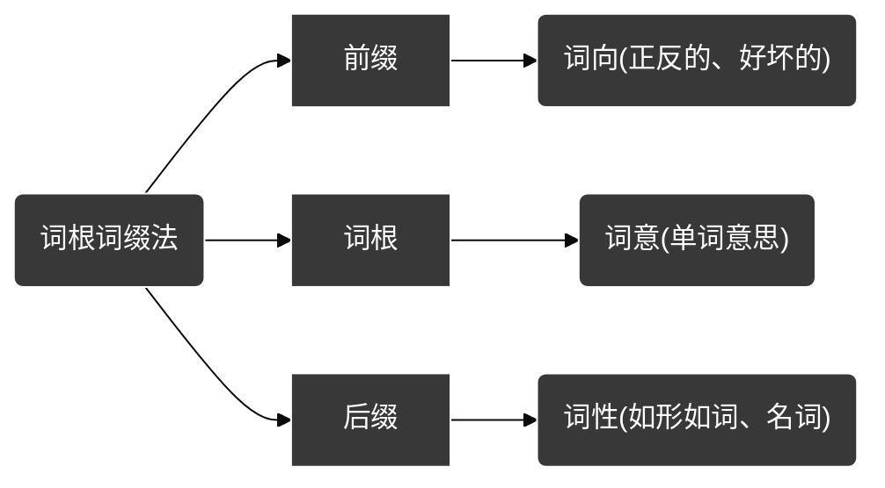

[toc]

**视频**

https://www.bilibili.com/video/BV1jD4y1q7L2/?spm_id_from=333.337.search-card.all.click&vd_source=1ec51cb8123536a0bf872aa061240412

#### such as

$\displaystyle{\textcolor{red}{un}\textcolor{white}{believ}\textcolor{yellow}{able} => 不相信地}\\\displaystyle{ 前缀:un(表否定),词根:believ(相信),词性:able(形容词后缀)}$

### 前缀篇

1. $\displaystyle{ab - 离去，相反，不}$

   - $\displaystyle{\textcolor{red}{ab}normal - 反常的}$
   - $\displaystyle{\textcolor{red}{ab}use - 滥用}$

2. $\displaystyle{anti - 反对，相反}$
   - $\displaystyle{\textcolor{red}{anti}war - 反战的}$
   - $\displaystyle{\textcolor{red}{anti}aging - 防衰老的}$
   - $\displaystyle{\textcolor{red}{anti}foreign - 排外的}$
   - $\displaystyle{\textcolor{red}{anti}noise - 防噪音的}$
3. $\displaystyle{co/col/con/com -一起}$
   - $\displaystyle{\textcolor{red}{co}operation - 合作}$
   - $\displaystyle{\textcolor{red}{col}labor\textcolor{yellow}{action} - 合作}$
   - $\displaystyle{\textcolor{red}{con}tribute - 贡献}$
   - $\displaystyle{\textcolor{red}{com}municate - 通讯}$
4. $\displaystyle{counter - 反对，相反}$
   - $\displaystyle{\textcolor{red}{counter}attack - 反击}$
   - $\displaystyle{\textcolor{red}{counter}effect - 反效果}$
   - $\displaystyle{\textcolor{red}{counter}trend - 反潮流}$
5. $\displaystyle{de - 否定、除去、向下}$
   - $\displaystyle{\textcolor{red}{de}nation \textcolor{yellow}{alize} - 非国有化}$
   - $\displaystyle{\textcolor{red}{de}compose - 分解}$
   - $\displaystyle{\textcolor{red}{de}merit - 缺点}$
     - $\displaystyle{de - 除去}$
   - $\displaystyle{\textcolor{red}{de}forest - 砍伐树林}$
   - $\displaystyle{\textcolor{red}{de}colour - 使褪色}$
   - $\displaystyle{\textcolor{red}{de}code - 解码}$
     - $\displaystyle{de - 向下}$
   - $\displaystyle{\textcolor{red}{de}press - 使沮丧、使萧条}$
   - $\displaystyle{\textcolor{red}{de}value - 贬值}$
6. $\displaystyle{dis - 否定、四面八方的感觉}$
   - $\displaystyle{\textcolor{red}{dis}order - 无秩序}$
   - $\displaystyle{\textcolor{red}{dis}appear - 消失}$
     - $\displaystyle{dis - 除去}$
   - $\displaystyle{\textcolor{red}{dis}forest - 砍伐森林}$
   - $\displaystyle{\textcolor{red}{dis}color - 使褪色}$
     - $\displaystyle{dis - 分开}$
   - $\displaystyle{\textcolor{red}{dis}tract- 分心}$
   - $\displaystyle{\textcolor{red}{dis}tribute - 分配}$
7. $\displaystyle{ex/e - 向外、前任的}$
   - $\displaystyle{\textcolor{red}{ex}-boyfriend - 前男友}$
   - $\displaystyle{\textcolor{red}{ex}port - 出口(v)}$
   - $\displaystyle{\textcolor{red}{ex}it - 出口}$
   - $\displaystyle{\textcolor{red}{ex}clude - 排外}$
8. $\displaystyle{fore - 前，先，预先}$
   - $\displaystyle{\textcolor{red}{fore}head - 前额}$
   - $\displaystyle{\textcolor{red}{fore}father - 祖父}$
   - $\displaystyle{\textcolor{red}{fore}see - 预知}$
9. $\displaystyle{in/im - 不\quad }$`(单词以p\b\m开头表否定则加im)`
   - $\displaystyle{\textcolor{red}{in}correct - 错误的}$
   - $\displaystyle{\textcolor{red}{in}complete - 不完全的}$
   - $\displaystyle{\textcolor{red}{im}possible - 不可能的}$
   - $\displaystyle{\textcolor{red}{im}balance - 不平衡}$
     - $\displaystyle{in/im - 向里}$
   - $\displaystyle{\textcolor{red}{in}door - 室内的}$
   - $\displaystyle{\textcolor{red}{in}breathe - 吸入}$
   - $\displaystyle{\textcolor{red}{im}port - 出口}$
   - $\displaystyle{\textcolor{red}{im}mortal - 不死的}$
10. $\displaystyle{inter- 在...之间}$
    - $\displaystyle{\textcolor{red}{inter}national - 国际的}$
    - $\displaystyle{\textcolor{red}{inter}personal - 人际的}$

#### 前缀篇 2

1. $\displaystyle{mis - 错}$

   - $\displaystyle{\textcolor{red}{mis}use - 误用}$
   - $\displaystyle{\textcolor{red}{mis}fortune - 不幸}$
   - $\displaystyle{\textcolor{red}{mis}understand - 误会}$

2. $\displaystyle{out - 超过、外}$
   - $\displaystyle{\textcolor{red}{out}number - 超过数量}$
   - $\displaystyle{\textcolor{red}{out}spend - 过度花费}$
   - $\displaystyle{\textcolor{red}{out}door - 户外的}$
3. $\displaystyle{over - 过度}$
   - $\displaystyle{\textcolor{red}{over}flow - 溢出}$
   - $\displaystyle{\textcolor{red}{over}praise - 过奖}$
   - $\displaystyle{\textcolor{red}{over}study - 过度学习}$
4. $\displaystyle{post - 后}$
   - $\displaystyle{\textcolor{red}{post}war - 战后的}$
   - $\displaystyle{\textcolor{red}{post}pone - 推后}$
   - $\displaystyle{\textcolor{red}{post}graduate - 研究生}$
5. $\displaystyle{pre - 前}$
   - $\displaystyle{\textcolor{red}{pre}history - 史前时期}$
   - $\displaystyle{\textcolor{red}{pre}condition - 前提条件}$
6. $\displaystyle{pro - 向前}$
   - $\displaystyle{\textcolor{red}{pro}gress - 进步}$
   - $\displaystyle{\textcolor{red}{pro}cess - 进程}$
   - $\displaystyle{\textcolor{red}{pro}long - 向前延伸的}$
7. $\displaystyle{re - 向后、重新}$
   - $\displaystyle{\textcolor{red}{re}turn - 回来}$
   - $\displaystyle{\textcolor{red}{re}call - 撤回}$
   - $\displaystyle{\textcolor{red}{re}gress - 退步}$
   - $\displaystyle{\textcolor{red}{re}verse - 逆向}$
     - $\displaystyle{-重新}$
   - $\displaystyle{\textcolor{red}{re}birth - 再生}$
   - $\displaystyle{\textcolor{red}{re}start - 重启}$
8. $\displaystyle{sub - 下、下级}$
   - $\displaystyle{\textcolor{red}{sub}way - 地铁🚇 ==> 中国的地铁叫metro ==> 香港的叫train}$
   - $\displaystyle{\textcolor{red}{sub}average - 低于平均水平}$
     - $\displaystyle{-下级}$
   - $\displaystyle{\textcolor{red}{sub}title - 副标题}$
   - $\displaystyle{\textcolor{red}{sub}branch - 分支}$
9. $\displaystyle{trans - 转移}$
   - $\displaystyle{\textcolor{red}{trans}lation - 翻译}$
   - $\displaystyle{\textcolor{red}{trans}from - 改变(Transformers变形金钢)}$
   - $\displaystyle{\textcolor{red}{trans}position - 互换位置}$

#### 数字前缀

1. $\displaystyle{mono - 1}$

   - $\displaystyle{\textcolor{red}{mono}tone - 单调}$
   - $\displaystyle{\textcolor{red}{mono}drama - 独角戏}$

2. $\displaystyle{bi - 2}$
   - $\displaystyle{\textcolor{red}{bi}cycle - 自行车(lifecycle-生命周期)}$
   - $\displaystyle{\textcolor{red}{bi}lateral - 双边的}$
3. $\displaystyle{di - 2}$
   - $\displaystyle{\textcolor{red}{di}oxide - 二氧化碳}$
   - $\displaystyle{\textcolor{red}{di}vorce - 离婚}$
4. $\displaystyle{tri - 3}$
   - $\displaystyle{\textcolor{red}{tri}angle - 三角形}$
   - $\displaystyle{\textcolor{red}{tri}ke - 三轮车(bike-自行车)}$
5. $\displaystyle{hemi-半}$
   - $\displaystyle{\textcolor{red}{hemi}sphere - 半球}$
   - $\displaystyle{\textcolor{red}{hemi}cycle - 半圆}$
6. $\displaystyle{semi-半}$
   - $\displaystyle{\textcolor{red}{semi}final - 半决赛}$
   - $\displaystyle{\textcolor{red}{semi}automatic - 半自动}$
7. $\displaystyle{poly - 多}$
   - $\displaystyle{mono\textcolor{red}{poly} - 垄断}$
   - $\displaystyle{\textcolor{red}{poly}technic - 理工学校}$
8. $\displaystyle{multi - 多}$
   - $\displaystyle{\textcolor{red}{multi}choice - 多选题}$
   - $\displaystyle{\textcolor{red}{multi}-purpose - 多功能的}$
   - $\displaystyle{\textcolor{red}{multi}-media - 多媒体}$

### 后缀

1. $\displaystyle{able - 【形容词后缀】能\dots的，具有\dots性质的}$

   - $\displaystyle{use\textcolor{red}{able} - 可用的}$
   - $\displaystyle{avail\textcolor{red}{able} - 可用的}$
   - $\displaystyle{mov\textcolor{red}{able} - 可移动的}$
   - $\displaystyle{adapt\textcolor{red}{able} - 适应的}$

2. $\displaystyle{al - 【形容词后缀】具有\dots性质的，属于\dots的}$
   - $\displaystyle{person\textcolor{red}{al} - 个人的}$
   - $\displaystyle{natur\textcolor{red}{al} - 自然的}$
   - $\displaystyle{region\textcolor{red}{al} - 局部的}$
     - $\displaystyle{al -【名词后缀】抽象名词、人}$
   - $\displaystyle{refus\textcolor{red}{al} - 拒绝}$
   - $\displaystyle{arriv\textcolor{red}{al} - 到达}$
     - $\displaystyle{al - 人}$
   - $\displaystyle{surviv\textcolor{red}{al} - 幸存者}$
   - $\displaystyle{crimin\textcolor{red}{al} - 罪犯}$
3. $\displaystyle{ate -【动词后缀】做、造成}$
   - $\displaystyle{gener\textcolor{red}{ate} - 造成}$
   - $\displaystyle{cre\textcolor{red}{ate} - 创作}$
     - $\displaystyle{ate -【名词后缀】人}$
   - $\displaystyle{gradu\textcolor{red}{ate} - 毕业生}$
   - $\displaystyle{candid\textcolor{red}{ate} - 候选人}$
   - $\displaystyle{advoc\textcolor{red}{ate} - 支持者}$
4. $\displaystyle{ed -【形容词后缀】加在名词后表:有\dots的}$
   - $\displaystyle{gift\textcolor{red}{ed} - 天生的}$
   - $\displaystyle{skill\textcolor{red}{ed}  - 熟练的}$
   - $\displaystyle{warm-heart\textcolor{red}{ed} - 热心的 }$
     - $\displaystyle{ed -【形容词后缀】加在动词后表:已\dots的 , 被\dots的}$
   - $\displaystyle{extend\textcolor{red}{ed} - 延伸的}$
   - $\displaystyle{educat\textcolor{red}{ed} - 受过教育的}$
   - $\displaystyle{marri\textcolor{red}{ed} - 已婚的}$
5. $\displaystyle{en -【动词后缀】使变成}$
   - $\displaystyle{short\textcolor{red}{en} - 缩短}$
   - $\displaystyle{sharp\textcolor{red}{en} - 削尖}$
   - $\displaystyle{strong> strength\textcolor{red}{en} - 加强}$
6. $\displaystyle{ence -【名词后缀】抽象名词}$
   - $\displaystyle{differ\textcolor{red}{ence} - 差别}$
   - $\displaystyle{confident > confid\textcolor{red}{ence} - 差别}$
   - $\displaystyle{depend\textcolor{red}{ence} - 差别}$
7. $\displaystyle{ful -【形容词后缀】富有\dots 、具有\dots性质的}$
   - $\displaystyle{beauti \textcolor{red}{ful} - 美丽的}$
   - $\displaystyle{use\textcolor{red}{ful} - 有用的}$
   - $\displaystyle{hope\textcolor{red}{ful} - 有希望的}$
8. $\displaystyle{fy -【动词后缀】使变成\dots}$
   - $\displaystyle{beauti\textcolor{red}{fy} - 美化}$
   - $\displaystyle{simple > simpli\textcolor{red}{ful} - 简化}$
   - $\displaystyle{pure > puri\textcolor{red}{fy} - 净化}$
9. $\displaystyle{ic -【形容词后缀】\dots的}$
   - $\displaystyle{histor\textcolor{red}{ic} - 历史的}$
   - $\displaystyle{base > bas\textcolor{red}{ic} - 基本的}$
   - $\displaystyle{real > realist\textcolor{red}{ic} - 现实的}$
10. $\displaystyle{ion -【名词后缀】抽象名词}$
    - $\displaystyle{act\textcolor{red}{ion} - 行为}$
    - $\displaystyle{correct\textcolor{red}{ion} - 改正}$
    - $\displaystyle{discuss\textcolor{red}{ion} - 讨论}$

#### 后缀 2

1. $\displaystyle{ism -【名词后缀】\dots主义 ， 流派，特性}$

   - $\displaystyle{individual\textcolor{red}{ism} - 个人主义}$
   - $\displaystyle{capital\textcolor{red}{ism} - 资本主义}$
   - $\displaystyle{modern\textcolor{red}{ism} - 现代主义}$
   - $\displaystyle{human\textcolor{red}{ism} - 人道主义}$

2. $\displaystyle{ist -【名词后缀】人，\dots家}$
   - $\displaystyle{art\textcolor{red}{ist} - 艺术家}$
   - $\displaystyle{commun\textcolor{red}{ist} - 共产主义者}$
   - $\displaystyle{scientce > scient\textcolor{red}{ist} - 科学家}$
3. $\displaystyle{ive -【形容词后缀】有\dots性质的/作用的}$
   - $\displaystyle{attract\textcolor{red}{ive} - 有魅力的}$
   - $\displaystyle{impress\textcolor{red}{ive} - 给人印象深刻的}$
   - $\displaystyle{creat\textcolor{red}{ive} - 有创造力的}$
4. $\displaystyle{ize -【动词后缀】\dots化}$
   - $\displaystyle{real\textcolor{red}{ize} - 实现}$
   - $\displaystyle{center > central\textcolor{red}{ize} - 集中}$
   - $\displaystyle{industry > industrial\textcolor{red}{ize} - 工业化}$
5. $\displaystyle{less -【形容词后缀】无\dots的}$
   - $\displaystyle{home\textcolor{red}{less} - 无家可归的}$
   - $\displaystyle{use\textcolor{red}{less} - 无用的}$
   - $\displaystyle{hope\textcolor{red}{less} - 绝望的}$
6. $\displaystyle{ment -【名词后缀】行为的过程或结果，物品}$
   - $\displaystyle{punish\textcolor{red}{ment} - 惩罚}$
   - $\displaystyle{develop\textcolor{red}{ment} - 发展}$
   - $\displaystyle{attach\textcolor{red}{ment} - 附件}$
   - $\displaystyle{base\textcolor{red}{ment} - 地下室}$
7. $\displaystyle{ness -【名词后缀】抽象名词}$
   - $\displaystyle{weak\textcolor{red}{ness} - 弱点}$
   - $\displaystyle{kind\textcolor{red}{ness} - 仁慈}$
   - $\displaystyle{dark\textcolor{red}{ness} - 黑暗}$
8. $\displaystyle{ship -【名词后缀】情况，关系}$
   - $\displaystyle{hard\textcolor{red}{ship} - 艰难困苦}$
   - $\displaystyle{friend\textcolor{red}{ship} - 友谊}$
     - $\displaystyle{ship -【名词后缀】身份、资格}$
   - $\displaystyle{king\textcolor{red}{ship} - 王位}$
   - $\displaystyle{member\textcolor{red}{ship} - 会员资格}$
9. $\displaystyle{ward -【形容词及副词后缀】向\dots的，朝\dots}$
   - $\displaystyle{down\textcolor{red}{ward} - 向下的}$
   - $\displaystyle{back\textcolor{red}{ward} - 向后的}$
   - $\displaystyle{north\textcolor{red}{ward} - 向北的}$
10. $\displaystyle{y -【形容词后缀】多\dots的，有\dots的}$
    - $\displaystyle{rain\textcolor{red}{y} - 下雨的}$
    - $\displaystyle{word\textcolor{red}{y} - 冗长的}$
    - $\displaystyle{hair\textcolor{red}{y} - 多毛的}$
      - $\displaystyle{y -【名词后缀】抽象名词}$
    - $\displaystyle{difficult\textcolor{red}{y} - 困难}$
    - $\displaystyle{discover\textcolor{red}{y} - 发现}$
    - $\displaystyle{master\textcolor{red}{y} - 精通}$

### 词根

1. $\displaystyle{ced / cess = go -  行走}$

   - $\displaystyle{pre \textcolor{red}{ced}e - 先于}$
   - $\displaystyle{unpre \textcolor{red}{ced}entedly - 史无前例地}$
   - $\displaystyle{re \textcolor{red}{ced}e - 后退}$
   - $\displaystyle{re \textcolor{red}{cess}ion - 经济衰退}$
   - $\displaystyle{inter \textcolor{red}{ced}e - 说情、调停}$
   - $\displaystyle{ex \textcolor{red}{cess}  - 超过}$

2. $\displaystyle{cid/cis = cut,kill - 切杀}$
   - $\displaystyle{de \textcolor{red}{cid}e - 决定}$
   - $\displaystyle{con \textcolor{red}{cis}e - 简洁的}$
   - $\displaystyle{pre \textcolor{red}{cis}e - 清晰的}$
   - $\displaystyle{self > sui \textcolor{red}{cid}e - 自杀}$
   - $\displaystyle{pesti \textcolor{red}{cid}e - 杀虫剂}$
3. $\displaystyle{claim  = cry,shout - 喊叫}$
   - $\displaystyle{ex\textcolor{red}{claim}  - 呼喊}$
   - $\displaystyle{pro\textcolor{red}{claim} - 宣告}$
   - $\displaystyle{de\textcolor{red}{claim} - 演讲}$
   - $\displaystyle{re\textcolor{red}{claim} - 收回}$
   - $\displaystyle{ac\textcolor{red}{claim} - 称赞}$
4. $\displaystyle{clud = close - 关闭}$
   - $\displaystyle{in\textcolor{red}{clud}e - 包含}$
   - $\displaystyle{ex\textcolor{red}{clud}e - 排除}$
   - $\displaystyle{con\textcolor{red}{clud}e - 结束}$
   - $\displaystyle{away > se\textcolor{red}{clud}e - 使隔绝}$
5. $\displaystyle{duc / duct  = lead - 引导}$
   - $\displaystyle{in > intro\textcolor{red}{duc}e - 介绍,引入}$
   - $\displaystyle{con\textcolor{red}{duct} - 指挥，执行，组织}$
   - $\displaystyle{se\textcolor{red}{duc}e - 勾引，引诱}$
   - $\displaystyle{re\textcolor{red}{duc}e - 减少}$
   - $\displaystyle{pro\textcolor{red}{duc}e - 生产}$
6. $\displaystyle{fer = bring  , carry  - 带、拿}$
   - $\displaystyle{of\textcolor{red}{fer} - 提供}$
   - $\displaystyle{pre\textcolor{red}{fer} - 更喜欢}$
   - $\displaystyle{dis -> dif\textcolor{red}{fer} - 不同}$
   - $\displaystyle{trans\textcolor{red}{fer} - 转移}$
7. $\displaystyle{ject = throw - 投掷}$
   - $\displaystyle{ob\textcolor{red}{ject}ion - 反对}$
   - $\displaystyle{sub\textcolor{red}{ject} - 主题}$
   - $\displaystyle{re\textcolor{red}{ject} - 抛弃，决裂}$
   - $\displaystyle{pro\textcolor{red}{ject} - 抛出，投出}$
   - $\displaystyle{in\textcolor{red}{ject} - 注射}$
8. $\displaystyle{migr - move}$
   - $\displaystyle{\textcolor{red}{migr}ate - 迁移}$
   - $\displaystyle{e\textcolor{red}{migr}ate - 移居国外}$
   - $\displaystyle{im\textcolor{red}{migr}ate - 移入}$
   - $\displaystyle{trans\textcolor{red}{migr}rate - 移居}$

#### 词根 2

1. $\displaystyle{pend / pens = hang - 悬挂}$

   - $\displaystyle{de\textcolor{red}{pend} - 依靠}$
   - $\displaystyle{inde\textcolor{red}{pend}ent - 独立自主的}$
   - $\displaystyle{sub>sus\textcolor{red}{pend} - 中止悬挂}$
     - $\displaystyle{{pend} / pens = pay - 花费}$
   - $\displaystyle{ex\textcolor{red}{pens}ive - 昂贵的}$
   - $\displaystyle{\textcolor{red}{pens}ion - 退休金}$
   - $\displaystyle{com\textcolor{red}{pens}ate - 补偿}$

2. $\displaystyle{pose > pos = put - 放置}$
   - $\displaystyle{ex\textcolor{red}{pose} - 揭露}$
   - $\displaystyle{com\textcolor{red}{pose} - 组装}$
   - $\displaystyle{op\textcolor{red}{pose} - 反对}$
   - $\displaystyle{dis\textcolor{red}{pose} - 处置}$
   - $\displaystyle{pro\textcolor{red}{pose} - 求婚、提议}$
   - $\displaystyle{\textcolor{red}{pos}ition - 位置、安置}$
3. $\displaystyle{rupt = break - 破}$
   - $\displaystyle{bank\textcolor{red}{rupt} - 破产}$
   - $\displaystyle{inter\textcolor{red}{rupt} - 中断}$
   - $\displaystyle{dis\textcolor{red}{rupt} - 使混乱、分裂}$
   - $\displaystyle{cor\textcolor{red}{rupt} - 腐败、堕落}$
   - $\displaystyle{e\textcolor{red}{rupt} - 爆发、喷发}$
4. $\displaystyle{spect = lock - 看}$
   - $\displaystyle{pro\textcolor{red}{spect} - 前景}$
   - $\displaystyle{in\textcolor{red}{spect} - 检察}$
   - $\displaystyle{expect - 期望}$
   - $\displaystyle{re\textcolor{red}{spect} - 尊敬}$
   - $\displaystyle{sub>su\textcolor{red}{spect} - 怀疑}$
   - $\displaystyle{er > \textcolor{red}{spect}ator - 观众}$
5. $\displaystyle{tract = draw - 拉、引}$
   - $\displaystyle{\textcolor{red}{tract}or - 拖拉机}$
   - $\displaystyle{at\textcolor{red}{tract} - 吸引}$
   - $\displaystyle{con\textcolor{red}{tract} - 合同}$
   - $\displaystyle{ex\textcolor{red}{tract} - 提取}$
   - $\displaystyle{dis\textcolor{red}{tract} - 使分心}$
6. $\displaystyle{vert/vers - turn}$
   - $\displaystyle{re\textcolor{red}{vers}e - 反转、逆向 => BinaryReverse}$
   - $\displaystyle{con\textcolor{red}{vert} - 转变}$
   - $\displaystyle{di\textcolor{red}{vers}e - 多种多样的}$
   - $\displaystyle{intro\textcolor{red}{vert} - 内向的人}$
   - $\displaystyle{extro\textcolor{red}{vert} - 外向的人}$
7. $\displaystyle{vis/vid - see}$
   - $\displaystyle{\textcolor{red}{vis}ible - 看得见的}$
   - $\displaystyle{re\textcolor{red}{vis}e - 复习}$
   - $\displaystyle{pre\textcolor{red}{vis}e - 预知}$
   - $\displaystyle{super\textcolor{red}{vis}e - 监督}$
   - $\displaystyle{\textcolor{red}{vis}ual - 视觉的}$
   - $\displaystyle{e\textcolor{red}{vid}ent - 明显的}$
   - $\displaystyle{e\textcolor{red}{vid}ence - 证据}$
8. $\displaystyle{viv - live}$
   - $\displaystyle{re\textcolor{red}{viv}e - 复活}$
   - $\displaystyle{\textcolor{red}{viv}d - 生动的}$
   - $\displaystyle{sur\textcolor{red}{viv}e - 幸存}$

https://www.bilibili.com/video/BV1jD4y1q7L2/?p=7&vd_source=1ec51cb8123536a0bf872aa061240412

插件:https://chrome.google.com/webstore/detail/%E5%B0%8F%E7%AA%97%E5%8F%A3%E8%A7%86%E9%A2%91-by-c4r/banggcaohiaanmdkalekjcffjonamlkj/related

`逆向记忆法，从记muscle -> mouse -> use很多人会说这不就是，词归纳法吗、拆分法吗`

### 口语+作文

$\displaystyle{build \quad confidence}$

$\displaystyle{difference\quad  A \quad from\quad  B ...}$
