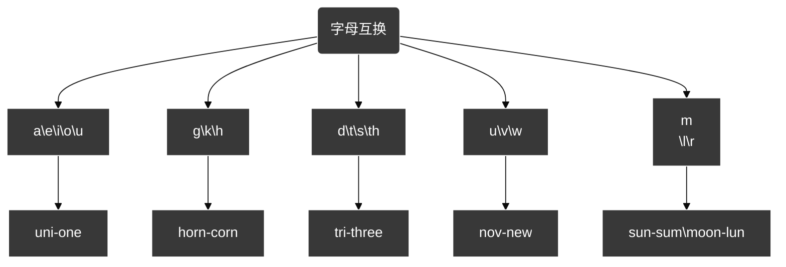

[toc]

视频
- https://www.bilibili.com/video/BV1tF411z7cF/?spm_id_from=333.999.0.0&vd_source=b328715e5f4dc09f3cc92453468d2d0d

b、p、m、f、\
d、t、\
n、l、\
g、k、h、\
j、q、x、zh、ch、sh、r、z、c、s、y、w

## 印欧语言变化规律

$\textcolor{red}{核心思想:}字母互换.意思同源$

### 一、a,e,i,o,u,w,y(元音+半元音)
- $r \textcolor{red}{e}st(休息)\rightarrow r \textcolor{red}{u}st(生锈)$

- $sh \textcolor{red}{i}rt(T恤)\rightarrow sh \textcolor{red}{o}rt(短)$
- $\textcolor{red}{o}n \textcolor{red}{e}(一)\rightarrow \textcolor{red}{u}n \textcolor{red}{i}(一)$

 半元音(w,y) 

- $yes[jes] -y发ye的音(辅音)$

- $fly[flai]-y发ai的音(元音)$

>$这就是为什么y结尾的单词要变i$

### 二、g,k[c],h
- $发音$

	- $c发k的音 \rightarrow  cat$

	- $k发g的音 \rightarrow  skill$
- $\textcolor{red}{h}orn(角) - \textcolor{red}{c}orn(玉米)$
### 三、d,t,s[c],th
- $发音$

	- $c 发s的音 \rightarrow  decide$

	- $th 发s的音 \rightarrow  think ,thank$
	- $t 发d的音 \rightarrow  stop , stand$
- $\textcolor{red}{d}en \textcolor{red}{t} - \textcolor{red}{t}ee \textcolor{red}{th}(ee\rightarrow e,n脱落) \rightarrow \textcolor{red}{dent}ist(牙医)$
- $\textcolor{red}{t}r \textcolor{red}{i}- \textcolor{red}{th}r \textcolor{red}{ee}(三)$
### 四、u,v,w
- $来源$

	- $字母u、w是由字母v派生出来的$
- $no \textcolor{red}{v}\rightarrow ne \textcolor{red}{w}$
- $\textcolor{red}{v}ol\rightarrow  \textcolor{red}{w}ill$
### 五、m,n,l,r
- $su \textcolor{red}{n}(太阳)\rightarrow so \textcolor{red}{l}(唯一)-su \textcolor{red}{m}mer$

- $\textcolor{red}{m}oon(月亮)\rightarrow \textcolor{red}{l}un$
- $sam - sem - sim - syn - sy(n鼻音脱落) - sym - syl \rightarrow 相同$
### 六、b,p,m,f,v

#### 复合互换(u|w|v+d|s|t|th)
- $vis-wit-vid-wis-wit-看$

## 象形文字
- $A = 牛角（起源于🐮）$
	- $acute -尖$

	- $ache -疼$
	- $arrow -箭$
	- $anger -生气$
	- $ang-eng-ank-anch = 角$
- $B = 房子（起源于两间房间🏠）$
	- $build -建造$

	- $bath -浴室$
	- $bed -床$
	- $base -地基$
	- $B = 两间房$
		- $both -两个$

		- $bike -自行车$
	- $br = 两个$
		- $bra -胸罩$

		- $brow(ow表示位置后缀)- 眉毛$
		- $brother -兄弟$

#### 词根

$bio = life$

>$来源：字母B->表示br->bir加了元音->bio和bir同源 = life$

#### 实战
$benevolence => bene + vol + ence 善意$
- $bene = fine = 好$

- $fine = fin(尖)$
- $fin = pen(钢笔)$
- $pen = penn(羽毛)$

