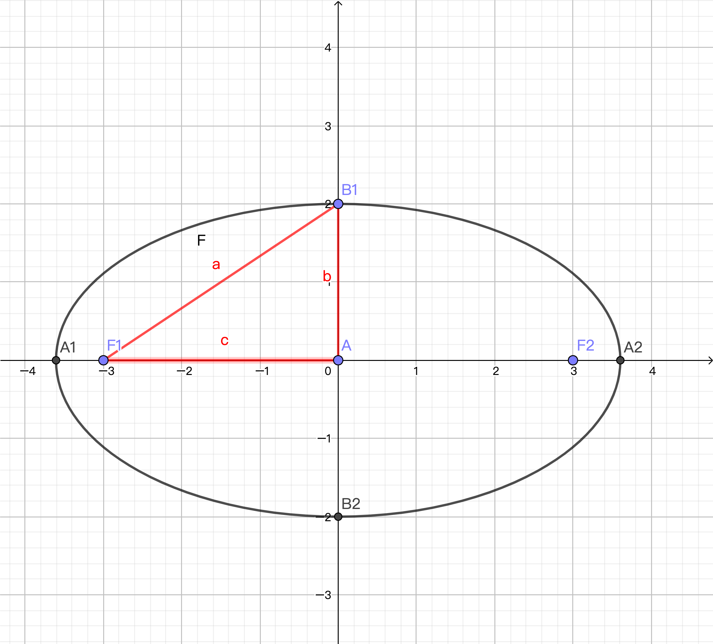
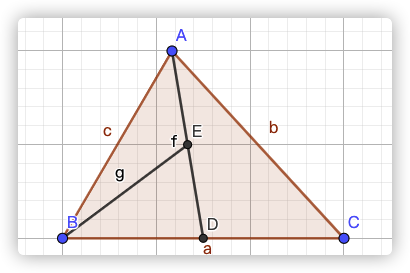
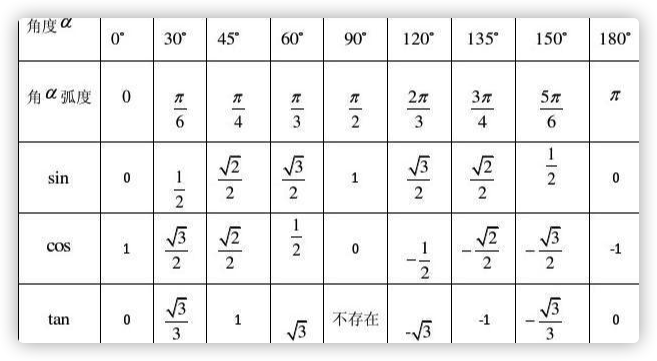
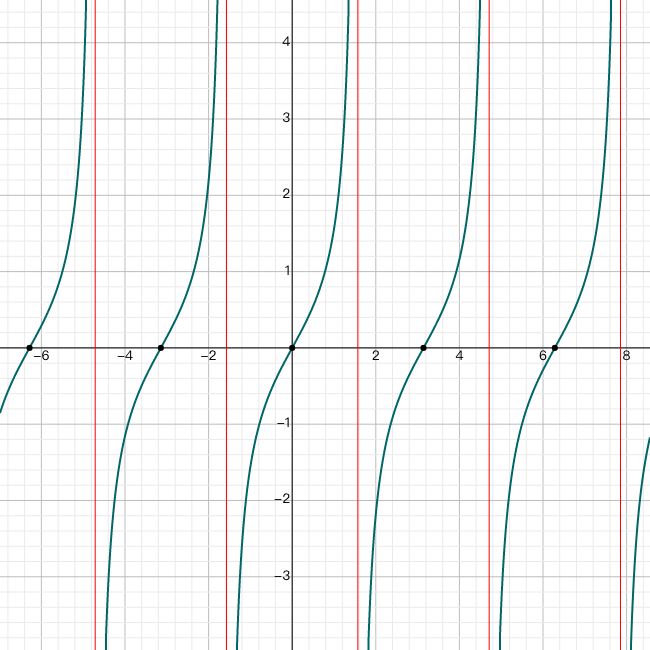
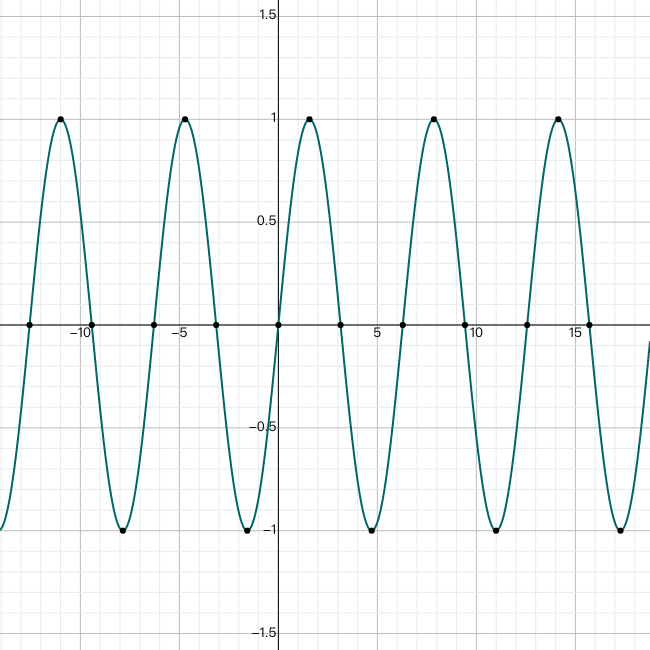
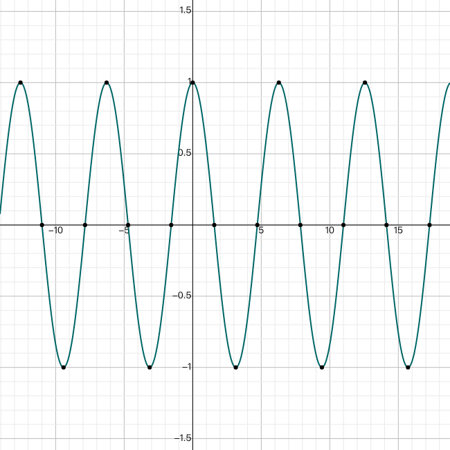

[toc]

## 复习知识点

### 基本方程公式

$(x+y)^2 = x^2 + 2xy + y^2$

$(x-y)^2 = x^2 -2xy + y^2$

$x^2 - y^2 = (x+y)(x-y)$

$a^{\frac{b}{c}} = \sqrt[c]{a^b}$ ---> $8^\frac{2}{3} = \sqrt[3]{8^2} = 4$

### 椭圆

其中$a^2 = b^2 + c^2$ ，长轴 A1A2 = 2a ，短轴 B1B2 = 2b，焦距 F1F2 = 2c，离心率为$e = \frac{c}{a}$

### 奇偶函数

奇函数关于原点对称，偶函数关于 y 轴对称

奇函数：f(-x) = -f(x) ,偶函数：f(-x) = f(x)

### 向量

AD 为 BC 边上的中线，E 为 AD 的中点。

其中$\vec{EB} = \vec{ED}+\vec{DB}$ ,$\vec{AC} + \vec{2CA} = -\vec{CA}$

### 三角函数

| 弧度 |  0  |    $\displaystyle{\frac{\pi}{6}}$    |    $\displaystyle{\frac{\pi}{4}}$    |    $\displaystyle{\frac{\pi}{3}}$    |
| :--: | :-: | :----------------------------------: | :----------------------------------: | :----------------------------------: |
| sin  |  0  |     $\displaystyle{\frac{1}{2}}$     | $\displaystyle{\frac{\sqrt{2} }{2}}$ | $\displaystyle{\frac{\sqrt{3} }{2}}$ |
| cos  |  1  | $\displaystyle{\frac{\sqrt{3} }{2}}$ | $\displaystyle{\frac{\sqrt{2} }{2}}$ |     $\displaystyle{\frac{1}{2}}$     |
| tan  |  0  | $\displaystyle{\frac{\sqrt{3} }{3}}$ |          $\displaystyle{1}$          |      $\displaystyle{\sqrt{3}}$       |

#### 大小关系

$\displaystyle{-1 \leq sinx \leq  1,-1 \leq cosx \leq 1,-1 \leq cos2x \leq 1}$

#### 基本公式

$\displaystyle{tanx = \frac{sinx}{coss} , \qquad sin^2x + cos^2 x= 1 }$

#### sin\cos

$\displaystyle{{sin(x\pm y) = sin{x} \cdot  cos{y} \pm cosx \cdot  siny}}$

$\displaystyle{cos(x\pm y) = cosx \cdot  cosy \mp sinx \cdot  siny}$

$\displaystyle{sinx = 2 \cdot  sin\frac{x}{2} \cdot  cos\frac{x}{2}}$

$\displaystyle{sin{2x} = 2 \cdot  sin{x} \cdot  cos{x}}$

$\displaystyle{{cos 2x = cos^2x - sin^2x}  = 2cos^2x -1 = 1 - 2sin^2x}$

#### sin\cos\tan

$\displaystyle{sin2x = \frac{2tanx}{1+tan^2x}}$

$\displaystyle{cos2x = \frac{1-tan^2x}{1+tan^2x}}$

$\displaystyle{tan2x = \frac{2tanx}{1-tan^2x}}$

#### 组合

$$
\begin{aligned}
&2 sin \frac{(x_0 + \Delta x) - x_0}{2} \cdot cos \frac{2x_0+\Delta x}{2} => 2sin \frac{\Delta x}{2} \cdot cos \frac{2x_0+\Delta x}{2}\\
&\displaystyle{sinx - sina = 2 sin \frac{x}{2} cos \frac{x}{2} -2 sin \frac{a}{2} cos \frac{a}{2}  = 2(sin \frac{x-a}{2}cos \frac{x+a}{2})}\\
\end{aligned}
$$

#### 扩展

$\displaystyle{余切cot＝\frac{cos}{sin}  \quad (或者ctg)}$

$\displaystyle{正割sec＝\frac{1}{cos}}$

$\displaystyle{余隔csc＝\frac{1}{sin}}$

### 三角函数 2

#### tan

|  sym   |                                          tan                                           |
| :----: | :------------------------------------------------------------------------------------: |
|  周期  |                                  $\displaystyle{\pi}$                                  |
| 定义域 | $\displaystyle{[\pi n,\frac{\pi}{2}+\pi n) \cup (\frac{\pi}{2} + \pi n ,\pi + \pi n)}$ |
|  值域  |                          $\displaystyle{(-\infty ,+\infty )}$                          |
| 轴截距 |                     $\displaystyle{X截距(\pi n , 0) , Y截距(0,0)}$                     |
| 渐近线 |                    $\displaystyle{垂直 x = \frac{\pi}{2} + \pi n}$                     |
| 极值点 |                                           无                                           |

#### sin

|  sym   |                                        sin                                         |
| :----: | :--------------------------------------------------------------------------------: |
|  周期  |                               $\displaystyle{2\pi}$                                |
| 定义域 |                        $\displaystyle{(-\infty ,+\infty )}$                        |
|  值域  |                              $\displaystyle{[-1,1]}$                               |
| 轴截距 |          $\displaystyle{X截距(2\pi n , 0),(\pi + 2\pi n,0) , Y截距(0,0)}$          |
| 渐近线 |                                         无                                         |
| 极值点 | $\displaystyle{Max(\frac{\pi}{2} + 2\pi n ,1) ,Min(\frac{3\pi }{2} + 2\pi n ,-1)}$ |

#### cos

|  sym   |                                             cos                                             |
| :----: | :-----------------------------------------------------------------------------------------: |
|  周期  |                                    $\displaystyle{2\pi}$                                    |
| 定义域 |                            $\displaystyle{(-\infty ,+\infty )}$                             |
|  值域  |                                   $\displaystyle{[-1,1]}$                                   |
| 轴截距 | $\displaystyle{X截距(\frac{\pi}{2} + 2\pi n,0),(\frac{3\pi }{2} + 2\pi n ,0) , Y截距(0,1)}$ |
| 渐近线 |                                             无                                              |
| 极值点 |                   $\displaystyle{Max(2\pi n ,1) ,Min(\pi + 2\pi n ,-1)}$                    |

### 奇、偶函数

- **奇函数**

$\displaystyle{当f(x)为一个实变量、实值函数时都成立如下等式:}$

$\displaystyle{f(x) = -f(-x) \quad or \quad f(-x) = -f(x)}$

奇函数关于原点对称，常见的函数有:$\displaystyle{x,\sin{x},\sinh{x},erf{x}}$

- **偶函数**

$\displaystyle{都为实变量、实值都成立如下等式:}$

$\displaystyle{f(x) = f(-x)}$

偶函数关于 y 轴对称，常见函数有$\displaystyle{|x|,\cos{x},\cosh{x}}$

> 一个偶函数和一个奇函数的相加不会是奇函数也不会是偶函数；如${\displaystyle x+x^{2}}$ 
> 两个偶函数的相加为偶函数，且一个偶函数的任意常数倍亦为偶函数。（偶+偶=偶 n× 偶=偶） 
> 两个奇函数的相加为奇函数，且一个奇函数的任意常数倍亦为奇函数。（奇+奇=奇 n× 奇=奇）

### 最小周正期

$\displaystyle{sin(a\pm b) = sin{a} cos{b} \pm cosa sinb }$

$\displaystyle{cos(a\pm b) = cosacosb \mp sina sinb}$

$\displaystyle{sin 2a = 2sina cosa}$

$\displaystyle{cos 2a = cos^2a - sin^2a}  = 2cos^2a -1 = 1 - 2sin^2a$

> $\displaystyle{exitxt=> f(x) = 4 \cos{x} \sin{(x+\frac{\pi}{6})} - 1 ,求f(x)的最小周正期}$

$$
\begin{aligned}
& f(x) = 4 \cos{x}(\sin{x}\cos{\frac{\pi}{6}} + \cos{x}\sin{\frac{\pi}{6}})-1\\
& f(x) = 4\cos{x}\sin{x}\frac{\sqrt{3} }{2} + 4\cos^2{x}\frac{1}{2} -1 \\
& f(x) = \sin{2x}\sqrt{3}  + \cos{2x}  \\
& f(x) = 2(\frac{\sqrt{3} }{2} \sin{2x} + \frac{1}{2}\cos{2x}) = 2\sin{(2x+\frac{\pi }{6})} \\
& T = \frac{2\pi}{W} = \frac{2\pi }{2}  = \pi\\
\end{aligned}
$$

- https://try8.cn/tool/format/markdown

> $\displaystyle{exitst => f(x) = \sin{(2x + \frac{\pi}{3})} + \sin{(2x - \frac{\pi}{3})} + 2 \cos{^2x} - 1  , x \in R,  求f(x)的最小周正期}$

$$
\begin{aligned}
& f(x) = 2\sin{2x}\cos{\frac{\pi}{3}} + 2 \cos{^2x} - 1 \\
& f(x) = \sin{2x} +  \cos{2x}\\
& f(x) = 2(\frac{1}{2}\sin{2x} + \frac{1}{2}\cos{2x}) \\
& f(x) = 2\sin{(2x + \frac{\pi}{3})} \\
& T = \frac{2\pi}{W} =  \frac{2\pi}{2}  = \pi \\
\end{aligned}
$$

> $\displaystyle{exitst => f(x)  = \tan{(2x + \frac{\pi}{4})} , 求f(x)的定义域、最小周正期}$

$$
\begin{aligned}
& \because \tan{x}=> x \neq \frac{\pi }{2} + \pi n \\
& \therefore 2x+\frac{\pi}{4} \neq  \frac{\pi}{2} + \pi n\\& => 2x \neq \frac{\pi}{4} + \pi n \\
& => x \neq \frac{\pi}{8} + \frac{\pi n }{2} \\
& \therefore x \in \{x | x\neq \frac{\pi}{8}+\frac{\pi n}{2}\} \\
& tan => T = \frac{\pi}{W}= \frac{\pi}{2}
\end{aligned}
$$

### 抛物线顶点

- $\displaystyle{顶点坐标公式1： f(x) = ax^2 + bx + c => 顶点(-\frac{b}{2a},\frac{4ac-b^2}{4a})}$

- $\displaystyle{顶点坐标公式2： f(x) = a(x-(+h))^2 + (+k) (a\neq 0) => 顶点(h,k)}$

> $\displaystyle{求f(x) = 2x - 4\sqrt{(1+x)} 的值域}$

$$
\begin{aligned}
& set \quad t = \sqrt{1+x} ,t \geq 0 \\
& f(x) = 2(t^2 - 1)  - 4t  = 2t^2 - 4t - 2\\
根据顶点坐标公式1& => \{a=2,b=-4,c=-2\} => 顶点(1,-4) \\
& f'(x) = 2(t-1)^2 -4 \\
根据顶点坐标公式2& => \{h=1,k=-4\} => 顶点(1,-4) \\
\end{aligned}
$$

> $\displaystyle{求f(x) = \frac{3x - 4}{2x}的值域}$

$$
\begin{aligned}
& f(x) = \frac{3}{2} - \frac{2}{x} \\
& \because -\frac{2}{x} \neq  0  \\
& \therefore f(x) \neq  \frac{3}{2} \\
& \therefore (-\infty  , \frac{3}{2}) \cup (\frac{3}{2} , +\infty )\\
\end{aligned}
$$

> $\displaystyle{求f(x) = \log{2^{(-x^2 + 8x - 12)}} 在(3,6)的值域}$

$$
\begin{aligned}
& set \quad g(x) = -(x^2 - 8x + 12)  =  -((x - 4)^2 - 4)\\
& 顶点= (4,4) \\
& Max => f(x) = \log{2^4}  = 2\\
& \because (-x^2 + 8x -12) \neq 0 \\
& \therefore 值域为(-\infty ,2]
\end{aligned}
$$

### 三角形定义

直角三角形斜边上的中线等于斜边的一半；

直角三角形中 30° 角所对的直角边等于斜边的一半；

### 对数函数

$\displaystyle{2^{2} = 4 , 2^{-2} = \frac{1}{2} , 2^{\frac{1}{2}} = \sqrt{2},2^6 =(2^{2})^3=64}$

$\displaystyle{a^x = N	其中x就是N的对数，表示为x = log_a^N   变换后又有=>a^{log_a^N} = N}$

> $\displaystyle{推导\quad log_a^{(MN)} = log_a^M + log_a^N}$

$$
\begin{aligned}
&set\quad M = a^{log_a^M} , N = a^{log_a^N} \\
&=> MN = a^{log_a^M + log_a^N}\\
& \because  从上面等式可以看出a的(\log{a^M}+\log{a^N})次方 = MN,则即为等式如下:\\
&=> log_a^{(MN)} = log_a^M + log_a^N \\
\end{aligned}
$$

 

$\displaystyle{\displaystyle{\ln{(xy)} = \ln{x} + \ln{y}}}$

$\displaystyle{\log_a^{{\frac{M}{N}}} = \log_a^M - \log_a^N}$

> $\displaystyle{推导\quad log_a^{M^n} = n \cdot  log_a^M}$

$$
\begin{aligned}
&\because M=a^{\log_a^M}  =>  M^n = (a^{log_a^{M}})^n \\
&\because x^{a^b} = x^{ab} \\
&\therefore (a^{log_a^M})^n = a ^{(n \cdot log_a^M)} \\
& \because M^n = (a^{\log_a^M})^n = a^{n\log_a^M} \\
& \therefore \log_a^{(a^{n\log_a^M})} = n \log_a^M \\
\end{aligned}
$$

> $\displaystyle{推导\quad \log_a^{n^M} =\frac{1}{n}log_a^M}$

$$
\begin{aligned}
& \because a^{\log_a^M} = M\\
& set	\quad a^N = a (换底数)\\
& \therefore (a^N)^{\log_a^{N^M}}= M \\
&M = a^{n \cdot  log_a^{n^M}}\\
&log_a^M = n \cdot  log_a^{n^M}\\
&log_a^M \cdot  \frac{1}{n} = log_a^{n^M}\\
\end{aligned}
$$

> $\displaystyle{推导\quad \log_a^b = \frac{log_c^b}{log_c^a}}$

$$
\begin{aligned}
&\because log_a^b 得=> a^x = b\\
&\therefore log_c^b = log_c^{a^x} , =>\quad log_c^b = x \cdot  log_c^a\\
&\therefore x = \frac{log_c^b}{log_c^a} = log_a^b\\
\end{aligned}
$$

> $\displaystyle{推导\quad log_a^{m^{b^n}} = \frac{n}{m} * log_a^b}$

$$
\begin{aligned}
&log_{a^m}^{b^n} = \frac{log_c^{b^n}}{log_c^{a^m}} = \frac{n * log_c^b}{ m* log_c^a} = \frac{n}{m} * log_a^b\\
\end{aligned}
$$

#### 例题 ：

> $\displaystyle{log_2^9 * log_3^4=?}$

$$
\begin{aligned}
& =\frac{log_{10}^9}{log_{10}^2} * \frac{log_{10}^4}{log_{10}^3}  \\
& =\frac{2 * log_{10}^3}{log_{10}^2} * \frac{2 * log_{10}^2}{log_{10}^3}  \\
& = 2 * 2 = 4
\end{aligned}
$$

### 求根

$\displaystyle{ax^2+bx+c=0 \quad  => \quad \frac{-b \pm \sqrt{b^2 - 4ac}}{2a}}$

### 根号运算

$\displaystyle{\sqrt{ab} = \sqrt{a} \cdot \sqrt{b}   }$

$\displaystyle{\sqrt{2\sqrt{2} }  =  \sqrt{2} \cdot \sqrt{\sqrt{2} }  = 2^{\frac{1}{2}} \cdot  2^{\frac{1}{4}} = 2^{\frac{3}{4}}= \sqrt[4]{8}}$

### 方差

在一组数据中${x_1 , x_2 , x_3 \dots x_n}$中各组数据与它们的平均数$\avg{x}$的差的平方和即为方差

$$
s^2 = \frac{1}{n}\left[(x_1 - x)^2 + (x_2 - x)^2 + \dots + (x_n - x)^2\right] \rightarrow \frac{\sum_{i=1}^n (x_i - x)^2}{n}
$$

方差用来衡量这组数据的波动大小,方差越小就越稳定

### 权值

权值指加权平均数中的每个数的频数

对于多位数,处在某一位上的“l”所表示的数值的大小,称为该位的位权.

例如十进制第2位的位权为10,第3位的位权为100；

而二进制第2位的位权为2,第3位的位权为4,对于 N进制数,整数部分第 i位的位权为N^(i-1)^

,而小数部分第j位的位权为N^-j.

