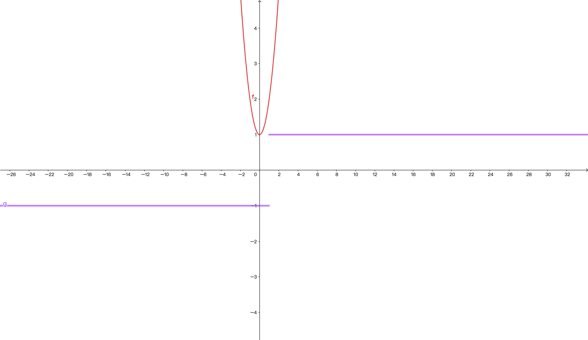

## Demo

**选择题**

> 1. $f(x) = \sqrt{x^2} + 1 , \quad  g(x) = |x| + 1$ 是否为同一函数？

$$\begin{aligned}
&\because f(x) = \sqrt{x^2} + 1 \\
&\because f(x) = |x| + 1   \qquad and  \qquad g(x) = |x| + 1 \\
&\therefore  对应法则相同 \\
&\therefore x \in R   \qquad and \qquad x \in R   \\
&\therefore 定义域相同\\
&\therefore 为同一函数
\end{aligned}$$

$f(x) = x+ 1 , \quad g(x) = \frac{(x+1)(x-1)}{x-1}$
$$\begin{aligned}
& \because g(x) = \frac{(x+1)(x-1)}{x-1} \quad => \quad x+1 \\
& \therefore f(x) = x+1  \qquad and \quad g(x) = x+1 \\
& \therefore f(x) =>x \in R  , \quad but \quad g(x)=> x \notin 1 \\
& \therefore 对应法则相同，定义域不相同。不为同一函数
\end{aligned}$$

$f(x)=\lg{x^2}, \quad g(x) =2\lg{x}$
$$\begin{aligned}
& f(x) = \lg{x^2} =>\log{10^{x^2}}  ==> 2\lg{x} \\
& \because x \notin 0 \\
& \therefore 不同函数
\end{aligned}$$

$f(x)=x, \quad g(x)=\sqrt{x^2}$
$$\begin{aligned}
& set: x =-1  \\
& \because f(x) = -1 , g(x) = 1 \\
& \therefore f(x) \neq g(x) \\
& \therefore 不同函数
\end{aligned}$$

$f(x)=\sqrt[3]{x^{4}-x^{3}}, \quad g(x)=x\sqrt[3]{x-1}$
$$\begin{aligned}
& f(x) = \sqrt[3]{x^{4}-x^{3}} => \sqrt[3]{(x-1)^{3}} =>x-1 \\
& g(x)= x\sqrt[3]{x-1} => \sqrt[3]{(x-1) \cdot x^{3}} => x-1\\
& \therefore 同函数
\end{aligned}$$

$f(x)=x+1 , \quad  g(x)=\frac{x^2-1}{x-1}$
$$\begin{aligned}
& g(x)=\frac{(x+1)(x-1)}{x-1}=>x+1\\
& \because x \notin 1 \\
& \therefore 不同函数
\end{aligned}$$

> 2. $exist => f(x+1) = \frac{x}{x+1}$ , beg => $f^{-1}(x+1)= ?$

$$\begin{aligned}
& \because  f(x+1) =>f(x)=\frac{x-1}{x}\\
& \therefore y = \frac{x-1}{x} => xy = x-1 => x(y - 1) = -1 \\
& \therefore x= \frac{-1}{y-1}=\frac{1}{1-y} =反=>f^{-1}(x) = \frac{1}{1-x} \\
& \therefore  f^{-1}(x+1) = \frac{1}{1-(x+1)} = -\frac{1}{x}
\end{aligned}$$

> 3. 命题如下:

$(A) \quad if => \lim\limits_{n\rightarrow \infty}|U_n| = a, 则\lim\limits_{n\rightarrow \infty}U_n = a$
$$\begin{aligned}
& set \quad  U_n = -1 \\
& \because \lim\limits_{n\rightarrow \infty}|U_n| = 1 , \lim\limits_{n\rightarrow \infty}U_n 不存在\\
& \therefore no \\
\end{aligned}$$

$(B) \quad  exitst => \{x_n \}, \lim\limits_{n\rightarrow \infty}y_n = 0, 则\lim\limits_{n\rightarrow \infty}x_n y_n = 0$
$$\begin{aligned}
& \because  n\rightarrow -\infty \quad and \quad n\rightarrow +\infty  \\
& \because y_n \rightarrow \frac{1}{x_n } , if=> x_n \rightarrow x_n => \lim\limits_{n\rightarrow \infty}x_n y_n = 1 \\
& \therefore no \\
\end{aligned}$$

$(C) \quad exitst=>\lim\limits_{n\rightarrow \infty}x_n y_n = 0, 则必有\lim\limits_{n\rightarrow \infty}x_n  = 0 或\lim\limits_{n\rightarrow \infty}y_n = 0$
$$\begin{aligned}
& set \quad  \lim\limits_{n\rightarrow \infty}x_n  = (1 - (-1)^n) \\
& set \quad \lim\limits_{n\rightarrow \infty}y_n  = (1 + (-1)^n) \\
& => \lim\limits_{n\rightarrow \infty}x_n y_n  = 0  \\
& but \quad \lim\limits_{n\rightarrow \infty}x_n 、\lim\limits_{n\rightarrow \infty}y_n => no \quad exitst \\
& \therefore  no
\end{aligned}$$

$(D) \quad 数列\{x_n \}收敛于a的充分必要条件是: 它的任一子数列都 收敛 于a$
$$\begin{aligned}
& yes \\
\end{aligned}$$

> 4. set => f(x) $\begin{cases}& 2x -1 , x>0 \\& 0, x= 0 \\& 1 + x^2, x<0 \\\end{cases} 则 \lim\limits_{x\rightarrow 0}f(x)?$

$$\begin{aligned}
& \because x\rightarrow 0^- \quad  | \quad x\rightarrow 0^+ \\
& \therefore  x\rightarrow 0^- => \lim\limits_{x\rightarrow 0^-}(1+x^2) = 1 \\
& \therefore x\rightarrow 0^+ => \lim\limits_{x\rightarrow 0^+}(2x-1) = -1 \\
& \because 1 \neq  -1 \\
& \therefore no \quad exitst \\
\end{aligned}$$

------------------------ 不理解"x -> 0"------------------------

> 5. $设f(x)和\phi(x)在(-\infty, +\infty)内有定义，f(x)为连续函数，且f(x) \neq 0，\phi(x)有间断点。则( )$

$$\begin{aligned}
& \because f(x) \neq 0 , f(x) 为连续函数 \\
& \therefore f(x)  = f(x^-) = f(x^+) \neq  0  \\
& set \quad f(x)  = x^2 + 1  , \phi(x)\begin{cases} & 1 , x\leq 1 \\ &-1, x>1 \\ \end{cases} , \phi (x)间断点为1 \\
& A => \phi[f(x) ] = 1 => error \\
& B => [\phi (1)]^2 = 1 => error  \\
& C => error
\end{aligned}$$
图像如下:

--------------------------------------------

> 6. $exitst => f(x)  = \begin{cases} &e^x , x< 0 \\ &a+x+2 , x\geq 0 \\ \end{cases} 在R上连续，则a=?$

$$\begin{aligned}
& \because x= 0 为间断点 \\
& \therefore  f(x) = f(x^-)  = f(x^+) \\
& x =0 => f(x) = a+2 \\
& x = 0^- => f(x^-) = \lim\limits_{x\rightarrow 0^-}  e^x = 1 \\
& x = 0^+ => f(x^+) = \lim\limits_{x\rightarrow 0^+} (a+x+2) = a+2  \\
& \therefore a+2 = 1 , a=-1
\end{aligned}$$

> 7. $exitst => f (x)的连续区间是[0, 1)，则函数 f [\ln(x+1)]的连续区间是$

$$\begin{aligned}
& \because 0 \leq f(x) < 1  \\
& 引用上述定义:'对连续函数加减乘除后依旧是连续函数' \\
& \therefore 0\leq \ln{(x+1)} < 1 \\
& 0 \leq \ln{(x+1)} => x\geq 0\\
& \ln{(x+1)} < 1 => 0 < x+1 < e  => -1 < x < e-1 \\
& \therefore 合并区间 x\geq 0 \quad and \quad -1 < x < e -1 \\
& \therefore  0 \leq  x < e-1
\end{aligned}$$

> 8. $exitst=> g(x)  = \begin{cases} &2-x, x\leq 0 \\ &x+2, x>0 \\ \end{cases} , f(x) = \begin{cases} &x^2 , x<0 \\ &-x , x\geq 0 \\ \end{cases}, 则g[f(x)]  =?$

$$\begin{aligned}
& x < 0 => g(x^2)  = x^2 + 2 \\
& x \geq  0 => g(-x) = 2 +x \\
& \begin{cases} &x^2+2 , x<0 \\ &2+x, x\geq 0 \\ \end{cases}
\end{aligned}$$

> 9. $exitst => f(x) = \ln{\frac{1}{|x-2|}}, 则x=2是f(x)的?$

$$\begin{aligned}
& x=2 => f(2^-) = \lim\limits_{x\rightarrow 2^-} \ln{\frac{1}{|x-2|}} =\infty \\
&\therefore  no \quad exitst \\
& 第二类间断点 \\
\end{aligned}$$

> 10. $当 x \rightarrow  0 时，无穷小量 sin 2 x - 2 sin x 是 x 的(?)阶无穷小量$

$$\begin{aligned}
& 由题意得：\lim\limits_{x\rightarrow 0} \frac{sin 2x - 2sinx}{x^k} , k?\\
& \because x\rightarrow 0 \\
& \therefore sin 2x - 2sinx = 2sinx \cdot cosx  - 2sinx  \\
& \because 无穷小量 \\
& \therefore 2sinx \cdot cosx - 2sinx => - 2sinx (1 - cosx) = -2 \cdot x \cdot \frac{1}{2}x^2 = x^3 \\
& 可得 \lim\limits_{x\rightarrow 0} \frac{x^3}{x^k} = 1, k = 3
\end{aligned}$$

**填空题**

> 1. $已知f(x)= e^{x^2} ，f[\phi(x)] = 1-x，且\phi(x)\geq  0，则\phi(x)=?$

$$\begin{aligned}
& f[\phi(x)] = e^{[\phi (x)]^2} = 1-x\\
& [\phi(x)]^2= \ln{(1-x)} \\
& \phi(x) = \sqrt{\ln{(1-x)}}(x\leq 0)
\end{aligned}$$

------------------------ 不理解"x -> 0"------------------------

> 2. $求\lim\limits_{n\rightarrow \infty}(1 + \frac{2}{n} + \frac{2}{n^2}) ^n$

$$\begin{aligned}
& 解法一:(1 + \frac{2}{n} + \frac{2}{n^2})^n = (\frac{n^2 + 2n + 2}{n^2})^n  = (\frac{n^2}{n^2})^n= 1 \\
& 答案为:e^2 \\
\end{aligned}$$
--------------------------------------------

> 3. $求\lim\limits_{x\rightarrow a}\frac{sinx - sina}{x -a}$

$$\begin{aligned}
& 洛:f'(x) = \lim\limits_{x\rightarrow a}\frac{cosx}{1} = cosx  \\
& a = cosa \\
\end{aligned}$$

> 4.$\displaystyle{求\lim\limits_{x\rightarrow 0}\bigg(\frac{\ln{(cos(\alpha x))}}{\ln{(cos(\beta  x))}}\bigg)(\beta \neq 0)}$

解法一:
$$\begin{aligned}
& \because x\rightarrow 0 \\
& \therefore cosx \alpha \rightarrow 1 \\
& 根据等价无穷小得 => \ln{(x+1)} = x \\
& \therefore \lim\limits_{x\rightarrow 0}\bigg(\frac{\ln{(cos(\alpha x)+1-1)}}{\ln{(cos(\beta x) + 1 -1)}}\bigg) = \frac{cos(\alpha x) -1 }{cos(\beta x)-1} = \frac{-(1-cos \alpha x)}{-(1-cos\beta x)} = \frac{\frac{1}{2}(ax)^2}{\frac{1}{2}(\beta x)^2} = \frac{\alpha ^2}{\beta ^2}\\
\end{aligned}$$

解法二:
$$\begin{aligned}
& 洛:f'(x) = \ln{(cos\alpha x)} = -atan(\alpha x) = -\alpha ^2sec^2(\alpha x) = -\alpha ^2 \\
& \therefore \lim\limits_{x\rightarrow 0}f(x) = \frac{\alpha ^2}{\beta ^2}  \\
\end{aligned}$$

> 5. $设 函 数 f (x) 在 (-\infty , +\infty) 内 有 定 义 , 且 f(x) \neq 0 , 对 任 意 的 实 数 x 和 y 均 有 f(xy) =  f(x)f(y)成立, 则f(2008)=?$

$$\begin{aligned}
& x(2, 2) y(3, 3) , f(xy) = f(x)f(y) => f(2 \cdot 3) = 2 \cdot 3 \\
& set \quad y =0 => f(0) = f(x) \cdot f(0) \\
& \because f(x) \neq  0  \\
& \therefore f(0) \neq  0 \\
& \therefore f(x) = 1 \\
& f(x) = f(2008) = 1
\end{aligned}$$

------------------------ 不理解"x -> 0"------------------------

> 6. $设函数f(x)的定义域为D = \{x | x \in R , x \neq 0, 且x\neq 1\} ，且满足f(x) + f(\frac{x-1}{x}) = 1+x , 则f(x)=?$

$$\begin{aligned}
& set \quad  x= \frac{x-1}{x} \\
(1) =>&f(\frac{x-1}{x}) + f(\frac{(x-1)/x - 1}{(x-1) /x}) = 1+ \frac{x-1}{x} \\
& =>>(\frac{x-1}{x} -1)  \cdot  \frac{x}{x-1} = 1-\frac{x}{x-1} = - \frac{1}{x-1}\\ 
& => f(\frac{x-1}{x}) + f(\frac{-1}{x-1}) = 1 + \frac{x-1}{x}\\
& \\
& set \quad x= \frac{- 1}{x-1} \\
(2) =>&f(- \frac{1}{x-1}) + f(\frac{-1 /(x-1) - 1}{-1 / (x-1)}) = 1 - \frac{1}{x-1} \\
& =>> (\frac{-1}{x-1} - 1) \cdot \frac{x-1}{-1}  = x\\
& => f(\frac{-1}{x-1}) + f(x) = 1 - \frac{1}{x-1} \\
& \\
(2)+(0)=>&2f(x) + f(\frac{x-1}{x}) +f(\frac{-1}{x-1}) = 2 - \frac{1}{x-1} + x \\
(2)+(0)-(1)=>&2f(x) = 1 - \frac{1}{x-1} - \frac{x-1}{x} + x  \\
& => 2f(x) =  \frac{x-2}{x-1}  + \frac{x^2 - x - 1}{x} \\
& => \frac{x^2 - 2x + (x-1)(x^2-x-1)}{x(x-1)} \\
& => \frac{x^2-2x + x^3 - x^2 - x - x^2 + x +1}{x(x-1)} \\
& => \frac{x^3 - x^2 -2x + 1}{x(x-1)} \\
\end{aligned}$$

--------------------------------------------

> 7. $\displaystyle{设函数f(x)= a^x(a>0, a \neq 1), 则\lim\limits_{n\rightarrow \infty}\frac{1}{n^2}ln[f(1)f(2)\dots f(n)]}=?$

$$\begin{aligned}
& f(x) = \lim\limits_{n\rightarrow \infty}\frac{1}{n^2}ln[a^1a^2\dots a^n] \\
& set \quad t_n = \sum_{i=1}^n \frac{1}{n^2}\ln{[a^i]} = \frac{\ln{a^i}}{n^2}\\
& set \quad  X_n(Min) = \sum_{i=1}^n \frac{1}{n^2}\ln{a} =\frac{\ln{a}}{n^2} \\
& set \quad Y_n(Max) = \sum_{i=1}^n \frac{1}{n^2}\ln{a^n} = \frac{\ln{a^{\frac{n(n+1)}{2}}}}{n^2} \\
& \because X_n \leq t_n \leq Y_n \\
& \lim\limits_{n\rightarrow \infty}\frac{n(n+1)}{2} \cdot  \ln{a} \cdot  \frac{1}{n^2} = \lim\limits_{n\rightarrow \infty}\frac{\ln{a}(n+1)}{2n} = \frac{\ln{a }}{2}
\end{aligned}$$

------------------------ 解题过程离谱------------------------

> 8. $\displaystyle{已知y = f(x)是最小正周期为5的偶函数。当f(-1) =1时，f(4)=?}$
$$\begin{aligned}
& \because f(x)为偶函数 \\
& \therefore f(x)关于y轴对称 \\
& T = 5 \\
& f(5) = 0 \\
& f(4) = f(-1 + 5) = 1+0 = 1 \\
\end{aligned}$$

--------------------------------------------

> 9. $\displaystyle{if=>f(\ln{x}) = x ,则f(3)的值?}$
$$\begin{aligned}
& \because  f(x) = e^{x} \\
& \therefore x = \ln{x} => f(\ln{x}) = x \\
& \therefore f(3) = e^3  \\
\end{aligned}$$

>10. $\displaystyle{exitst => 数列a_1 = 2, a_2 = 2 + \frac{1}{2}, a_3 = 2+\frac{1}{2+\frac{1}{2}},\dots 的极限存在，则极限为?}$ 
$$\begin{aligned}
& set \quad a_n = 2 + \frac{1}{a_{n-1}} (n \geq 2) \\
& set \quad X_n(Min) = \frac{3}{2} \\
& \because 数列a_n存在极限 \\
& \therefore \lim\limits_{n\rightarrow \infty } a_n = \lim\limits_{n\rightarrow \infty}(2+\frac{1}{a_n-1}) = \lim\limits_{n\rightarrow \infty}2 + \lim\limits_{n\rightarrow \infty} 1 \div \lim\limits_{n\rightarrow \infty} (a_n -1) = 2+ \frac{1}{\lim\limits_{n\rightarrow \infty}(a_{n-1} )}\\
& 由数列可知数列在[2,+\infty ) 区间单调递减 \\
& \therefore \lim\limits_{n\rightarrow \infty}a_n = \lim\limits_{n\rightarrow \infty}a_{n-1} =可得=> a = 2+ \frac{1}{a}  \\
& \therefore \frac{a^2-1}{a}  = 2 => a^2 -2a - 1 = 0 => (a-1)^2 = 2 => a= \pm \sqrt{2} + 1 \\
& \because a>0 \\
& \therefore a = \sqrt{2}  + 1
\end{aligned}$$

简答题
>1. $\displaystyle{exitst=> f(x)为二次函数，且f(x+1)+f(x-1)=2x^2-4x,f(x)= ? }$
$$\begin{aligned}
& \because f(x)为二次函数 \\
& \therefore set \quad f(x) = ax^2 + bx + c \\
& 则有 a(x + 1)^2 + b(x+1) + c + a(x-1)^2 + b(x-1)+c = 2x^2 - 4x \\
& => ax^2 +2bx + a + bx + b + c + ax^2 -2ax + a+ bx - b + c = 2x^2 -4x \\
& => 2ax^2  -2ax + 4bx + 2a + 2c = 2x^2 - 4x \\
& => 2ax^2 + (4b-2a)x + 2(a+c) = 2x^2 -4x \\
& \therefore 2a = 2 , 4b-2a = -4 , 2(a+c) = 0 \\
& \therefore a = 1,b= -\frac{1}{2} , c = -1 \\
& \therefore f(x) = x^2 - \frac{1}{2}x -1
\end{aligned}$$

> 2. $\displaystyle{设实数a<b，函数f(x)对任意实数x，有f(a-x)= f(a+x),f(b-x)= f(b+x)。}$ $\displaystyle{证明: f (x)是以2b-2a为周期的周期函数}$ 
 $$\begin{aligned}
反证:\quad &\because f(x)以2b-2a为周期 \\
&\therefore f(x) = f(x+ 2b-2a)  \\
& f(x+2b-2a) = f(b - (2a - x -b)) => f(b+(2a-x-b))\\
& => f(2a-x) = f(a+ (a-x)) => f(a-(a-x)) = f(x) \\
\end{aligned}$$

> 3. $\displaystyle{exitst=> f(x) = \lim\limits_{n \rightarrow \infty}\frac{\ln{(e^n + x^n)}}{n} (x > 0) ,f(x)=>?}$
$$\begin{aligned}
& \because n\rightarrow \infty  \\
& set \quad f(x) = \ln{x}  , \quad g(x) = e^n + x^n  \\
& 连锁律 : f(g(x)) = f'(g(x)) g'(x)  = \frac{1}{e^n + x^n} \cdot (e^n + nx^{n-1}) = \frac{e^n + nx^{n-1}}{e^n + x^n} \\
& 洛: f'(x) = \lim\limits_{n\rightarrow \infty} \frac{e^n + nx^{n-1}}{ne^n + nx^{n}} = \\
&  \\
& if \quad 0 < x \leq e \\
& \ln{(e^n + x^n)} = \ln{(e^n(1 + \frac{x^n}{e^n}))} = n + \ln{(1+\frac{x^n}{e^n})} \\
&  则f(x) = \lim\limits_{n\rightarrow \infty} 1 + \frac{\ln{[1+(\frac{x}{e})^n]}}{n}   = 1+ 0 = 1 \\
& \\
& if \quad x > e  \\
& \frac{\ln{(e^n + x^n)}}{n} = \frac{\ln{[x^n(\frac{e^n}{x^n} + 1)]}}{n} = \frac{\ln{x^n}  + \ln{[(\frac{e}{x})^n + 1]}}{n}\\
& \because \frac{e^n}{x^n} \rightarrow 0 \\
& \therefore  等价无穷小=>  \frac{\ln{x^n}  + \ln{[(\frac{e}{x})^n + 1]}}{n} = \frac{\ln{x^n} + (\frac{e}{x})^n}{n} = \ln{x} + 0 = \ln{x} \\
& \therefore f(x) = \begin{cases} &1,\quad  0 < x \leq e \\ &\ln{x} , \quad x > e \\ \end{cases}
\end{aligned}$$

连锁律 : https://www.youtube.com/watch?v=Rb4KizHRij8&ab_channel=chengsak

------------------------不理解‘最后一步’------------------------

> 4. $\displaystyle{if => f(x)在[0,a](a>0)上连续，且f(0) \neq f(a),则f(x) = f(x+\frac{a}{2})在(0,a)中至少有一个实根}$
$$\begin{aligned}
& \lim\limits_{x\rightarrow 0}f(0) = f(0), \lim\limits_{x\rightarrow a}f(a) = f(a)\\
& f(0) = f(\frac{a}{2}) \\
& set \quad g(x) = f(x) - f(x + \frac{a}{2}) \\
& g(0) = f(0) - f(\frac{a}{2}) \\
& g(\frac{a}{2}) = f(\frac{a}{2}) - f(0) \\
& g(0) = - g(\frac{a}{2}) \\
& \therefore  g(0) \cdot  g(\frac{a}{2}) \leq  0 \\
& if \quad g(0) = g(\frac{a}{2}) => f(0) = f(\frac{a}{2}) \\
& 则 \quad f(0) = 0  , 0^2 = 0 ,存在实根 \\
& if	\quad g(0) \neq  g(\frac{a}{2}) => g(0) \cdot g(\frac{a}{2}) < 0 \\
& 则 \quad g(0)与g(\frac{a}{2})互为相反数，且f(x)在[0,a]区间连续，x在(0,\frac{a}{2})区间必有g(x_0) = 0 \\
& (以上为零点定理)记为 x \in (0,\frac{a}{2}) , g(x_0) = 0 \\
& \therefore 就有f(x_0) = f(x_0 + \frac{a}{2}) \\
& \because f(x_0 + \frac{a}{2}) \in  g(x)  则\\
& x_0 是(0,a)内g(x)的根
\end{aligned}$$

--------------------------------------------

> 5. $\displaystyle{exitst => x_1 = \sqrt{2}  ,x_n = \sqrt{2+x_{n-1}}(n\geq 2),求\lim\limits_{n\rightarrow \infty}x_n }$
$$\begin{aligned}
& \because  x_1 = \sqrt{2} , x_2 = \sqrt{2+\sqrt{2} }  \\
& \therefore \{x\}为单调递增 ,x_n > x_{n-1}, 且x_n > 0\\
& \because n \rightarrow  \infty  \\
& \therefore set \quad  t = \lim\limits_{n\rightarrow \infty} x_n = \lim\limits_{n\rightarrow \infty}x_{n+1} \\
& \therefore t = \sqrt{2+t} => t^2  -t -2 = 0 \\
& 求根公式=> \frac{-b \pm \sqrt{b^2 - 4ac}}{2a} =  \frac{1 \pm \sqrt{1 +8} }{2} = \frac{1\pm 3}{2}\\
& t = \begin{cases} &2 \\ &-1 (舍去) \\ \end{cases} \\
& \therefore  \lim\limits_{n\rightarrow \infty} x_n = 2
\end{aligned}$$

