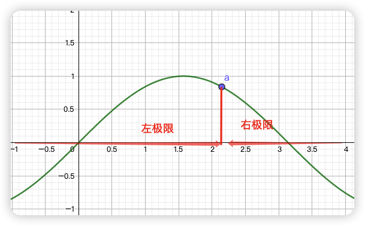
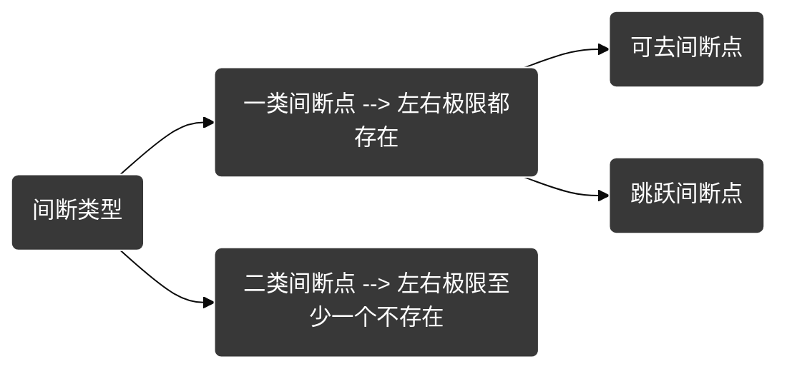
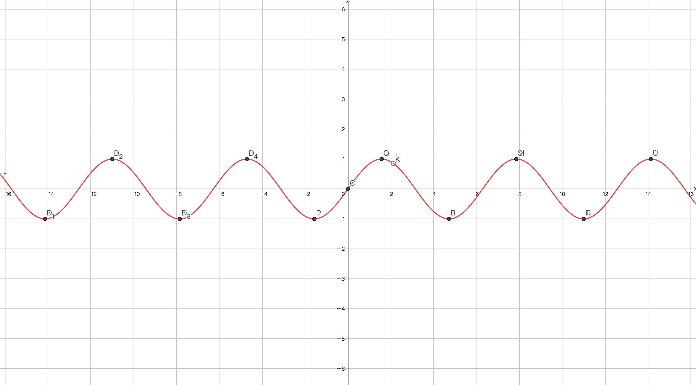
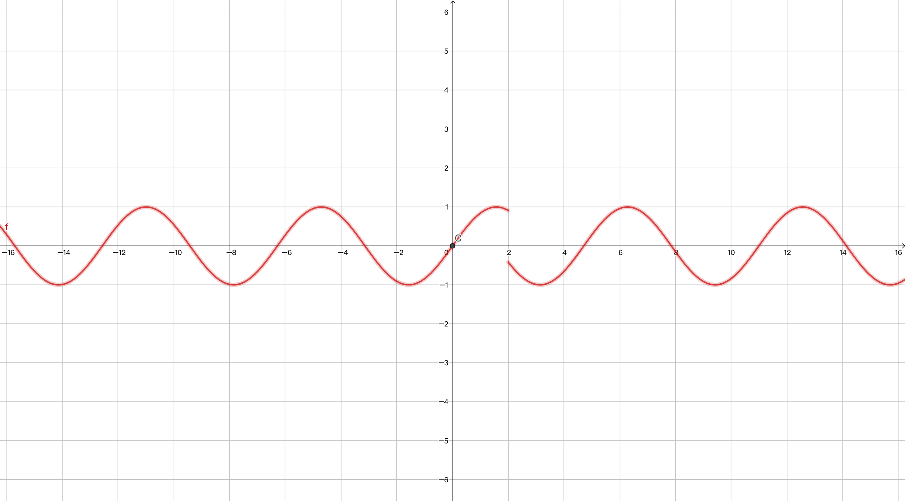
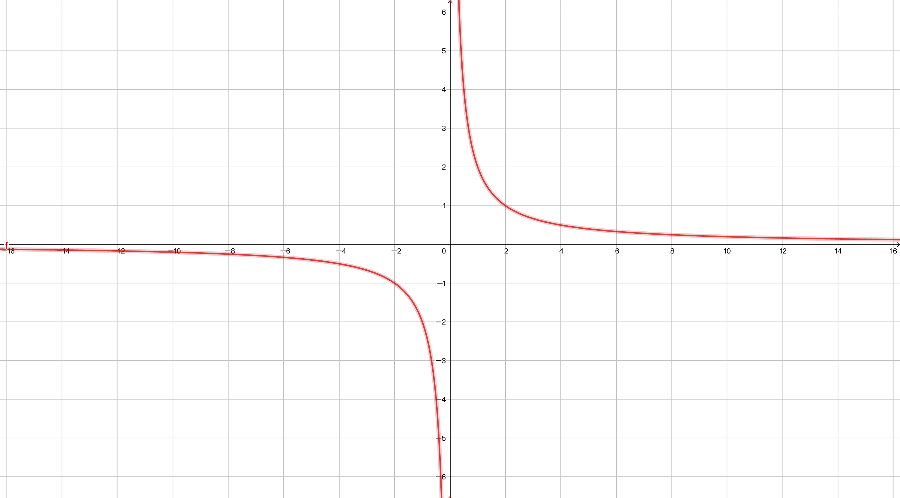
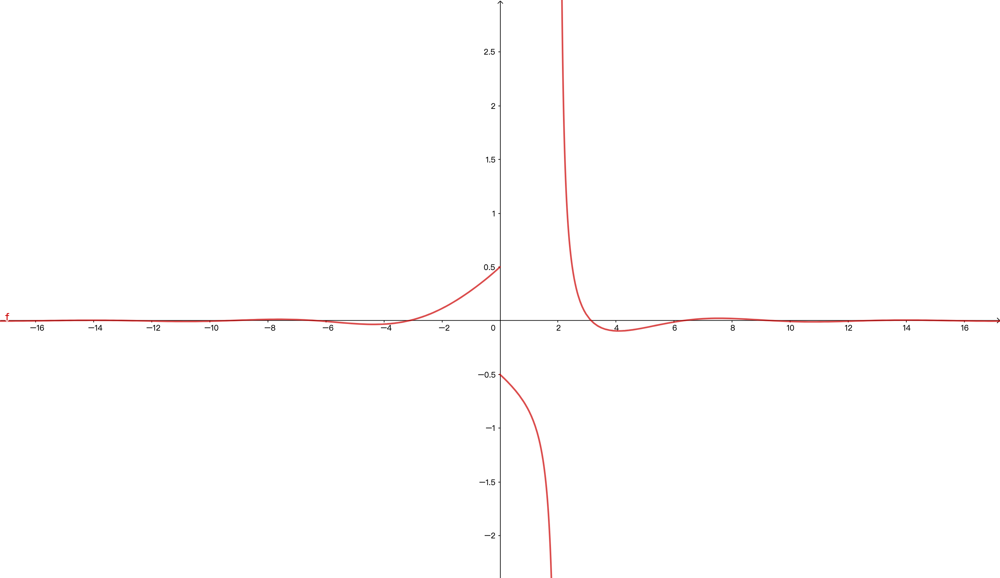
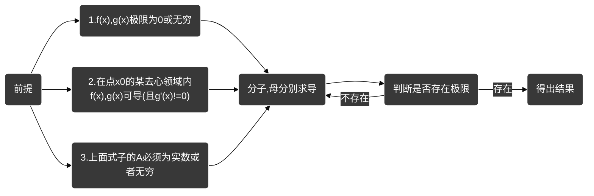
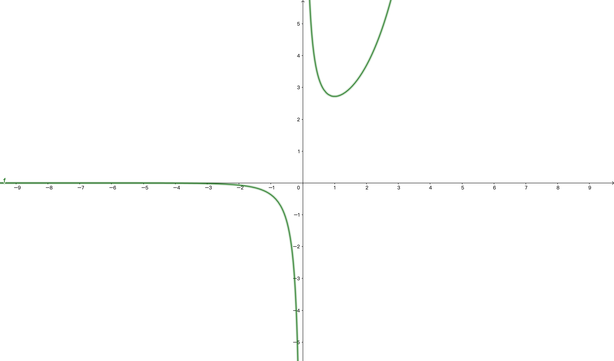
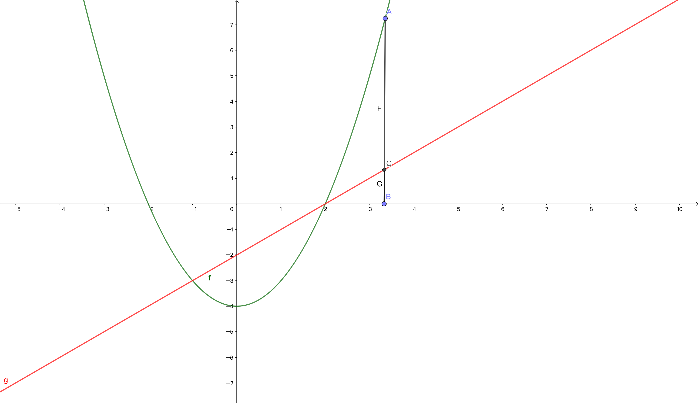
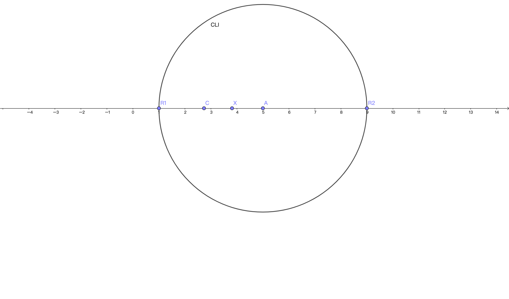

[toc]

# 函数与极限

## 判断是否同一函数

- 定义域相同
- 对应法则相同

## 极限

定义：存在数列 $\{y_0, \dots, y_n\} , n \rightarrow \infty$时

### 数列极限

> $exist =>  y_n \rightarrow A(A为常数)$

- 极限则为 $A$
- 称 ${y_n}$是收敛的
- 符号记为 $\lim\limits_{n\rightarrow\infty} y_n =A$

> $exist => \{y_n\}, y_n = \frac{1}{n}$

$\because \lim\limits_{n\rightarrow\infty}y_n= \lim\limits_{n\rightarrow\infty}\frac{1}{n}=0$

$\therefore n \rightarrow \infty , \frac{1}{n}$接近与 0

- 此时 $y_n$**收敛**

> $exist => \{y_n\} , y_n = \frac{n}{n+1}$

$\because  \lim\limits_{n\rightarrow\infty}y_n = \lim\limits_{n\rightarrow\infty} \frac{n}{n+1} = 1 .$

$\therefore n \rightarrow\infty , \frac{n}{n+1}$ 接近与 1

- 此时 $y_n$ **收敛**

> $exist => \{y_n\}, y_n = (-1)^n$

$\because \lim\limits_{n\rightarrow\infty}y_n = \lim\limits_{n\rightarrow\infty} (-1)^n  =>$此时不存在唯一一个常数（可为 1、-1）

- 此时 $y_n$ **发散**

 

### 函数极限

- 自变量接近无穷大的极限
- 自变量接近定点的极限

1. > $exist => \lim\limits_{x\rightarrow+\infty}\frac{1}{2^x}$, 求极限

$$
\begin{aligned}
&\because  x \rightarrow +\infty \\
&\therefore \frac{1}{2^x} \rightarrow 0 \\
&\therefore \lim\limits_{x\rightarrow+\infty} \frac{1}{2^x} = 0
\end{aligned}
$$

2. > $exist =>  \lim\limits_{x\rightarrow-\infty}2^x$,求极限

   $$
   \begin{aligned}
   & \because x \rightarrow-\infty  \\
   & \therefore 2^x = 0 \\
   & \therefore  \lim\limits_{x\rightarrow-\infty}2^x = 0
   \end{aligned}
   $$

3. > $exist => \lim\limits_{x\rightarrow\infty} \frac{1}{x^3}$,求极限

   $$
   \begin{aligned}
   & \because x \rightarrow +\infty \quad | \quad x \rightarrow-\infty\\
   & \therefore x \rightarrow+ \infty => \lim\limits_{x\rightarrow+\infty} \frac{1}{x^3} = 0\\
   & \therefore x \rightarrow -\infty =>\lim\limits_{x\rightarrow-\infty}\frac{1}{x^3} = 0 \\
   & \therefore \lim\limits_{x\rightarrow\infty}\frac{1}{x^3}  = 0
   \end{aligned}
   $$

4. > $exist => \lim\limits_{x\rightarrow\infty}2^x$求极限

$$
\begin{aligned}
& \because x\rightarrow+\infty \quad | \quad x \rightarrow-\infty \\
& \therefore x\rightarrow+\infty => \lim\limits_{x\rightarrow+\infty}2^x = +\infty\\
& \therefore x \rightarrow-\infty => \lim\limits_{x\rightarrow-\infty}2^x = 0 \\
&\therefore \lim\limits_{x\rightarrow\infty}2^x \quad no \quad exitst\\
\end{aligned}
$$

5. > $exist => \lim\limits_{x\rightarrow\infty}(1+\frac{1}{x})$
   
   $$
   \begin{aligned}
   & \because x\rightarrow+\infty \quad | \quad  x\rightarrow-\infty \\
   &  \therefore x\rightarrow+\infty => \lim\limits_{x\rightarrow+\infty}(1+\frac{1}{x})= 1\\
   &  \therefore x\rightarrow-\infty => \lim\limits_{x\rightarrow-\infty}(1+\frac{1}{x}) = 1\\
   &  \therefore \lim\limits_{x\rightarrow\infty}(1+\frac{1}{x}) = 1\\
   \end{aligned}
   $$

- $x \rightarrow x_0 时f(x)的极限, (此时x_0是常数, x是动点)$

  - $x\rightarrow x_0^-$ => 在 x 轴中 : x 位于`负侧`无限接近 $x_0$,此时 $x<x_0$
  - $x\rightarrow x_0^+$ => 在 x 轴中 : x 位于`正侧`无限接近 $x_0$,此时 $x>x_0$
  - $x\rightarrow x_0$ => 在 x 轴中 : $x$从点$x_0$的`两侧`无限接近 $x_0$
  - $x无限接近与x_0但永不会等于x_0$
     

- 左极限 : $f(x_0^-) =\lim\limits_{x\rightarrow x_0^-}f(x) = A$
- 右极限 : $f(x_0^+) =\lim\limits_{x\rightarrow x_0^+}f(x) = A$

> $exitst => x\rightarrow 1 , f(x) = 3x - 1的变化趋势$

$$
\begin{aligned}
& \because x\rightarrow 1 \\
& \therefore \lim\limits_{x\rightarrow 1} 3x - 1 = 2 \\
\end{aligned}
$$

> $exitst => x\rightarrow 1 , f(x)  = \frac{x^2 -1}{x-1} 的变化趋势$

$$
\begin{aligned}
& \because x\rightarrow 1 \\
& \therefore x \neq 1 \\
& f(x)  = \frac{x^2 -1}{x-1} = \frac{(x+1)(x-1)}{x-1}  = x+1 \\
& \therefore \lim\limits_{x\rightarrow 1} \frac{x^2 -1}{x-1} = 2 \\
&  \\
\end{aligned}
$$

> $exitst => f(x) = \begin{cases} x -2 , x \leq 0  \\ x+1 , x>0 \end{cases}, 求函数f(x) 在x=0 的极限$

$$
\begin{aligned}
& f(0^-) =  \lim\limits_{x\rightarrow 0^-} x-2  = -2 \\
& f(0^+) = \lim\limits_{x\rightarrow o^+} x+1 = 1  \\
& \because  f(0^-) \neq f(0^+) \\
& \therefore \lim\limits_{x\rightarrow 0}  no \quad exitst \\
\end{aligned}
$$

> $exitst => f(x)  = \begin{cases}  x^2, x<0 \\ x, x>0 \end{cases} , 求函数f(x)在 x \rightarrow 0 的极限$

$$
\begin{aligned}
& f(0^-) = \lim\limits_{x\rightarrow 0^-} x^2 = 0 \\
& f(0^+) = \lim\limits_{x\rightarrow 0^+}  x = 0 \\
& \because f(0^-)  = f(0^+) \\
& \therefore  \lim\limits_{x\rightarrow 0} f(x) = 0 \\
\end{aligned}
$$

#### 极限四则运算

- $\displaystyle{\lim{[f(x) \pm g(x)]} = \lim{f(x)} \pm \lim{g(x)} = A \pm B}$
- $\displaystyle{\lim{[f(x) \cdot g(x) ]}  =  \lim{f(x) } \cdot \lim{g(x) }= A \cdot B}$
- $\displaystyle{exitst => B \neq 0, \lim{ \frac{f(x) }{g(x) } = \frac{\lim{f(x)}}{\lim{g(x) }} = \frac{A}{B}}}$
- $\lim\limits_{x\rightarrow x_0} (a_0x^n+a_1x^{n-1}+ \dots + a_{n-1}x + a_n) =(a_0x^n+a_1x^{n-1}+ \dots + a_{n-1}x + a_n)$

> $求\lim\limits_{x\rightarrow 2} (2x^3 + x- 3)$

$$
\begin{aligned}
& \because x\rightarrow 2^-  \quad | \quad x \rightarrow 2^+ \\
& \lim\limits_{x\rightarrow 2} (2x^3 + x - 3) = 16+2-3 = 15 \\
\end{aligned}
$$

> $求\lim\limits_{x\rightarrow 1}\frac{(x^2-x-3)}{3x-1}$

$$
\begin{aligned}
& x\rightarrow 1^- \quad | \quad x\rightarrow 1^+ \\
& \lim\limits_{x\rightarrow 1} \frac{x^2-x-3}{3x-1}  = \frac{1-1-3}{3-1} = -\frac{3}{2}\\
\end{aligned}
$$

#### 极限值种类

|                  type                  |                   type                   |                  type                   |
| :------------------------------------: | :--------------------------------------: | :-------------------------------------: |
| $\displaystyle{\frac{c}{0} = \infty}$  | $\displaystyle{\frac{c}{0^-} = -\infty}$ | $\displaystyle{\frac{c}{0^+} =+\infty}$ |
| $\displaystyle{\frac{c}{\infty } = 0}$ | $\displaystyle{\frac{c}{-\infty } = 0}$  | $\displaystyle{\frac{c}{+\infty } = 0}$ |

 

> $求\lim\limits_{x\rightarrow 1} \frac{(x^2-x+2)}{x-1}$

$$
\begin{aligned}
& \because x\rightarrow 1^- \quad | \quad x\rightarrow 1^+ \\
& \therefore x \neq 1 \\
& \therefore \lim\limits_{x\rightarrow 1} \frac{x^2-x+2}{x-1}  = \frac{1-1+2}{1-1} \\
& \therefore "\frac{2}{0}" => \infty  \\
\end{aligned}
$$

#### 复合函数极限

- 当极限表达式过臃肿时，采用变量替换的形式简化式子
- 比如$:u= \phi (x_0) , 则\lim\limits_{x\rightarrow x_0} f(\phi(x)) = \lim\limits_{u\rightarrow u_0} f(u)$

> $exitst => \lim\limits_{x\rightarrow 1} (2x+1)^{10}$

$$
\begin{aligned}
& set \quad u = 2x+1 \\
& \because x\rightarrow 1 => 2x+1 = 3 \\
& \therefore u = 3 \\
&  \therefore \lim\limits_{u\rightarrow 3} u^{10} = 3^{10}\\
\end{aligned}
$$

> $求\lim\limits_{x\rightarrow 0} \frac{\sqrt{1-x} - 1}{x}$

$$
\begin{aligned}
& \because x\rightarrow 0 \\
& \therefore x \neq 0 \\
& \lim\limits_{x\rightarrow 0} \frac{\sqrt{1-x} -1}{x} = \lim\limits_{x\rightarrow 0} \frac{(\sqrt{1-x}-1)(\sqrt{1-x}+1)}{x \cdot (\sqrt{1-x}+1)} \\
& = \lim\limits_{x\rightarrow 0}\frac{-x}{x \cdot (\sqrt{1-x}+1)}  = \lim\limits_{x\rightarrow 0} -\frac{1}{\sqrt{1-x}+1} \\
& \therefore  \lim\limits_{x\rightarrow 0} -\frac{1}{\sqrt{1-x}+1} = -\frac{1}{2} \\
\end{aligned}
$$

#### 无穷极限运算-> `除法`

- $\lim\limits_{x\rightarrow \infty} \frac{a_nx^n+a_{n-1}x^{n-1}+\dots +a_0}{b_nx^m+b_{m-1}x^{m-1}+\dots +b_0} = \lim\limits_{x\rightarrow \infty} \frac{a_nx^n}{b_mx^m}$ ==> （原理：极限中抓大放小）
- 例如:$\frac{100-2}{10000+2} \approx \frac{100}{10000} \approx 0.01$

 

> $求\lim\limits_{x\rightarrow \infty} \frac{3x^2-x-3}{x^2 -1}$

$$
\begin{aligned}
& \because x\rightarrow -\infty  \quad | \quad x \rightarrow +\infty \\
& \lim\limits_{x\rightarrow \infty} \frac{3x^2-x-3}{x^2-1} = \lim\limits_{x\rightarrow \infty} \frac{3x^2}{x^2} = 3  \\
\end{aligned}
$$

> $求\lim\limits_{x\rightarrow \infty} \frac{x^2-5x+2}{x^3+3x-1}$

$$
\begin{aligned}
& \because x\rightarrow -\infty  \quad | \quad x\rightarrow +\infty  \\
& \lim\limits_{x\rightarrow \infty} \frac{x^2-5x+2}{x^3+3x-1} = \lim\limits_{x\rightarrow \infty} \frac{x^2}{x^3}  = 0\\
\end{aligned}
$$

#### 无穷极限运算-> `减法`

- 先通分形成$\frac{0}{0}$或$\frac{\infty }{\infty }$

 

> $求\lim\limits_{x\rightarrow 1} (\frac{2}{x^2-1} - \frac{1}{x-1})$

$$
\begin{aligned}
& \frac{2}{x^2-1} - \frac{1}{x-1}  = \frac{2(x-1)}{(x^2-1)(x-1)} - \frac{x^2-1}{(x^2-1)(x-1)}\\
& set \quad u = (x^2-1)(x-1) \\
& \therefore \frac{2x-2-x^2+1}{u} = \frac{-(x^2-2x+1)}{u} = \frac{-(x-1)^2}{u} \\
& \therefore \frac{-(x-1)}{x^2-1}  = -\frac{1}{x+1} = -\frac{1}{2} \\
\end{aligned}
$$

> $求\lim\limits_{x\rightarrow 1} \frac{x^2-1}{2x^2-x-1}$

$$
\begin{aligned}
& \frac{x^2-1}{2x^2-x-1} = \frac{(x+1)(x-1)}{(2x+1)(x-1)} = \frac{x+1}{2x+1}\\
& \because x\rightarrow 1 \\
& \therefore = \frac{2}{3}
\end{aligned}
$$

> $求\lim\limits_{x\rightarrow 9} \frac{x-9}{\sqrt{x}-3}$

$$
\begin{aligned}
& \frac{x-9}{\sqrt{x}-3}  = \frac{(x-9)( \sqrt{x}+3 )}{x-9} = \sqrt{x}+3 \\
&  \because x\rightarrow 9\\
&  \therefore =6\\
\end{aligned}
$$

> $求\lim\limits_{x\rightarrow \infty } \frac{5x^2-x-3}{2x^2-3x-1}$

$$
\begin{aligned}
& \because x\rightarrow \infty  \\
& \therefore \lim\limits_{x\rightarrow \infty} \frac{5x^2-x-3}{2x^2-3x-1} = \lim\limits_{x\rightarrow \infty} \frac{5x^2}{2x^2} = \frac{5}{2} \\
\end{aligned}
$$

 $结论:$ 

> $exitst => f(x) = \frac{x}{x+1}$

 置于 f(x) 无穷大时=>使分子不为 0, 分母为 0

置于 f(x) 无穷小时=>使分子为 0, 分母不为 0

 

#### 无穷小高、低、同、等阶

- 引用 👆 表格

| type                    | type                      | type                     |
| ----------------------- | ------------------------- | ------------------------ |
| $\frac{c}{0} = \infty$  | $\frac{c}{0^-} = -\infty$ | $\frac{c}{0^+} =+\infty$ |
| $\frac{c}{\infty } = 0$ | $\frac{c}{-\infty } = 0$  | $\frac{c}{+\infty } = 0$ |

 

> $exitst => \alpha , \beta$是同一过程中的两个无穷小, 且$\alpha \neq 0$

- $if => \lim\frac{\beta}{\alpha} = 0 , 则称\beta 是比\alpha 高阶的无穷小, 记为\beta  = o(\alpha )$
  - 理解:$\beta$ 和$\alpha$ 都在趋向 0 但$\beta$ 更快
- $if => \lim \frac{\beta}{\alpha } = C(C\neq 0) , 则称\beta 与\alpha 是同阶的无穷小$
  - 理解:$\beta$ 和$\alpha$ 都在趋向 0 时它们的比值为常数且不为 0 或无穷大则表示为同阶
- $if => \lim\frac{\beta}{\alpha} = 1 , 则称\beta 与\alpha 是等阶的无穷小, 记为\alpha$~$\beta$

  - 理解:$\beta$ 和$\alpha$ 趋向 0 的距离一样

- $if => \lim\frac{\beta}{x^k} = C , 则称\beta 是x的k阶无穷小$

- $if => \lim \frac{\beta}{\alpha} = \infty , 则称\beta 是\alpha 的低阶的无穷小$

#### 常用等阶无穷小

$$lim \frac{\beta }{\alpha } =1$$

等阶无穷小含义:

$exitst => x \rightarrow 0, \lim\frac{\beta}{\alpha} =1 => \beta  = \alpha + o(\alpha )$

>$as => 1-cosx  = \frac{1}{2}x^2 + o(x^2)$

**小技巧 🌟:**

$exitst => x\rightarrow 0$

- $tanx > arcsinx > x > sinx > arctanx$

- $tanx = x + \frac{1}{3}x^3 + o(x^3) , \quad 由反函数关于"y=x"对称得出=>\quad arctanx = x-\frac{1}{3}x^3 + o(x^3)$

- $sinx = x - \frac{1}{6}x^3 + o(x^3) , \quad 反函数=> \quad arcsinx = x + \frac{1}{6}x^3 + o(x^3)$

- 在极限中 a~b , b~y => a~y

- 只在乘除极限运算中可用$o(\beta)$替换

- 乘除外的极限运算可用上面技巧式子替换

- 通过"抓大放小"原则=>$\lim{\frac{A+o(A)}{B+o(B)} = \lim{\frac{A}{B}}}$

 

> $exitst => x \rightarrow 0 :$

|       after       |        sym         |                                befor                                 |
| :---------------: | :----------------: | :------------------------------------------------------------------: |
|      $sinx$       |         ~x         |           $\lim\limits_{x\rightarrow 0}\frac{x}{sinx} =1$            |
|     $arcsinx$     |         ~x         |         $\lim\limits_{x\rightarrow 0}\frac{x}{arcsinx} = 1$          |
|      $tanx$       |         ~x         |          $\lim\limits_{x\rightarrow 0}\frac{x}{tanx} =  1$           |
|     $arctanx$     |         ~x         |         $\lim\limits_{x\rightarrow 0}\frac{x}{arctanx} = 1$          |
|   $\ln{(1+x)}$    |         ~x         |        $\lim\limits_{x\rightarrow 0}\frac{x}{\ln{(1+x)}} = 1$        |
|     $e^x - 1$     |         ~x         |          $\lim\limits_{x\rightarrow 0}\frac{x}{e^x -1} =1$           |
|    $1 - cosx$     | ~ $\frac{1}{2}x^2$ |  $\lim\limits_{x\rightarrow 0}\frac{(\frac{1}{2}x^2)}{1-cosx} = 1$   |
| $\sqrt{1+x} - 1$  |  ~$\frac{1}{2}x$   | $\lim\limits_{x\rightarrow 0}\frac{\frac{1}{2}x^2}{\sqrt{1+x}-1} =1$ |
| $(1+x)^\alpha -1$ |       ~$ax$        |        $\lim\limits_{x\rightarrow 0}\frac{ax}{(1+x)^a -1}=1$         |

> $exitst => x \rightarrow \infty  :$

|                                after                                |         sym          |
| :-----------------------------------------------------------------: | :------------------: |
| $\displaystyle{\lim\limits_{x\rightarrow \infty}(1+\frac{k}{x})^x}$ | $\displaystyle{e^k}$ |

 

> $求\lim\limits_{x\rightarrow 0}\frac{tanx - sinx}{x^3}$

解法一：

$$
\begin{aligned}
& \because  tanx-sinx = (\frac{sinx}{cosx})-sinx = \frac{sinx-(sinx \cdot cosx)}{cosx} = \frac{sinx(1-cosx)}{cosx}\\
& = tanx \cdot (1-cosx) = [x+o(x)] \cdot [\frac{1}{2}x^2 + o(x)] \\
& \because x\rightarrow 0\\
& \therefore \lim\limits_{x\rightarrow 0}\frac{tanx-sinx}{x^3} = \lim\limits_{x\rightarrow 0}\frac{\frac{1}{2}x^3}{x^3} = \frac{1}{2} \\
\end{aligned}
$$

解法二(小技巧 🌟):

$$
\begin{aligned}
& \because x\rightarrow 0 \\
& tanx - sinx = [x+\frac{1}{3}x^3+o(x^3)]  - [x-\frac{1}{6}x^3 + o(x^3)]\\
&  = \frac{1}{3}x^3 + \frac{1}{6}x^3  = \frac{1}{2}x^3\\
&  \lim\limits_{x\rightarrow 0}\frac{tanx - sinx}{x^3} = \frac{\frac{1}{2}x^3}{x^3} = \frac{1}{2}\\
\end{aligned}
$$

> $\displaystyle{求 \lim\limits_{x\rightarrow 0}\frac{tan^22x}{1-cosx}}$

$$
\begin{aligned}
& \because x\rightarrow 0 \\
& \therefore tan 2x \iff tanx\\
& \because 等阶中 tanx = x \\
& \therefore  tan 2x = 2x \\
& \therefore \lim\limits_{x\rightarrow 0}\frac{4x^2}{\frac{1}{2}x^2} = 8 \\
\end{aligned}
$$

> $\displaystyle{求\lim\limits_{x\rightarrow \infty}x^2\ln{(1+\frac{2}{x^3})}}$

$$
\begin{aligned}
& \because x\rightarrow \infty \\
& \therefore \frac{2}{x^3}\rightarrow 0\\
&  \therefore 等阶中\ln(1+\frac{2}{x^3})=  \frac{2}{x^3}\\
&  \therefore \lim\limits_{x\rightarrow \infty}x^2\ln{(1 + \frac{2}{x^3})} = \lim\limits_{x\rightarrow \infty}\frac{2}{x} = 0\\
\end{aligned}
$$

> $\displaystyle{求\lim\limits_{x\rightarrow 0}\frac{\ln{\sqrt{1+x}+2sinx}}{tanx}}$

$$
\begin{aligned}
& \because \frac{\ln{\sqrt{ 1+x}}+2sinx}{tanx} = \frac{\ln{\sqrt{1+x} }}{tanx} + \frac{2sinx}{tanx} \\
& \ln{\sqrt{1+x} } = \ln{(1+x)^{\frac{1}{2}}} = \frac{1}{2}\ln{(1+x)} \\
& \therefore  \frac{\frac{1}{2}\ln{(1+x)}}{tanx}+ \frac{2sinx}{tanx}\\
& \because x\rightarrow 0 \\
& \therefore 等阶中\lim\limits_{x\rightarrow 0}(\frac{\frac{1}{2}\ln{(1+x)}}{tanx} + \frac{2sinx}{tanx}) = \lim\limits_{x\rightarrow 0}(\frac{\frac{1}{2}x}{x}+\frac{2x}{x})  =  \frac{5}{2} = 2 \frac{1}{2}\\
\end{aligned}
$$

> $\displaystyle{求\lim\limits_{x\rightarrow 0}\frac{tan5x-cosx+1}{ sin 3x}}$

解法一:

$$
\begin{aligned}
& \because  tan5x -cosx + 1 = tan 5x + 1- cosx \\
& \therefore \frac{tan 5x}{sin 3x} + \frac{1-conx}{sin 3x} \\
& \because x\rightarrow 0 \\
& \therefore 等阶中 tan 5x = 5x , sin 3x = 3x , 1-conx = \frac{1}{2}x^2 \\
& \therefore \lim\limits_{x\rightarrow 0}(\frac{tan 5x}{sin 3x} + \frac{1-conx}{sin 3x}) = \lim\limits_{x\rightarrow 0}\frac{5}{3}  + \lim\limits_{x\rightarrow 0} \frac{\frac{1}{2}x^2}{3x} \\
& \because \lim\limits_{x\rightarrow 0}\frac{5}{3} =\frac{5}{3} , \quad \lim\limits_{x\rightarrow 0}\frac{x^2}{6x} = 0  \\
&\therefore = \frac{5}{3}
\end{aligned}
$$

解法二(小技巧 🌟):

$$
\begin{aligned}
& 根据解法一可得如下式子:  \\
&根据\lim{\frac{A+o(A)}{B+o(B)} = \lim{\frac{A}{B}}} 可得\\
& 原式 = \lim\limits_{x\rightarrow 0} \frac{5x+o(x) + \frac{1}{2} x^2 + o(x^2)}{3x + o(x)}  = \lim\limits_{x\rightarrow 0}\frac{5x}{3x} =  \frac{5}{3}\\
\end{aligned}
$$

 

> $exitst=>ae^x+bx-1是x的二阶无穷小, 求a、b?$

- 引用 👆 定义:
  - > $if => \lim\frac{\beta}{x^k} = C ,则称\beta 是x的k阶无穷小$
  - 可得出式子如下:
    $$
    \begin{aligned}
    & \lim\limits_{x\rightarrow 0}\frac{ae^2+bx-1}{x^2} = C(C\neq 0) \\
    & \therefore x^2 \neq \infty  \\
    & \because x\rightarrow 0 , and \quad C为一个常数\\
    & \therefore ae^2 + bx - 1 \rightarrow 0 \\
    & \therefore ae^2 = 1 => a= 1 \\
    & \\
    & 洛\lim\limits_{x\rightarrow 0}\frac{e^x+bx}{2x} \\
    & \because x\rightarrow 0, \quad e^x + bx \rightarrow 0 \\
    & \therefore b = -1
    \end{aligned}
    $$

 $结论:$ 

> $exitst => x \rightarrow 0$

- 引用 👆 定义:
  - > $\ln{(1+x)}$~x$\iff\lim\limits_{x\rightarrow 0}\frac{x}{\ln{(1+x)}} = 1$
  - > $e^x - 1$~x$\iff \lim\limits_{x\rightarrow 0}\frac{x}{e^x -1} =1$
    > 可得如下:

$e^x -1 -x$ ~ $\frac{1}{2}x^2$

$x-\ln{(1+x)}$ ~ $\frac{1}{2}x^2$

#### 抓大放小原则

'>>' : 表示远大于

- $if => \lim{\frac{A}{B}} = \infty => A >>B , 则在极限运算中可使用(A+B)=>A进行代替式子运算$
- $if => \lim{A} = \lim{B} = \infty 且\lim{\frac{A}{B}}, 则A和B等阶无穷大(无穷大运算和无穷小运算相同)$
- 极限变化速度: 指数函数 >> 幂函数 >> 对数函数, 如 $99^x >> x^{99} >> \ln{99}$

> $求\lim\limits_{x\rightarrow +\infty}\frac{x^2+\sqrt{x+\ln{x}}}{e^{\sqrt{x}}-x^2}$

$$
\begin{aligned}
& set \quad \sqrt{x}  = t , x = t^2 \\
& \because \sqrt{\ln{x}}  = \sqrt{ln{t^2}} = \sqrt{2lnt}    \\
& \therefore \lim\limits_{x\rightarrow +\infty } \frac{x^2+ \sqrt{x+\ln{x}} }{e^{\sqrt{x} }-x^2} = \frac{t^4 + \sqrt{t^2+2\ln{t}}}{e^t -t^4} \\
& \because x\rightarrow +\infty  \\
& \therefore t\rightarrow +\infty  \\
& \therefore 根据速度变化原则 e^t >> t^4 \rightarrow +\infty , \quad t^4 >> \sqrt{t^2 + 2\ln{t}} -> +\infty  \\
& \therefore end = \lim\limits_{x\rightarrow +\infty } \frac{t^4}{e^t} = 0 \\
\end{aligned}
$$

> $求\lim\limits_{x\rightarrow +\infty }\frac{\ln{x+100}}{\sqrt{x} }$

$$
\begin{aligned}
& = \lim\limits_{x\rightarrow +\infty }\frac{\ln{x + 100}}{\sqrt{x} } = \lim\limits_{x\rightarrow +\infty }\frac{\ln{x}}{\sqrt{x} } \\
& \because x\rightarrow +\infty  \\
& \because \sqrt{x}  >> \ln{x}\\
& \therefore lim = 0
\end{aligned}
$$

> $求\lim\limits_{x\rightarrow 0}x^\alpha  \cdot{\ln{x}}(\alpha > 0)$

$$
\begin{aligned}
& \because x\rightarrow 0 \\
& \therefore x^\alpha \rightarrow 0  \\
& \therefore \ln{x} \rightarrow -\infty  \\
& \because x^\alpha  >> \ln{x} \\
& \therefore lim = 0
\end{aligned}
$$

> $求\lim\limits_{x\rightarrow -\infty }e^x \cdot{\ln{(-x)}}$

$$
\begin{aligned}
& \because x\rightarrow -\infty \\
& \therefore e^x \rightarrow 0 \\
& \therefore \ln{(-x)} \rightarrow +\infty  \\
& \because e^x >> \ln{(-x)} \\
& \therefore lim = 0 \\
\end{aligned}
$$

> $求\lim\limits_{x\rightarrow +\infty }\frac{\ln{(x+e^x)}+cos x}{x-arctanx \cdot \ln{x}}$

$$
\begin{aligned}
& \because x\rightarrow +\infty  \\
& \ln{(x+e^x)} + cosx => \ln{(x+e^x)} \rightarrow \infty  \\
& \because x 不是趋于0, 它不属于等阶无穷小 , 那么可以直接在减法后面替换值\\
& \therefore arctanx = \frac{\pi}{2} \\
&  \therefore x-arctancx \cdot{\ln{x}} = x - \frac{\pi}{2} \cdot{\ln{x}} \\
& \therefore = \lim\limits_{x\rightarrow +\infty }\frac{ln(x+e^x)}{x} = 洛\lim\limits_{x\rightarrow +\infty }\frac{1+e^x}{x+e^x} = 1\\
\end{aligned}
$$

#### 重要极限

:one:
$$\textcolor{red}{\lim\limits_{x\rightarrow 0}\frac{sinx}{x}= 1}$$

> $求 \lim\limits_{x\rightarrow 2} \frac{sin(x^2-4)}{x-2}$

$$
\begin{aligned}
& \because x\rightarrow 2 , x^2 - 4 \rightarrow  0 \\
& \therefore sin(x^2 -  4)  =  x^2 - 4 + o(x) \\
& \therefore 等阶无穷小中 \lim\limits_{x\rightarrow 2}\frac{x^2-4}{x-2} \\
&  = \lim\limits_{x\rightarrow 2}\frac{x^2-4}{x- 2} = \lim\limits_{x\rightarrow 2}x+2  =  4\\
\end{aligned}
$$

:two:

$$\textcolor{red}{\lim\limits_{x\rightarrow \infty}(1+\frac{1}{x})^x = e}$$

> $求\lim\limits_{x\rightarrow \infty}(1-\frac{1}{x})^x$

$$
\begin{aligned}
& \because x\rightarrow \infty  \\
& \therefore (1-\frac{1}{x})^x = [1+(-\frac{1}{x})]^{-x \cdot -1} = e^{-1} \\
\end{aligned}
$$

> $求\lim\limits_{x\rightarrow \infty}(1+\frac{3}{x})^{2x}$

$$
\begin{aligned}
& \because x\rightarrow \infty  \\
& \therefore (1+\frac{3}{x})^{2x} = (1+\frac{3}{x})^{\frac{x}{3} \cdot 6} = \{(1+\frac{3}{x})^{\frac{x}{3}}\}^6  = e^6\\
\end{aligned}
$$

> $求\lim\limits_{x\rightarrow \infty}(\frac{x+3}{x-1})^x$

$$
\begin{aligned}
& \because x\rightarrow \infty  \\
& (\frac{x+3}{x-1})^x = (\frac{x-1}{x-1} + \frac{4}{x-1})^x = (1+\frac{4}{x-1})^x\\
& =(1+\frac{4}{x-1})^{\frac{x-1}{4} \cdot \frac{4x}{x-1}} \\
& = e^{\lim\limits_{x\rightarrow \infty}\frac{4x}{x-1}}  = e^4\\
\end{aligned}
$$

------------------------ 不理解"x -> 0"------------------------

> $求\lim\limits_{x\rightarrow 0}(1+tanx)^{2 cot x}$

$$
\begin{aligned}
& \because x\rightarrow 0 \\
& \therefore (1+tanx)^{2cotx} = (1+tanx)^{\frac{1}{tanx} \cdot \frac{tanx}{1} \cdot 2cotx} = e^{\lim\limits_{x\rightarrow 0}tanx \cdot 2cot x}  = e^2\\
\end{aligned}
$$

## 

 
 

> $求\lim\limits_{x\rightarrow \infty}(1-\frac{3}{x})^x$

$$
\begin{aligned}
& \because x\rightarrow \infty  \\
& \therefore (1-\frac{3}{x})^x = (1+(-\frac{3}{x}))^{-\frac{x}{3}\cdot -\frac{3}{x} \cdot x} = e^{-3} = \frac{1}{e^3} \\
\end{aligned}
$$

> $求\lim\limits_{x\rightarrow 0}(1+2x)^{\frac{1}{x}}$

$$
\begin{aligned}
& \because x\rightarrow 0 \\
& (1+2x)^{\frac{1}{x}} = (1+2x)^{\frac{1}{2x} \cdot \frac{2x}{1} \cdot \frac{1}{x}} = e^2 \\
\end{aligned}
$$

### 夹逼原则

对于数列$\{a_n\}, \{X_n\}, \{Y_n\}$ => 满足$X_n \leq a_n \leq Y_n$
$, \quad and \quad \lim\limits_{n\rightarrow \infty}X_n = \lim\limits_{n\rightarrow \infty}Y_n = A$

则$\lim\limits_{n\rightarrow \infty}a_n =A$

**小技巧**🌟:

1. 将数列写为$\sum$形式

2. 放缩分母使得每一项分母相同

3. 抓大放小原则同样适用

 

> $求\lim\limits_{n\rightarrow \infty}\frac{1}{\sqrt{n^2+1}} + \frac{1}{\sqrt{n^2 + 2}} + \dots + \frac{1}{\sqrt{n^2+n}}$

$$
\begin{aligned}
& set \quad a_n = \sum_{i=1}^n \frac{1}{\sqrt{n^2 + i}} (a_n 表示数列的第n个)\\
& set \quad X_n(Min) = \sum_{i=1}^n \frac{1}{\sqrt{n^2+n} } = \frac{n}{\sqrt{n^2+n} } \\
& set \quad Y_n(Max) = \sum_{i=1}^n \frac{1}{\sqrt{n^2 + 1} } = \frac{n}{\sqrt{n^2 + 1} }  \\
& \because n\rightarrow \infty  \\
& \therefore  X_n \leq a_n \leq Y_n \\
& \because \lim\limits_{n\rightarrow \infty}\frac{n}{\sqrt{n^2 + n}} = \lim\limits_{n\rightarrow \infty}\frac{n}{\sqrt{n^2+1} } = 1 \\
& \therefore \begin{cases} &X_n \leq a_n \leq Y_n \\ &\lim\limits_{n\rightarrow \infty}X_n = \lim\limits_{n\rightarrow \infty}Y_n = 1 \\ \end{cases} => \lim\limits_{n\rightarrow \infty}a_n = 1
\end{aligned}
$$

> $求\lim\limits_{n\rightarrow \infty}\frac{1+\frac{1}{n}}{n^2+n+1} + \frac{2+\frac{2}{n}}{n^2+n+2} + \dots + \frac{n+\frac{n}{n}}{n^2+n+n}$

$$
\begin{aligned}
& set \quad a_n = \sum_{i=1}^n \frac{i+\frac{i}{n}}{n^2+n+i} \\
& set \quad X_n(Min) = \sum_{i=1}^n \frac{i+\frac{1}{n}}{n^2+n+n} = \frac{(1+2+\dots +n)+(\frac{1}{n} \cdot n)}{n^2+2n} = \frac{\frac{n(n+1)}{2}+1}{n^2+2n}\\
& 解释=>\because X_n取最小=>\frac{min}{max},\\
&\therefore n^2+n+i ==最大==> n^2 + n +n\\
&\therefore i + \frac{i}{n} ==最小==> 根据抓大放小原则=> i不能改变 \frac{i}{n}可以变\therefore i + \frac{i}{n} => i + \frac{1}{n}\\
& =\frac{n(n+1)}{n^2 \cdot 2} = \frac{n+1}{2n} = \frac{n}{2n} = \frac{1}{2}\\
& set \quad Y_n(Max) = \sum_{i=1}^n \frac{i+\frac{n}{n} \cdot n}{n^2+n+1} = \frac{(1+2+\dots+n)+n}{n^2+n+1} = \frac{\frac{n(n+1)}{2}+n}{n^2+n+1}\\
& = \frac{n(n+1)}{n^2 \cdot 2} = \frac{n+1}{2n} = \frac{1}{2}\\
& \therefore X_n \leq a_n \leq Y_n \\
& \because \lim\limits_{x\rightarrow \infty}X_n = \lim\limits_{x\rightarrow \infty}Y_n = \frac{1}{2} \\
& \therefore \lim\limits_{x\rightarrow \infty}a_n = \frac{1}{2}
\end{aligned}
$$

$注! \quad  \frac{n(n+1)}{2} = (1+2+\dots+n)推导过程如下:$

$$
\begin{aligned}
&set \quad n =  \{1+2+3+4+\dots +98 +99\}  \\
& set \quad n' = \{99+98+97+96+\dots+2+1\} \\
& n = n \cdot 2 \div 2 = (n+n') \div 2 \\
& (n+n') \div 2 = \{100+100+100+100+\dots+100+100\} \div 2 = 99\cdot 100\div2\\
& \frac{9900}{2} = \frac{10000}{2} - \frac{100}{2}  = 5000-50 = 4950
\end{aligned}
$$

 

##### 单调有界定理

对于数列$\{a_n\}$满足：单调递减（增）且有下（上）界，则 $\lim\limits_{n\rightarrow \infty}a_n$ 存在

**小技巧**🌟:

- $a_1$为常数时，采用 `数学归纳法`

- $a_1$为范围值时，采用 `均值不等式` 确定 `上\下界` ，采用 `作差法、作除法` 确定 `单调性`

> $exitst => \{x_n\} , x_1 = 10 , x_n = \sqrt{6+x_{n-1}} , n=1, 2, \dots, 证明\lim\limits_{n\rightarrow \infty}x_n存在, 并求极限值$

$$
\begin{aligned}
& \because x_1 = 10 , x_2 = 4 \\
& \therefore 假设  , x_{n-1} > x_n\\
&  \because x_{n+1} = \sqrt{6 + x_n} , \quad   x_n = \sqrt{6 + x_{n-1}}  \\
& \sqrt{6+x_n} < \sqrt{6+x_{n-1}}   \\
& \therefore  \{x_n\}为单调递减\\
& \because xn = \sqrt{6+x_{n-1}} > 0  \\
& \therefore 确定了单调性和界值, 则\lim\limits_{n\rightarrow \infty}x_n 存在极值 \\
& \because n\rightarrow \infty  \\
& \therefore \lim\limits_{n\rightarrow \infty}x_n = \lim\limits_{x\rightarrow \infty}x_{n-1}  \\
&\therefore  \sqrt{6 + t} = t => t=-2 \quad or \quad t = 3\\
& \because 数列界值为0  \\
& \therefore t \neq 0 \\
& \therefore \lim\limits_{n\rightarrow \infty}x_n = 3
\end{aligned}
$$

常用均值不等式有:
sym | sym
:-----------------------------:|:--:
$a+b\geq 2\sqrt{ab}$ | $a^2 + b^2 \geq 2ab$
$\sqrt{ab} \leq \frac{a+b}{2}$ | $ab \leq (\frac{a+b}{2})^2$

------------------------ 需要二次理解 --------------------

> $exitst => \{x_n\} , 0< x_1 < 3 , x_{n+1} = \sqrt{x_n(3-x_n)}, n =, 1, 2, \dots, 证明\lim\limits_{n\rightarrow \infty}x_n存在, 并求极限值$

$$
\begin{aligned}
& 根据上述常用不等式可得:\sqrt{x_n(3-x_n)} \leq \frac{x_n + 3-x_n}{2} \leq \frac{3}{2} \\
& \therefore x_{n+1}存在上界\\
& \therefore x_n \leq \frac{3}{2}(n=2, 3, \dots) \\
& \frac{x_{n+1}}{x_n}  = \frac{\sqrt{x_n(3-x_n)}}{x_n} = \sqrt{\frac{3-x_n}{x_n}}  = \sqrt{\frac{3}{x_n} - 1}  \\
& \because x_n \leq \frac{3}{2} => \frac{1}{x_n } \geq \frac{2}{3}  => \frac{3}{x_n} \geq 2\\
& \therefore \frac{x_{n+1}}{x_n}\geq 1 , 得出该数列从第二项(n=2, 3, \dots)开始单调递增\\
& \because 数列存在单调递增 \\
& \therefore \lim\limits_{n\rightarrow \infty}x_n 存在 \\
& set \quad \lim\limits_{n\rightarrow \infty}x_n  = A , x_{n+1} = \sqrt{x_n (3-x_n )}  => A = \sqrt{A(3-A)} => A=\frac{3}{2} \quad or \quad 0 \\
& \because 数列存在单调递增 \\
& \therefore \lim\limits_{n\rightarrow \infty} x_n  = \frac{3}{2}
\end{aligned}
$$

## 

> $exitst \{x_n \} , x_{n+1} = \frac{1}{2}(x_n + \frac{1}{x_n }), x_1 > 0 , (n=1, 2, 3, \dots), 证明\lim\limits_{n\rightarrow \infty}x_n 存在, 并求极限$

$$
\begin{aligned}
& 根据上述常用不等式可得:\frac{1}{2}(x_n + \frac{1}{x_n }) => \frac{x_n }{2} + \frac{1}{2x_n } \geq 2\sqrt{\frac{1}{4}} \\
& \therefore \frac{1}{2}(x_n +\frac{1}{x_n })  \geq 1, 则x_{n+1}存在下界\\
& \therefore x_n \geq 1(n=2, 3, 4, \dots) \\
& \frac{x_{n+1}}{x_n } = \frac{\frac{1}{2}(x_n + \frac{1}{x_n })}{x_n }=\frac{x_n +\frac{1}{x_n }}{2x_n } = \frac{1}{2} + \frac{1}{2x_n ^2} \\
&\because x_n \geq 1 , \frac{x_n +1}{x_n } = \frac{1}{2}+ \frac{1}{2x_n ^2} \\
&\therefore \frac{x_n +1}{x_n }\leq 1\quad 得出数列在n(2, 3, 4\dots)出单调递减\\
&\therefore \lim\limits_{n\rightarrow \infty}x_n 存在 \\
&set \quad \lim\limits_{n\rightarrow \infty}x_n = \lim\limits_{n\rightarrow \infty}x_{n+1} = A \\
& \therefore \lim\limits_{n\rightarrow \infty}x_n = \frac{1}{2}(x_n + \frac{1}{x_n }) => A = \frac{1}{2}(A+\frac{1}{A}) => 2A = A+\frac{1}{A} => A = \frac{1}{A} \\
&\therefore A = \pm 1 \\
&\because x_{n+1}存在下届 \\
&\therefore \lim\limits_{n\rightarrow \infty}x_n  = 1 \\
\end{aligned}
$$

#### 函数连续性

- 左连续 : $\lim\limits_{x\rightarrow x_0^-}f(x) =  f(x_0)$
- 右连续 : $\lim\limits_{x\rightarrow x_0^+}f(x) =  f(x_0)$
- 连续 $\iff$ 左右都连续

- 定义: $if=> \lim\limits_{x\rightarrow a} f(x)  = f(a) , 则该f(x) 函数为连续函数$
- 扩展定义 ：$若\lim\limits_{\Delta x\rightarrow 0}f(x_0 + \Delta x) = f(x_0) , 则f(x) 在x_0处连续$
- 解释：当 x 接近 a 时 f(x)这个函数的极限值 = x 为 a 时的 y 值

 $\displaystyle{如果极限为无穷且左右连续，则同样连续}$ 

- $as => \lim\limits_{x\rightarrow 2}\frac{x^2-4}{x-2} 此时存在极限值, 但此时x=2时f(x) 无定义(分母为0)$

    -  $结论$  : $f(x) 在x_0有定义$ (这里需要区分一下函数值和极限值的区别)

- 一切初等函数在其定义域内都是连续的(一般来说题目中不是分段函数就是初等函数)

- 分段函数一般不是初等函数，但每个分段内都是初等函数

- 间断点只需考虑定义域不存在的点和分段点

##### 对连续函数加减乘除后依旧是连续函数(使用数列极限的方法证明)

> $exitst => f(x) = \begin{cases}  3x^2 - 1 \quad -1<x\leq 1 \\ \frac{sin(x-1)}{x-1} \quad 1<x<5\\ \end{cases} 在x=1点是否连续$

$$
\begin{aligned}
& \because x=1 \\
& \therefore x\rightarrow 1^-  => \lim\limits_{x\rightarrow 1^-}f(x)  =  \lim\limits_{x\rightarrow 1^-} 3x^2 - 1 = 2\\
& x\rightarrow 1^+ => \lim\limits_{x\rightarrow 1^+}f(x)  = \lim\limits_{x\rightarrow 1^+} \frac{sin(x-1)}{x-1} = \frac{x-1+o(x)}{x-1} = 1 \\
& x = 1 => f(x)  = 3x^2 - 1 = 2 \\
& \because \lim\limits_{x\rightarrow 1^-} \neq \lim\limits_{x\rightarrow 1^+} \\
& \therefore 不连续
\end{aligned}
$$

> $exitst => f(x) = \begin{cases} \frac{\ln{(1+x)}}{x} \quad , x<0  \\a-1 \quad , x=0  \\ x cos \frac{1}{x} + b  \quad , x>0 \\ \end{cases}在定义域内是连续的，求a、b的值$

$$
\begin{aligned}
& set \quad x = 0 \\
& \therefore \lim\limits_{x\rightarrow 0^-} f(x)  = \lim\limits_{x\rightarrow 0^+} f(x)  = f(x) \\
& \lim\limits_{x\rightarrow 0^-} \frac{\ln{(1+x)}}{x} = 1 \\
& \lim\limits_{x\rightarrow 0^+} x \cos{\frac{1}{x}} + b = b \\
& x = 0  => f(x) =  a-1 = 1  => a= 2 \\
& \therefore  a= 2, b = 1
\end{aligned}
$$

------------------------ 不理解"2|sin \Delta x /2 !<= 1"-----------------------

> $证明sinx在区间(-\infty , +\infty )上连续$

$$
\begin{aligned}
& set \quad x_0 \in (-\infty , +\infty ) \\
& 则有\Delta y = sin(x_0+\Delta x) - sinx_0  = sin(x_0+\Delta x - x_0)\\
& = 2 sin \frac{(x_0 + \Delta x) - x_0}{2} \cdot cos \frac{2x_0+\Delta x}{2}\\
& = 2sin \frac{\Delta x}{2} \cdot cos \frac{2x_0+\Delta x}{2} \\
& 变化=> |\Delta y | = 2 |sin \frac{\Delta x}{2}| \cdot  |cos \frac{2x_0 + \Delta  x}{2}|\\
& \because |cos \frac{2x_0+\Delta x}{2}| \leq 1 \\
& \therefore |\Delta y| \leq 2 sin \frac{|\Delta x|}{2} \\
& 有定义: exitst=> x \in (0, \frac{\pi}{2}) , 则 sinx < x < tanx \\
& \therefore if => \Delta x \rightarrow 0 则 \quad 2sin \frac{|\Delta x|}{2} \rightarrow 0\\
& \therefore 可得 \Delta x\rightarrow 0  , |\Delta y| = \Delta y \rightarrow 0 \\
& \therefore sinx在(-\infty , +\infty )上连续
\end{aligned}
$$

#### 间断点

 $注意$ 

当极限无穷时，这里也是等同于不存在的

可去间断点： $f(x_0) = f(x^+) \neq f(x^-)$

跳跃间断点: $f(x_0^-) \neq f(x_0^+)$ (这里演示的是 sinx)

至少一个不存在极值: $f(x_0^-) \quad or \quad f(x^+) no \quad exitst$

 

> $exitst => f(x)  = \frac{(x+2)sinx}{|x|(x^2-4)} 的连续性，并判定其间断点的类型$

$$
\begin{aligned}
& 通过分母为0使定义不存在的情况下得出x=0、-2、2处间断 \\
x = 0 => &f(0^-) = \lim\limits_{x\rightarrow 0^-}\frac{(x+2)sinx}{|x|(x^2-4)} = \frac{sinx}{-x(x-2)} = -\frac{1}{x-2} = \frac{1}{2} \\
& f(0^+) = \lim\limits_{x\rightarrow 0^+} \frac{sinx}{x(x-2)} = -\frac{1}{2}\\
& f(0^-) \neq f(0^+) \\
& \therefore exitst=>x=0, 则为跳跃间断点 \\
x = -2 => &f(-2^-) = \lim\limits_{x\rightarrow -2^-}\frac{sinx}{|x|(x-2)} = \frac{sin 2}{8} \\
&f(-2^+) = \lim\limits_{x\rightarrow 2^+} \frac{sinx}{|x|(x-2)}  = \frac{sin 2} {8} \\
& f(-2) \neq f(-2^-) = f(-2^+) \\
& \therefore 为可去间断点 \\
x = 2 => &f(2^-) = \lim\limits_{x\rightarrow 2^-}\frac{sinx}{|x|(x-2)} = "\frac{sin 2}{0}" => \infty \\
& f(2^+) = \lim\limits_{x\rightarrow 2^+}\frac{sinx}{|x|(x-2)} = "\frac{sin 2}{0}" => \infty\\
& \therefore 为不存在间断点\end{aligned}
$$

图像如下:

## 数学定理

### 柯西定理

$\displaystyle{形式:()}$

### 洛必达法则

$\displaystyle{等式: \lim\limits_{x\rightarrow x_0}\frac{f(x)}{g(x)} = A}$
 

#### 🙅 错误用法

> $Beg \quad \displaystyle{\lim\limits_{x\rightarrow \infty}\frac{\sin{x} + x}{x}}$

$$
\begin{aligned}
& 洛: \because x\rightarrow \infty  ,(\sin{x} + x) \rightarrow \infty  \\
& \therefore \lim\limits_{x\rightarrow \infty}\frac{\sin{x}+x}{x} = \lim\limits_{x\rightarrow \infty}\frac{\cos{x}+1}{1}（此时\cos{x}为震荡函数它的极限不存在） \\
& \therefore 根据洛必达前提的第三条，求导后的值为不存在值 \\
& \therefore 洛必达法则无法求出 \\
\end{aligned}
$$

#### 法则一

$"\frac{0}{0}"型不定式$

> $\displaystyle{exitst => f(x), g(x) 满足：}$ > $\displaystyle{1. 点x_0在某去心领域内可导、且g'(x) \neq  0}$ > $\displaystyle{2. \lim\limits_{x\rightarrow x_0}f(x) = 0 , \lim\limits_{x\rightarrow x_0}g(x) = 0 }$ > $\displaystyle{3. \lim\limits_{x\rightarrow x_0}\frac{f'(x)}{g'(x)} = A(或\infty )}$

 $结论$ 

$$
\begin{aligned}
& \lim\limits_{x\rightarrow x_0}\frac{f(x)}{g(x)} = \lim\limits_{x\rightarrow x_0}\frac{f'(x)}{g'(x)} = A 或\infty  \\
\end{aligned}
$$

证明理解方式(不严格):

$$
\begin{aligned}
& set \quad x\rightarrow 0 \\
& \lim\limits_{x\rightarrow x_0} \frac{f'(x)}{g'(x)} = \lim\limits_{x\rightarrow x_0} \frac{\frac{f(x)-f(x_0)}{x-x_0}}{\frac{g(x) - g(x_0)}{x-x_0}} = \lim\limits_{x\rightarrow x_0}\frac{f(x) -f(x_0)}{g(x)- g(x_0)} = \lim\limits_{x\rightarrow x_0}\frac{f(x)}{g(x)}\\
\end{aligned}
$$

> $求\lim\limits_{x\rightarrow 0}\frac{sinx}{x}$

$$
\begin{aligned}
& 洛：\lim\limits_{x\rightarrow 0}\frac{sinx}{x} = \lim\limits_{x\rightarrow 0}\frac{cosx}{1}  = 1 \\
\end{aligned}
$$

#### 法则二

$"\frac{\infty }{\infty }"型不定式$

> $exitst => f(x), g(x) 满足：\\ 1) 点x_0在某去心领域内可导、且g'(x) \neq  0 \\2)\lim\limits_{x\rightarrow x_0}f(x) = \infty  , \lim\limits_{x\rightarrow x_0}g(x) = \infty\\3)\lim\limits_{x\rightarrow x_0}\frac{f'(x)}{g'(x)} = A(或\infty )$

证明:

$$
\begin{aligned}
将\infty视为\frac{1}{0}即可
\end{aligned}
$$

> $求\lim\limits_{x\rightarrow 0^+}x\ln{x}$

$$
\begin{aligned}
& 洛：\lim\limits_{x\rightarrow 0^+} \frac{\ln{x}}{\frac{1}{x}} = \lim\limits_{x\rightarrow 0^+} \frac{\frac{1}{x}}{-\frac{1}{x^2}} = \lim\limits_{x\rightarrow 0^+} (-x) = 0 \\
\end{aligned}
$$

> $exitst=>a<5且ae^5 = 5e^a , b<4且be^4 = 4e^b , c<3且ce^3=3e^c, 求a, b, c大小$

$$
\begin{aligned}
& a=> \frac{e^a}{a} = \frac{e^5}{5} \\
& b=>\frac{e^b}{b} =  \frac{e^4}{4} \\
& c=> \frac{e^c}{c} = \frac{e^3}{3} \\
& 可得函数f(x) = \frac{e^x}{x} , f'(x) = \frac{e^x(x-1)}{x^2}\\
& \because 在区间(0, 1)上 => f'(x)<0 , \therefore f(x)为减函数\\
& \because 在区间(1, +\infty )上 => f'(x) > 0 , \therefore f(x)为增函数\\
& 由此可得=> a<b<c
\end{aligned}
$$

函数图像如下:

 
 

> $exitst=>sinx > x -ax^3在x \in (0, \displaystyle{ \frac{\pi}{2}})上恒成立的，求a的取值范围$

- 解法一(多次求导+端点效应)：

  $$
  \begin{aligned}
  & 题意得=>ax^3 + sinx - x > 0  \\
  & set \quad f(x) = ax^3 + sinx - x\\
  & f'(x) = 3ax^2 + cosx - 1 , f'(0) = 0\\
  & f''(x) = 6ax - sinx , f''(0) = 0 \\
  & f'''(x) = 6a - cosx , f'''(0) = 6a -1  \\
  & 得6a-1 \geq 0, a \geq \frac{1}{6}\\
  \end{aligned}
  $$

- 解法二(洛必达)
  $$
  \begin{aligned}
  & 题意得=> a >  \frac{x - sinx}{x^3}  \\
  & set \quad f(x) = \frac{x-sinx}{x^3} \\
  & f'(x) = \frac{3sinx - xcosx - 2x}{x^4}\\
  & set \quad g(x) = 3sinx - xcosx - 2x \\
  & g'(x) = 2cosx + xsinx - 2  , g'(0) = 0 \\
  & g''(x) = -sinx + xcosx , g''(0) = 0\\
  & g'''(x) = -cosx +  cosx + (-xsinx) = -xsinx \\
  & \because x \in (0, \frac{\pi}{2}) \\
  & \therefore g'''(x) <  0 => g''(x)<0 => g'(0) < 0 => g(x) < 0 => f'(x) < 0 \\
  & \therefore f(x) < 0 , f(x) = \frac{x-sinx}{x^3} 在(0, \frac{\pi}{2})为减函数\\
  & 此时则可以用洛必达法则可得：\\
  & \lim\limits_{x\rightarrow 0}\frac{x-sinx}{x^3} = \lim\limits_{x\rightarrow 0}\frac{1-cosx}{3x^2} = \lim\limits_{x\rightarrow 0}\frac{sinx}{6x} = \lim\limits_{x\rightarrow 0}\frac{cosx}{6} = \frac{1}{6} \\
  & \therefore a \geq \frac{1}{6}
  \end{aligned}
  $$

> $\displaystyle{exitst => \lim\limits_{x\rightarrow 2}\frac{x^2 - 4}{x- 2} = \frac{f}{g} , 其中f(x) = x^2 - 4 , g(x) = x- 2}$

函数图像如下:

极限值则为如上图的$\frac{F}{G}$的比值 => 洛必达法则表示为在点 B 处$\frac{F}{G} = \frac{f(x)倾斜的斜率}{g(x)倾斜的斜率}$这里的倾斜斜率就是它的微分，表达式记为:$\frac{f'}{g'}$

**证明**:

$下面\Delta y_1 : AB , \Delta y_2 : CB , \Delta x : 2->B$

$$
\begin{aligned}
&\frac{f'}{g'} =\frac{\frac{\Delta y_1}{\Delta x} }{ \frac{\Delta y_2}{\Delta x}}=\frac{\Delta y_1}{\Delta y_2}
\end{aligned}
$$

**完整证明**:

> $\displaystyle{求证\lim\limits_{x\rightarrow a}\frac{f(x)}{g(x)} = \lim\limits_{x\rightarrow a}\frac{f'(x)}{g'(x)} = M , 其中=>\xi: 随机变量, \epsilon: 任意正数}$

$$
\begin{aligned}
& 1)\quad 根据极限定义可得等式=> |\frac{f'(\xi)}{g'(\xi)} - M| < \epsilon \\
& set \quad 点c为下图处值, 不管a怎么运动都有: a>x>c \\
& 根据柯西中值定理可得：\frac{f(x) - f(c)}{g(x) - g(c)} = \frac{f'(\xi_x)}{g'(\xi_x)} , \quad (\xi_x为(c-x)中的一个变量) \\
& \therefore 求证\lim\limits_{x\rightarrow a} \frac{f(x)}{g(x)} = \frac{\infty}{\infty } = M 即可 \\
&\qquad \qquad \frac{f(x)}{g(x)} = \frac{f(x)}{f(x) - f(c)} \cdot  \frac{g(x) - g(c)}{g(x)} \cdot \frac{f(x)- f(c)}{g(x) - g(c)} \\
& 第一项分子、分母除f(x) , 第二项分子、分母除g(x) , 第三项根据柯西定理可得 \\
& \therefore \frac{f(x)}{g(x)} = \frac{1}{1-\frac{f(c)}{f(x)}} \cdot \frac{1-\frac{g(c)}{g(x)}}{1} \cdot  \frac{f'(\xi_x)}{g'(\xi_x)} = \frac{1-\frac{g(c)}{g(x)}}{1-\frac{f(c)}{f(x)}} \cdot \frac{f'(\xi_x)}{g'(\xi_x)} \\
& \because x \rightarrow a , f(x) -> \infty  , g(x) -> \infty , a>x>c   \\
& \therefore g(x) > g(c), f(x)>f(c) => \lim{\frac{g(c)}{g(x)}} = 0, \lim{\frac{f(c)}{f(x)}}  = 0 \\
& \therefore  \lim{\frac{1-\frac{g(c)}{g(x)}}{1-\frac{f(c)}{f(x)}}} = 1 \\
& 2)\quad 由上证明和极限定义可得不等式=> \bigg|\frac{1-g(c) / g(x)}{1-f(c) / f(x)} - 1\bigg| < \frac{\epsilon}{|M|+\epsilon}\\& => \frac{f(x)}{g(x)} = \frac{1-g(c) / g(x)}{1 - f(c) / f(x)} \cdot \frac{f'(\xi_x)}{g'(\xi_x)} \\
& => \bigg|\frac{f(x)}{g(x)} - M \bigg| = \bigg|\frac{1-g(c) / g(x)}{1 - f(c) / f(x)} \cdot \frac{f'(\xi_x)}{g'(\xi_x)} -M \bigg| \\
& => \bigg|\frac{f(x)}{g(x)} - M \bigg| = \bigg|\bigg[\frac{1-g(c) / g(x)}{1 - f(c) / f(x)}  - 1 + 1\bigg]\cdot \frac{f'(\xi_x)}{g'(\xi_x)} -M \bigg| \\
& => \bigg|\frac{f(x)}{g(x)} - M \bigg| = \bigg|\bigg[\frac{1-g(c) / g(x)}{1 - f(c) / f(x)}  - 1 \bigg]\cdot \frac{f'(\xi_x)}{g'(\xi_x)} + \bigg[\frac{f'(\xi_x)}{g'(\xi_x)} -M \bigg]\bigg| \\
& 将上面两个不等式代入后可得:\\
& => \bigg|\frac{f(x)}{g(x)} -M \bigg| \leq \frac{\epsilon}{|M|+\epsilon} \cdot (|M|+\epsilon) + \epsilon  = 2\epsilon \\
& => \bigg|\frac{f(x)}{g(x)} -M \bigg| < 2\epsilon \\
\end{aligned}
$$

[Wipeyy for chrome](1)

**wiki 解释** :

$exitst => c \in \bar{\mathbb{R}}，两函数f(x), g(x)在x=c 为端点开区间可微, \lim\limits_{x\rightarrow c}\frac{f'(x)}{g'(x)} \in \bar{\mathbb{R}}, 且g'(x) \neq 0$

$if => \lim\limits_{x\rightarrow c}f(x)=\lim\limits_{x\rightarrow c}g(x) = 0或\lim\limits_{x\rightarrow c}|f(x)| = \lim\limits_{x\rightarrow c}|g(x)| = \infty 其中一项成立则\lim\limits_{x\rightarrow c}\frac{f(x)}{g(x)}为未定式$

$\displaystyle{此时的洛必达表达式为:\lim\limits_{x\rightarrow c}\frac{f(x)}{g(x)} = \lim\limits_{x\rightarrow c}\frac{f'(x)}{g'(x)}}$

**注意**：不能在数列形式下直接用洛必达法则，因为对于离散变量是无法求导数的。但此时有形式类近的斯托尔兹－切萨罗定理（Stolz－Cesàro theorem）作为替代

> $exitxt => \lim\limits_{x\rightarrow \infty }f(x) = \lim\limits_{x\rightarrow \infty}g(x) = 0$

$$
\begin{aligned}
& set \quad x = \frac{1}{t} , 则\lim\limits_{x\rightarrow +\infty } = 0^+ \\
& \lim\limits_{x\rightarrow +\infty } \frac{f(x)}{g(x)} = \lim\limits_{t\rightarrow 0^+} \frac{f(\frac{1}{t})}{g(\frac{1}{t})} = \lim\limits_{t\rightarrow 0^+} \frac{f'(\frac{1}{t}) (\frac{1}{t})' }{g'(\frac{1}{t})(\frac{1}{t})'} = \lim\limits_{t\rightarrow 0^+}\frac{f'(\frac{1}{t})}{g'(\frac{1}{t})} = \lim\limits_{x\rightarrow \infty} \frac{f'(x)}{g'(x)} \\
\end{aligned}
$$
