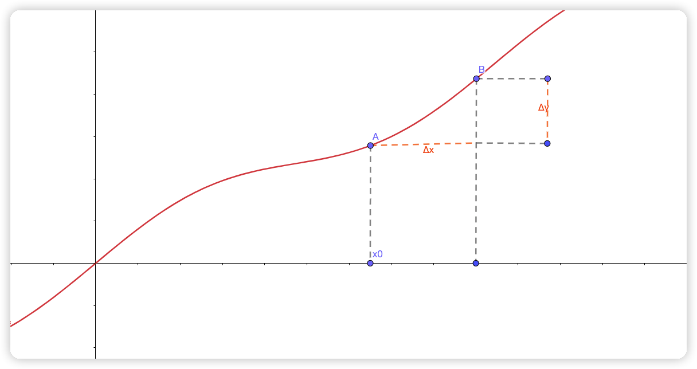
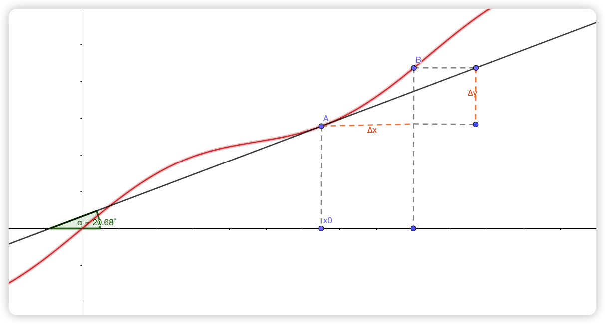
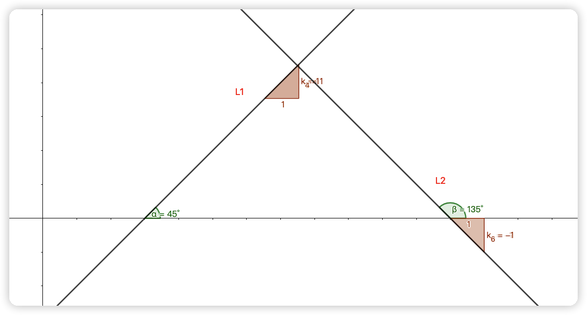
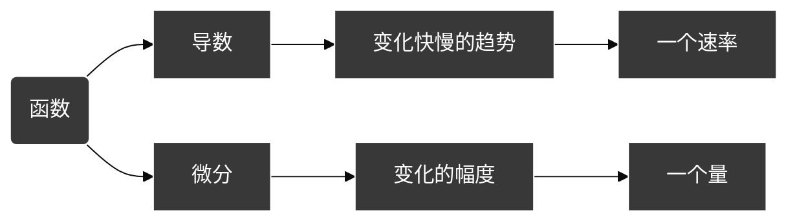
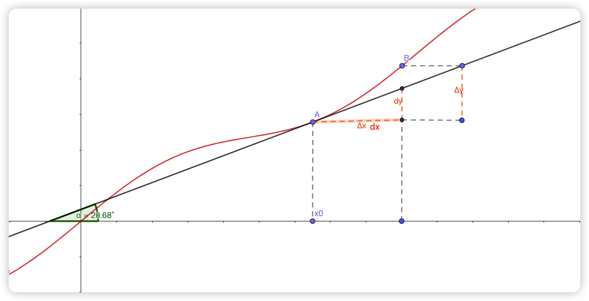
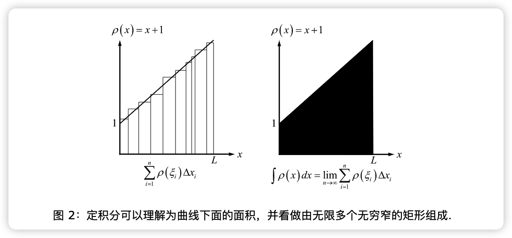
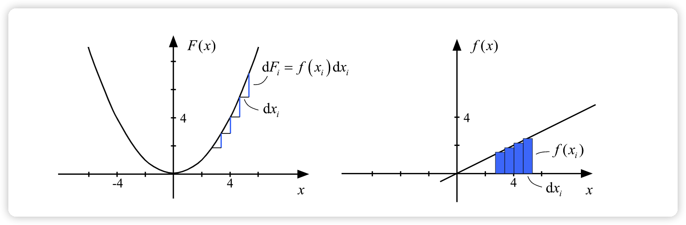

[TOC]

# 导数与微分

知乎文章 : https://www.zhihu.com/question/265021971/answer/288270304

视频 : https://www.bilibili.com/video/BV1kt41197JB?p=27&spm_id_from=pageDriver&vd_source=1ec51cb8123536a0bf872aa061240412

表情：https://gist.github.com/rxaviers/7360908

## 导数

$\displaystyle{由上章"函数连续性"可知若\lim\limits_{\Delta{x}\rightarrow 0}(f(x_0 + \Delta{x}) = f(x_0) , 则f(x) 在x_0处连续}$

$\displaystyle{那么set两点的变化量为: \quad \Delta{y} = \lim\limits_{\Delta{x}\rightarrow 0}f(x_0 + \Delta{x}) - f(x_0),  \Delta{x} ,函数图像如下:}$

$\displaystyle{f(x) = \sin{\frac{x}{3}} +  \frac{x}{2}}$

$$set \quad \displaystyle{\lim\limits_{\Delta{x}\rightarrow 0} \frac{\Delta{y}}{\Delta{x}} = \lim\limits_{\Delta{x}\rightarrow 0}\frac{f(x_0 + \Delta{x}) - f(x_0)}{\Delta{x}} = A}$$
 

$\displaystyle{如果上述函数等式成立则称: }$

- $\displaystyle{函数y = f(x)在x_0处可导}$

- $\displaystyle{极限值A为y = f(x)在x_0处的导数}$

$\displaystyle{记为: f'(x_0) \quad}$

#### 可导

$\displaystyle{由上述公式可知:如果f'(x_0)存在，则它一定在x_0处连续,反之不一定}$

$$
\begin{aligned}
& if \quad f'(x_0)存在 \quad then \quad x_0连续\\
& \therefore \lim\limits_{x\rightarrow x_0^+}f(x) = \lim\limits_{x\rightarrow x_0^-}f(x) = f(x_0)  \\
& \therefore f_+(x_0) = f_-(x_0) = f(x_0) \\
& \therefore f_-'(x_0) =  f_+'(x_0) = f'(x_0) \\
\end{aligned}
$$

> $\displaystyle{讨论函数f(x) = |x| = \begin{cases} &-x,(x<0) \\ &0,(x=0) \\ &x,(x>0) \end{cases}在分段点x=0的连续性和可导性}$

$$
\begin{aligned}
& \because \lim\limits_{x\rightarrow 0^-}f(0) = \lim\limits_{x\rightarrow 0^+}f(0) = f(0) = 0 \\
& \therefore f(x)在x=0处连续 \\
& 根据导数公式 f'_-(0) = \lim\limits_{\Delta{x}\rightarrow 0}\frac{f(\Delta{x} + 0) - f(0)}{\Delta{x}} = \frac{-\Delta{x} - 0}{\Delta{x}} = -1 \\
& f'_+(0) = \lim\limits_{\Delta{x}\rightarrow 0}\frac{f(\Delta{x} + 0) - f(0)}{\Delta{x}} = \frac{\Delta{x} - 0}{\Delta{x}} = 1 \\
& \because f'_-(0) \neq  f_+'(0) \\
& \therefore 不可导 \\
\end{aligned}
$$

 

> 1.  $\displaystyle{Beg \quad  函数y =x^2 在x = 3 处的导数}$

$$
\begin{aligned}
& \because A = \lim\limits_{\Delta{x}\rightarrow 0}\frac{\Delta{y}}{\Delta{x}} = \lim\limits_{\Delta{x}\rightarrow 0}\frac{f(x_0 + \Delta{x}) - f(x_0)}{\Delta{x}} \\
& \therefore f'(3) = \lim\limits_{\Delta{x}\rightarrow 0}\frac{f(3 + \Delta{x}) - f(3)}{\Delta{x}}  \\
& = \lim\limits_{\Delta{x}\rightarrow 0}\frac{(3+\Delta{x})^2 - 3^2}{\Delta{x}}\\
& = \lim\limits_{\Delta{x}\rightarrow 0}\frac{3^2 + 6\Delta{x} + \Delta{x}^2 - 3^2}{\Delta{x}} \\
& = \lim\limits_{\Delta{x}\rightarrow 0}\Delta{x} + 6 \\
& = 6
\end{aligned}
$$

> 2.  $\displaystyle{Beg \quad f(x) = \sin{x} 在 x= 0 处的导数}$

$$
\begin{aligned}
& \because A = \lim\limits_{\Delta{x}\rightarrow 0}\frac{\Delta{y}}{\Delta{x}} = \lim\limits_{\Delta{x}\rightarrow 0}\frac{f(x_0 + \Delta{x}) - f(x_0)}{\Delta{x}}  \\
& \therefore f'(0) = \frac{\sin{\Delta{x} - \sin{0}}}{\Delta{x}} \\
& =\lim\limits_{\Delta{x}\rightarrow 0}\frac{\sin{\Delta{x}} }{\Delta{x}}\\
& = 1
\end{aligned}
$$

### 导函数

由$\displaystyle{y = f(x)}$ 在区间$\displaystyle{(a,b)}$ 所有点的导数构成的函数，称为函数在$\displaystyle{(a,b)}$ 内的导函数

$\displaystyle{记为:\quad f'(x） 或 \frac{dy}{dx}}$

> 3.  $\displaystyle{Beg \quad f(x) = x^2 的导函数f'(x)}$

$$
\begin{aligned}
& \because f'(x) = \lim\limits_{\Delta{x}\rightarrow 0}\frac{f(\Delta{x} +x) - f(x)}{\Delta{x}} \\
& = \lim\limits_{\Delta{x}\rightarrow 0}\frac{(\Delta{x} + x)^2 - x^2}{\Delta{x}} \\
& = \lim\limits_{\Delta{x}\rightarrow 0}\frac{\Delta{x}(2x + \Delta{x})}{\Delta{x}} \\
& = \lim\limits_{\Delta{x}\rightarrow 0}2x + \Delta{x} \\
& = 2x \\
& 即(x^2)' = 2x \\
\end{aligned}
$$

### 导数几何

$\displaystyle{f(x) = \sin{\frac{x}{3}}+ \frac{x}{2}}$

$\displaystyle{f'(x_0)表示f(x)在点A(x_0,y_0)处切线的斜率,表示为\tan{ \alpha } = f'(x_0)}$

#### 斜率

$\displaystyle{直线斜率k:直线与x轴夹角的正切值}$

 

 $当直线与 x 轴正向夹角存在以下定理：$

- $\displaystyle{ \alpha  = 0 ,k = 0}$

- $\displaystyle{ 0 < \alpha  < 90 ,k为正斜率}$

- $\displaystyle{ \alpha  = 90 , k不存在}$

- $\displaystyle{ \alpha  > 90 , k为负斜率}$

$\displaystyle{点斜式: y - y_0 = k(x- x_0)}$

> $\displaystyle{直线过(1,2)点，且直线斜率为-3，求直线方程}$

$$
\begin{aligned}
& \because k = -3 \\
& \therefore 点斜式=> y - 2 = -3(x-1) \\
& \therefore y = 5 - 3x \\
\end{aligned}
$$

#### 法线

过切点与切线垂直的直线称为法线.有公式
$$\displaystyle{if=>\quad l_1 垂直 l_2 \quad then=>\quad  k_1 \cdot k_2 = -1}$$

> $\displaystyle{Beg \quad 函数y = x^2 在x= 3处的切线方程和法线方程}$

$$
\begin{aligned}
& 切点=(x,x^2) = (3,9) \\
& 对函数进行求导=> y' = 2x  = 6\\
& \because 切点的导数=斜率 \\
& \therefore k = 6 => (y - y_0)  = k(x-x_0) \\
& \therefore y - 9 = 6(x - 3)  \\
& \therefore 切线方程=>y = 6x - 9\\
& \because 法线同样过点(3,9)\\
& \therefore 法线斜率 = \frac{-1}{k_1} = -\frac{1}{6}\\
& \therefore 法线方程=> y = -\frac{1}{6}x + \frac{19}{2}\\
\end{aligned}
$$

> $\displaystyle{if \quad f'(x_0) = \alpha  , \lim\limits_{\Delta{x}\rightarrow 0}\frac{f(x_0 + \Delta{x}) - f(x_0 - 3 \Delta{x})}{\Delta{x}} = ?}$

$$
\begin{aligned}
& \lim\limits_{\Delta{x}\rightarrow 0} \frac{f(x_0 + \Delta{x}) - f(x_0) + f(x_0) - f(x_0 - 3 \Delta{x})}{\Delta{x}} \\
= &\lim\limits_{\Delta{x}\rightarrow 0} \frac{f(x_0 + \Delta{x})-f(x_0)}{\Delta{x}} + \lim\limits_{\Delta{x}\rightarrow 0}\frac{-(f(x_0 - 3\Delta{x}) - f(x_0))}{\Delta{x}} \\
= & f'(x_0) + \lim\limits_{\Delta{x}\rightarrow 0} -3 \cdot \frac{-(f(x_0 + (-3\Delta{x}))- f(x_0))}{-3\Delta{x}}\\
= & f'(x_0) + (3  \cdot f(x_0)) \\
= & \alpha  + 3 \alpha  \\
= & 4 \alpha   \\
\end{aligned}
$$

### 导数运算

- $\displaystyle{(f \pm g)' =  f' \pm g'}$

- $\displaystyle{(f \cdot g)' = f'g + fg'}$

- $\displaystyle{(\frac{f}{g})' = \frac{f'g - fg'}{g^2}}$

- $\displaystyle{e^{f(x)} = e^{f(x)} \cdot f(x)'}$

> $\displaystyle{Beg \quad f(x) = \ln{x} - \cos{ \frac{\pi}{3}} - e^x + \pi ^4},f'(x) = ?$

$$
\begin{aligned}
& f'(x) = \frac{1}{x} - 0 - e^x - 0 = \frac{1}{x} - e^x \\
\end{aligned}
$$

> $\displaystyle{Beg \quad f(x) = x\ln{x} - \frac{x}{x+1},f'(x) = ?}$

$$
\begin{aligned}
& f(x\ln{x})' = \ln{x} + x \cdot \frac{1}{x} = \ln{x} + 1 \\
& f(\frac{x}{x+1})' = \frac{(x+1) - x}{(x+1)^2}  = \frac{1}{(x+1)^2}\\
& \therefore f'(x) = \ln{x} + 1 -\frac{1}{(x+1)^2}  \\
\end{aligned}
$$

> $\displaystyle{Beg \quad f(x) = \frac{e^x}{x^2}}, f'(x) = ?$

$$
\begin{aligned}
& 使用微分除法定则：(\frac{f}{g})' = \frac{f'\cdot g - g' \cdot f}{g^2} \\
& 则 => \frac{d}{dx}(\frac{e^x}{x^2}) = \frac{\frac{d}{dx}(e^x)x^2 - \frac{d}{dx}(x^2)e^x}{(x^2)^2} \\
& \frac{d}{dx}(e^x) = e^x  , \quad \frac{d}{dx}(x^2) = 2x\\
& 代入=> \frac{e^xx^2 - 2xe^x}{(x^2)^2} \\
& = \frac{e^xx - 2e^x}{x^3} = \frac{e^x(x-2)}{x^3} \\
\end{aligned}
$$

### 连锁律

- 对于多次方如:$\displaystyle{f(x) = (2x^2 - 3x + 1)^2}$ => 微分则有$\displaystyle{f'(x) = (2x^2 - 3x + 1)(2x^2 - 3x +1 )}$

- 那么对于多次方如:$\displaystyle{f(x) = (2x^2 - 3x + 1)^{20}}$ ,而此时则微分计算量太大

连锁律公式 => $\displaystyle{\frac{d}{dx} f(g(x)) = f'(g(x)) \cdot  g'(x)}$

> 对上述方程使用连锁率即可很方便的求出：

$$
\begin{aligned}
& set \quad f(x) = x^{20} \\
& set \quad g(x) = 2x^2 - 3x +1 \\
& => f(g(x))  = (2x^2 - 3x + 1)^{20}\\
& \frac{d}{dx}f(g(x)) = f'(g(x)) \cdot g'(x) = 20(2x^2 - 3x + 1)^{19} \cdot (4x - 3) \\
\end{aligned}
$$

> $\displaystyle{exitst => f(x) = \frac{1}{(2x-1)^3} ，求微分}$

$$
\begin{aligned}
& \frac{d}{dx} \bigg(\frac{1}{(2x-1)^3}\bigg) = \frac{d}{dx} ((2x-1)^{-3}) \\
& \frac{d}{dx} f(g(x)) = (2x-1)^{-3} \\
& f'(g(x)) \cdot g'(x) = -3(2x-1)^{-4}  \cdot 2\\
\end{aligned}
$$

> $\displaystyle{f(x) = \sqrt{u+1} (1-2u^4)^8},求微分$

$$
\begin{aligned}
&f(x) = (u+1)^{\frac{1}{2}} (1-2u^4)^8 \\
&(f \cdot  g)' = f'g + fg' \\
=> \bigg[\frac{1}{2}(u+1)^{-\frac{1}{2}} \cdot 1 & \cdot (1-2u^4)^8\bigg] \quad +  \quad  \bigg[ (u+1)^{\frac{1}{2}}  \cdot  8(1-2u^4)^7  \cdot -8u^3\bigg]\\
\end{aligned}
$$

> $\displaystyle{f(x) = e^{2x+\cos{x}} ,Beg \quad f'(x) = ?}$

$$
\begin{aligned}
& set\quad f(x) = e^x , g(x) = 2x + \cos{x}\\
& \frac{d}{dx} f(g(x)) = e^{2x+\cos{x}} \cdot (2x+\cos{x})' = e^{2x+\cos{x}} \cdot (2-\sin{x})
\end{aligned}
$$

> $\displaystyle{f(x) = \ln{(e^x + a)},Beg \quad f'(x) = ?}$

$$
\begin{aligned}
& set \quad f(x) = \ln{x} , g(x) = e^x + a \\
& \frac{d}{dx}f(g(x)) = \frac{1}{e^x + a} \cdot (e^x + a)' = \frac{e^x}{e^x + a}  \\
\end{aligned}
$$

## 微分

#### 与导数的区别

`导数`描述的是函数在一点处的变化快慢的`趋势`，是一个变化的`速率`

`微分`描述的是函数从一点（移动一个无穷小量）到另一点的变化`幅度`，是一个变化的`量`

描述变化快慢，就得看导数，即切线的斜率

对齐图像如下:

$\displaystyle{上图中：\Delta{x} , \Delta{y}表示增量, dx,dy表示微分}$

##### 由此得出

- $\displaystyle{如果\Delta{x} \rightarrow 0,则\Delta{y}}$ ~ $\displaystyle{dy(等阶无穷小)}$

- $\displaystyle{f'(x) = \lim\limits_{\Delta{x}\rightarrow 0}\frac{\Delta{y}}{\Delta{x}} = \frac{dy}{dx}}$

$\displaystyle{得出微分公式:}$
$$ dy =dx \cdot f'(x) \quad or \quad df(x) = dx \cdot f'(x)$$
$\displaystyle{称 dy 为函数 y=f(x)的微分}$

 

> $\displaystyle{f(x) = \ln{(x+2)},求微分}$

$$
\begin{aligned}
& \because dy = dx \cdot f'(x)\\
& \therefore f'(x) = \frac{1}{x+2} \cdot (x+2)' = \frac{1}{x+2} \\
& \because dx  = \Delta{x} \rightarrow 0 \\
& \therefore dy = \frac{1}{x+2} \cdot \Delta{x} \\
\end{aligned}
$$

> $\displaystyle{f(x) = x^3 ,if \quad x_0 = 2 , \Delta{x} = 0.1,then \quad 函数增量\Delta{y}与微分dy=?}$

$$
\begin{aligned}
& \because f(x) = x^3 => f'(x) = 3x^2 \\
& \because \Delta{y} = f(\Delta{x} + x_0) - f(x_0) =(2 + \frac{1}{10})^3 - 2^3 = x^3 + 3x^2y + 3xy^2  + y^3 - 2^3 \\
& = 2^3 + \frac{12}{10} + \frac{6}{100} + \frac{1}{1000} -2^3 = \frac{1200+60+1}{1000} = 1.261\\
& \therefore dy = \frac{1}{10} \cdot 3x^2 = 1.2 \\
\end{aligned}
$$

### 隐函数

$\displaystyle{没有直接可用x表示y的函数称为隐函数,如:}$
$${x-y+1 = 0 , \quad \sin{x}^2 + x - y = 0}$$

$\displaystyle{求导本质：}$

1. $\displaystyle{对x求导}$

2. $\displaystyle{使用连锁律进行复合求导}$

3. $\displaystyle{\frac{dx}{dx} = 1, \frac{dy}{dy} = 1 , \frac{dy}{dx}= y'}$

 

$\displaystyle{公式表达为:}$

$$
(x+y)' = \frac{dx}{dx} + \frac{dy}{dy} = 1 + y' \\
(x \cdot y)' = \frac{dx}{dx}y + x \frac{dy}{dx} = y+x \cdot y'
$$

 

> $\displaystyle{方程x^2 + y^2 = 4 确定了函数y = f(x) , 求一阶导数y'(1)}$

$$
\begin{aligned}
& set \quad g(x) = x^2 + y^2 - 4  = 0 \\
& \therefore g'(x) = 2x + 2y \cdot y'   =0 \\
& \therefore y' = -\frac{x}{y} \\
& \because x =1 ,\therefore y = \pm \sqrt{3}  \\
& \therefore y'(1) = \pm\frac{\sqrt{3} }{3} \\
\end{aligned}
$$

> $\displaystyle{方程x+y-e^{xy} = 0确定了函数y = f(x) , 求微分}$

$$
\begin{aligned}
& set \quad g(x)  =x+y-e^{xy} = 0 \\
& g'(x) = 1 + y' - e^{xy} \cdot (xy)' = 1+ y' - [e^{xy} \cdot (y + xy')] = 0 \\
& \therefore y' = ye^{xy} + xy'e^{xy} - 1 = \frac{ye^{xy} - 1}{1 -xe^{xy}} \\
& dy  = \frac{ye^{xy} - 1}{1 - xe^{xy}} \cdot dx \\
&  \\
\end{aligned}
$$

## 定积分

$\displaystyle{设函数p(x) = x + 1如下图所示，则f(\xi_i)\Delta{x_i}可以表示左图的第i个小长方形面积}$

$\displaystyle{所有小长方形面积之和表示为：\sum_{i=1}^n p(\xi_i)\Delta{x_i},如果n \rightarrow +\infty 且每个\Delta{x_i}取得非常小}$

$\displaystyle{则每个小长方形的面积会无限接近于右图阴影部分的面积}$

$\displaystyle{综上信息则为这个积分是从0积到L，其中0是积分下限，L是积分上限。符号记为:\int_{0}^{L}p(x) dx}$

$\displaystyle{则对于一元函数的定积分的公式为:}$

$$S = \int_{a}^{b} f(x) dx$$

> 定积分表示圆的面积

$$
\begin{aligned}
& 圆的方程:x^2 + y^2 = R^2 \\
& set \quad上半圆 f(x) = y = \sqrt{R^2 - x^2}  \quad (x \in [-R,R]) \\
& 则定积分再乘2得到圆面积: \\
& S = 2\int_{-R}^{R} f(x) dx = 2\int_{-R}^{R}\sqrt{R^2 - x^2} \cdot dx \\
& = 2 \cdot \frac{1}{2} (x\sqrt{R^2 - x^2} + R^2 \arcsin{\frac{x}{R}}) + C \bigg|_{-R}^{R}\\
& = R^2 \arcsin{1}  - R^2 \arcsin{-1} \\
& = \frac{\pi R^2}{2} + \frac{\pi R^2}{2} \\
& = \pi R^2
\end{aligned}
$$

## 牛顿莱布尼兹公式

- 文章：https://wuli.wiki//online/NLeib.html
- 视频：https://www.youtube.com/watch?v=khYocUMgO24

#### 不定积分：求导的逆运算

#### 定积分：函数曲线与 x 轴之间的面积

- 牛顿-莱布尼茨公式沟通了`微分学`与`积分学`之间的关系;

- 揭示了`定积分`与`被积函数`的`原函数`之间的本质联系

##### 定义

1. $\displaystyle{设F(x)为原函数、f(x)为导函数=>F'(x) = f(x)}$

2. $\displaystyle{根据常数导数为0 => \big[F(x) + C\big]' = f(x) \quad \#此时称F(x) + C为f(x)的全体原函数}$

$\displaystyle{若函数f(x)在[a,b]上连续，f(x)为f(x)在[a,b]上的任意一个原函数，则从a到b的积分}$

$\displaystyle{为原函数F(x)中b点到a点的y轴增量,记为:}$

$${\int_a^b f(x)dx =  F(b)  - F(a)}$$

 

$\displaystyle{根据微分公式:df(x) = f'(x) \cdot dx 又可推导为:\int_a^bdf(x) = F(b) - F(a)}$

##### 证明

$$
\begin{aligned}
& \because 在[a,b]区间中f(x)连续 => f(x)存在原函数 ,\quad 表示为: \phi (x) = \int_a^x f(t)dt \\
& \because F(x)为f(x)的原函数,\quad 表示为: \int_a^x f(t)dt = F(x) + C  \\
& 当x=a时 : 0 = \int_a^a f(t) dt = F(a) + C \\
& \qquad \quad \qquad   0 = F(a) + C \\
& \qquad \quad \qquad   C = -F(a) \\
& \therefore \int_a^x f(t)dt = F(x) - F(a) \\
& 当x=b时,即可完成证明:  \int_a^b f(t) dt = F(b) - F(a) \\
\end{aligned}
$$

 $几何证明$ 

$\displaystyle{根据定积分可知:f(x)的面积可表示为:}$

$$
\int_{a}^{b}f(x) dx = \lim\limits_{\Delta{x_i}\rightarrow 0}\sum_i f(x_i)\Delta{x_i}
$$

$\displaystyle{将x_i理解为第i个小矩形左端的x坐标，根据求导为不定积分逆运算可知小矩形面积为:}$

$${f(x_i)\Delta{x_i} = F'(x_i)\Delta{x_i}=\bigg(\lim\limits_{\Delta{x_i}\rightarrow 0}\frac{\Delta{F_i}}{\Delta{x_i}}\bigg) \cdot \Delta{x_i} = \Delta{F_i} = F(x_{i+1}) - F(x_i)}$$

$\displaystyle{那么总面积可表示为如下,即完成证明}$

$$ \int_{a}^{b}f(x)dx = \lim\limits_{\Delta{x}\rightarrow 0}\sum_i [F(x_{i+1}) - F(x_i)] = F(b) - F(a)$$

 $\displaystyle{注! F(b) - F(a) 又可记为 F(x) |_a^b}$

##### 结论

$\displaystyle{当步长趋近0时,f(x)中的长方形面积趋近与F(x)中小竖线的长度}$

##### 例题

> $\displaystyle{求\int_0^{\frac{\pi}{2}}(2 \cos{x} + \sin{x} - 1) dx}$

$$
\begin{aligned}
&\because 被积函数2\cos{x} + \sin{x} - 1在积分区间[0,\frac{\pi}{2}]连续 \\
&\because 2\cos{x} + \sin{x} - 1 = (2\sin{x} - \cos{x} - x)' \\
\therefore \int_0^{\frac{\pi}{2}} &(2\cos{x} + \sin{x}  - 1)dx = (2\sin{x} - \cos{x} - x) \big|_0^{\frac{\pi}{2}} \\
& = (2\sin{\frac{\pi}{2}} - \cos{\frac{\pi}{2}} - \frac{\pi}{2}) - (2\sin{0} - \cos{0} - 0) \\
& = 3 - \frac{\pi}{2}  \\
\end{aligned}
$$

> $\displaystyle{set \quad f(x) = \begin{cases} 2x& , 0\leq x \leq 1 \\ 5& , 1 < x \leq 2 \\ \end{cases} \quad , 求\int_0^2 f(x) dx}$

$$
\begin{aligned}
& set \quad x \in (1,2]中x=1时 f(x)= 5 \\
& 则满足可根据牛顿莱布尼茨公式得: \\
& \int_{0}^{2}f(x)dx = \int_{0}^{1}f(x)dx + \int_{1}^{2}f(x)dx \\
& = \int_{0}^{1} 2xdx + \int_{1}^{2} 5 dx \\
& = (x^2) \big|_0^1 + (5x) \big|_1^2  \\
& = [(1) - (0)] + [(2 \cdot 5) -(1 \cdot 5)] \\
& = 6
\end{aligned}
$$

### 牛顿-莱布尼茨(高阶导数)

$$
\begin{aligned}
&(u \cdot v)^{(n)} = \sum_{k=0}^{n} C_n^k \cdot  u^{(n-k)} \cdot  v^{(k)}\\
\end{aligned}
$$

$\displaystyle{注！其中(n)表示n阶级导数}$

##### 常见公式转换

| $\displaystyle{F(x)}$   | $\displaystyle{f(x)}$ |
|:-------------------------------------------------------:|:-----------------------------------------------------:|
$\displaystyle{(e^{ax+b})^{(n)}}$       | $\displaystyle{a^n e^{ax+b}}$
$\displaystyle{[\sin{(ax+b)}]^{(n)}}$   | $\displaystyle{a^n\sin{(ax+b+\frac{n\pi}{2})}}$
$\displaystyle{[\cos{(ax+b)}]^{(n)}}$   | $\displaystyle{a^n\cos{(ax+b+\frac{n\pi}{2})}}$
$\displaystyle{[\ln{(ax+b)}]^{(n)}}$    | $\displaystyle{\frac{(-1)^{n - 1}a^n(n-1)!}{(ax+b)^n}}$
$\displaystyle{[\frac{1}{ax+b}]^{(n)}}$ | $\displaystyle{\frac{(-1)^n a^n n!}{(ax+b)^{n+1}}}$

   

>$\displaystyle{求 y = \frac{1}{x^2 - 3x + 2} 的n阶导数}$

$$\begin{aligned}
& \frac{1}{x^2 - 3x + 2}  = \frac{1}{(x-2)(x-1)} = \frac{1}{x-2}  - \frac{1}{x-1}\\
& 根据上述常见公式转换可知 \\
& \frac{1}{x-2} => \frac{(-1)^nn!}{(x-2)^{n+1}} \\
& \frac{1}{x-1} => \frac{(-1)^nn!}{(x-1)^{n+1}} \\
& \therefore y^{(n)}  = \frac{(-1)^n n!}{(x-2)^{n+1}} - \frac{(-1)^n n!}{(x-1)^{n+1}}\\
\end{aligned}$$

>$\displaystyle{f(x) = \ln{(1-2x)}在x= 0 处的n阶导数f^{(n)}(0) = ?}$

$$\begin{aligned}
& [\ln{(1-2x)}]^{(n)} = \frac{(-1)^{n-1} a^n (n-1)!}{(ax + b)^n} = \frac{(-1)^{n-1}(-2)^n(n-1)!}{(-2x + 1)^n} \\
x = 0 & => (-1)^{n-1}(-2)^n (n-1)!  \\
& = (-1)^{n-1}(-1)^n (2)^n (n-1)! \\
& =(-1)^{2n-1}(2)^{n}(n-1)! \\
& =-2^n (n-1)! \\
\end{aligned}$$

>$\displaystyle{求f(x) = x^2 \ln{(1+x)} 在x = 0处的n阶导数f^{(n)}(0)}$

$$\begin{aligned}
(x^2&\ln{(1+x)})^{(n)}  \\
& = C_n^0 (x^2)^{(n)}\ln{(1+x)} \quad +\quad  C_n^1(x^2)^{(n-1)}\ln{(1+x)'}\quad + \dots \\
& = C_n^0 \ln{(1+x)}^{(n)}(x^2) \quad +\quad  C_n^1\ln{(1+x)}^{(n-1)}(x^2)'\quad + \dots \\
& = C_n^0\ln{(1+x)^{(n)}} \cdot x^2  \quad + \quad C_n^1\ln{(1+x)}^{(n-1)} \cdot 2x \quad  + \quad  C_n^2\ln{(1+x)}^{(n-2)} \cdot 2 + 0 + 0 + \dots \\
& 当x = 0 时: \\
& f^{(n)}(0) = C_n^2 \cdot \ln{(1+x)}^{(n-2)} \cdot 2 \bigg|_{x=0} \\
& \ln{(1+x)}^{(n-2)} \bigg|_{x=0} = \frac{(-1)^{n-3} (n -3 )!}{(1+x)^{n-2}} \bigg|_{x=0} = (-1)^{n-3}(n - 3)! \\
& 代入原式: \\
& f^{(n)}(0) = C_n^2 \cdot \ln{(1+x)}^{(n-2)} \cdot 2 \bigg|_{x=0}  = \frac{n(n-1)}{2} \cdot 2 \cdot (-1)^{n-3}(n-3)! = (-1)^{n-3} \frac{n!}{n - 2}\\
& (n)! = n \cdot (n-1) \cdot (n-2) \cdot (n-3)!
\end{aligned}$$

                   

## 五大基本函数

1. $\displaystyle{幂函数:f(x) = x^a)}$

2. $\displaystyle{指数函数:f(x) = a^x (a>0)}$

3. $\displaystyle{对数函数:f(x) = \log{_a^x}(a>0)}$

4. $\displaystyle{三角函数:f(x) = \sin{x} , \cos{x} , \tan{x} ,cot,sec,csc}$

5. $\displaystyle{反三角函数:f(x)=  arc\sin{x} , arc\cos{x},  arc\tan{x}}$

## 导值

注意：函数求导、和洛必达的分子、分母分别求导是不一样的

$\displaystyle{根据f'(x) = \lim\limits_{\Delta{x}\rightarrow 0}\frac{f(\Delta{x} + x_0) - f(x_0)}{\Delta{x}} ,常用的导值如下:}$

##### 基本函数

| $\displaystyle{f(x)}$ | $\displaystyle{f'(x)}$ |
| :---------------------------------------------------: | :----------------------------------------------------: |
|                  $\displaystyle{C}$                   |                   $\displaystyle{0}$                   |
|                 $\displaystyle{x^u}$                  |               $\displaystyle{ux^{u-1}}$                |
|               $\displaystyle{\sin{x}}$                |                $\displaystyle{\cos{x}}$                |
|               $\displaystyle{\cos{x}}$                |               $\displaystyle{-\sin{x}}$                |
|               $\displaystyle{\tan{x}}$                |               $\displaystyle{\sec{^2x}}$               |
|                 $\displaystyle{a^x}$                  |               $\displaystyle{a^x\ln{a}}$               |
|                 $\displaystyle{e^x}$                  |                  $\displaystyle{e^x}$                  |
|              $\displaystyle{\log{_a^x}}$              |           $\displaystyle{\frac{1}{x\ln{a}}}$           |
|                $\displaystyle{\ln{x}}$                |              $\displaystyle{\frac{1}{x}}$              |

##### 连锁律推导导数

| $\displaystyle{f(x)}$ | $\displaystyle{f'(x)}$ |
| :---------------------------------------------------: | :----------------------------------------------------: |
|            $\displaystyle{\frac{e^x}{x}}$             |         $\displaystyle{\frac{e^x(x-1)}{x^2}}$          |
|            $\displaystyle{\ln{(e^x + a)}}$            |          $\displaystyle{\frac{e^x}{e^x + a}}$          |

--------------------以上 a、C 为常数--------------------

### 符号解释

|                 sym                  |                    meaning                    |
| :----------------------------------: | :-------------------------------------------: |
| $\displaystyle{arcsinx = sin^{-1}x}$ |         $\displaystyle{sinx的反函数}$         |
| $\displaystyle{arctanx = tan^{-1}x}$ |         $\displaystyle{tanx的反函数}$         |
|       $\displaystyle{\lg{x}}$        |          $\displaystyle{\log{10^x}}$          |
|       $\displaystyle{\ln{x}}$        |          $\displaystyle{\log{e^x}}$           |
|          $\displaystyle{e}$          | $\displaystyle{e是一个常数，等于2.71828183…}$ |
|   $\displaystyle{\alpha , \beta}$    |    $\displaystyle{同一过程中的两个无穷小}$    |
| $\displaystyle{{\bar{\mathbb{R}}}}$  |           $\displaystyle{扩展实数}$           |
|      $\displaystyle{\xi(柯西)}$      |           $\displaystyle{随机变量}$           |
|       $\displaystyle{\forall}$       |             $\displaystyle{任意}$             |
|      $\displaystyle{\epsilon}$       |           $\displaystyle{任意正数}$           |
|       $\displaystyle{\forall}$       |             $\displaystyle{任意}$             |
|       $\displaystyle{\exists}$       |             $\displaystyle{存在}$             |
|       $\displaystyle{\delta}$        |          $\displaystyle{变量、符号}$          |
