[toc]

┌──────────────────────────────────┐
- 本文中gif默认播放2次\
``ffmpeg -i demo.gif_bck -loop 1 demo.gif``\
设置一直循环\
``ffmpeg -i demo.gif_bck -ignore_loop 0 demo.gif``

- 本文图片默认缩放70%

└──────────────────────────────────┘

**视频**

- 图解： https://www.bilibili.com/video/BV1Qs41167bP/?spm_id_from=333.788.recommend_more_video.-1&vd_source=1ec51cb8123536a0bf872aa061240412

# 前言理解

## 向量

- $\displaystyle{向量表示:\left[ \begin{matrix}a \\ b\end{matrix} \right] }$

- $\displaystyle{线性代数中向量的箭头起点位于原点}$

> 二维

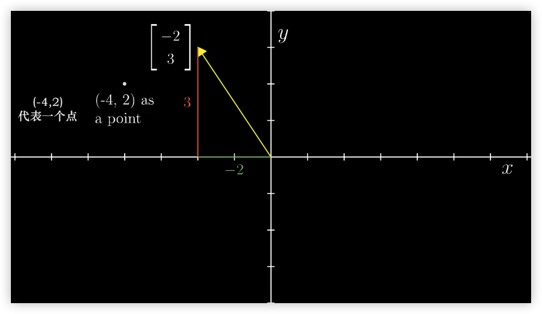

> 三维

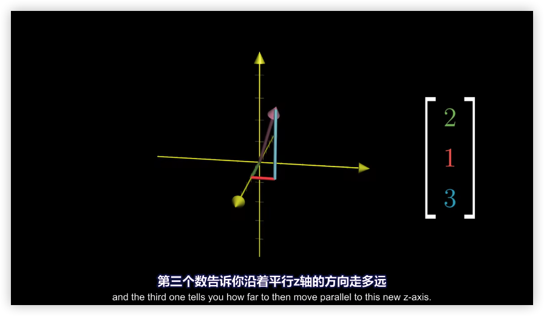

### 向量加法

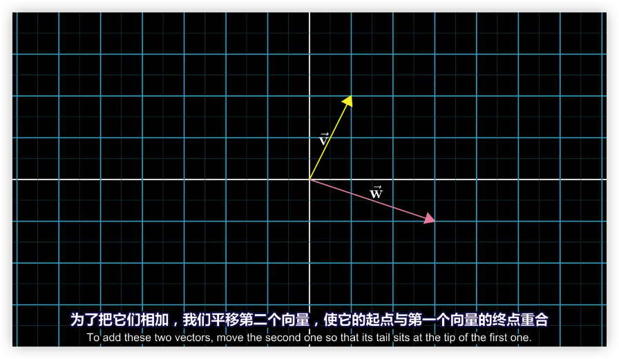

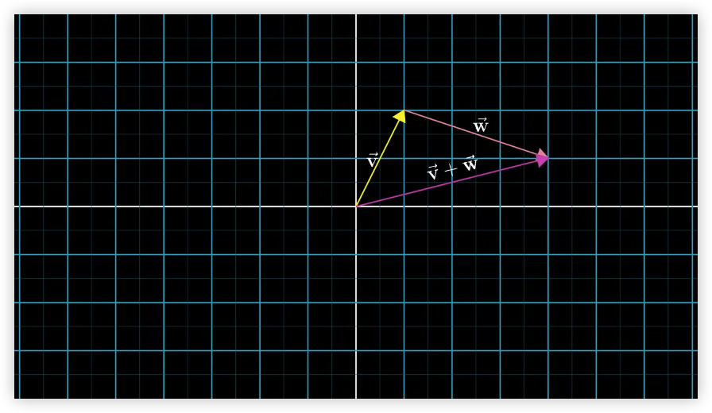

$\displaystyle{公式如下:}$

$$
\left[\begin{matrix} x_1 \\ y_1 \\ \end{matrix}\right] +  \left[\begin{matrix} x_2 \\ y_2 \\ \end{matrix}\right] = \left[\begin{matrix} x_1 + x_2 \\ y_1 + y_2 \\ \end{matrix}\right]
$$

### 向量乘法

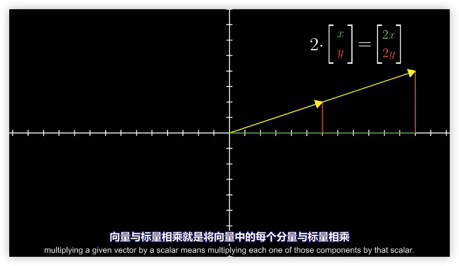

$\displaystyle{公式如下:}$

$$
2 \cdot \left[\begin{matrix} x \\ y \\ \end{matrix}\right] = \left[\begin{matrix} 2x \\ 2y \\ \end{matrix}\right]
$$

## 线性组合、张成的空间与基

- $\displaystyle{i帽：一个指向正\textcolor{red}{右方}，长度为1的单位向量}$

- $\displaystyle{j帽：一个指向正\textcolor{red}{上方}，长度为1的单位向量}$

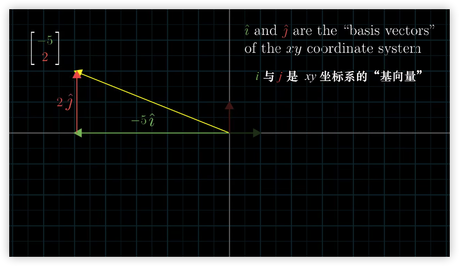

- $\displaystyle{两个向量标量乘法之和的结果称为这两个向量的线性组合}$

$$
\vec{v}与\vec{w}的线性组合=> a\vec{v} + b\vec{w}
$$

### 张成的空间

- $\displaystyle{两个向量的张成空间:向量之间的运算获得的所有可能的向量集合}$

- $\displaystyle{\textcolor{red}{给定向量}张成的空间:所有可以表示为\textcolor{red}{给定向量线性组合}的向量集合}$

* $\displaystyle{大部分二维向量来说张成空间是所有二维向量的集合}$

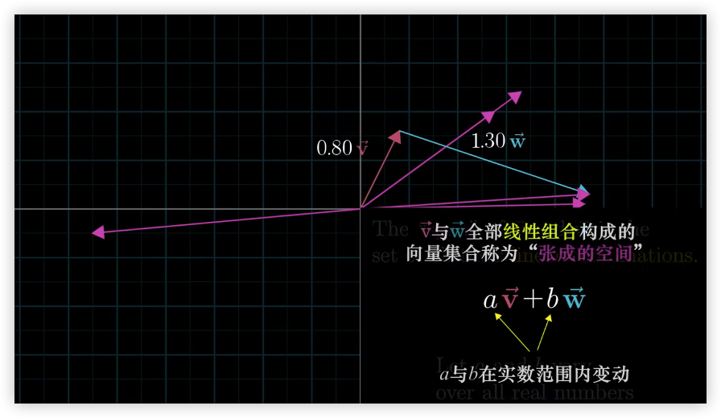

- $\displaystyle{当向量共线时张成空间是终点落在一条直线上的向量集合}$

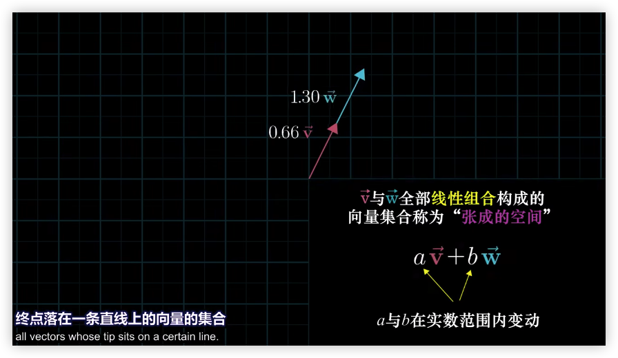

- $\displaystyle{三维空间中两个向量张成的空间}$

$\displaystyle{\textcolor{red}{拓展}：当第三个向量没有落在前两个向量张成的空间中，那么进行缩放会得到整个三维空间}$

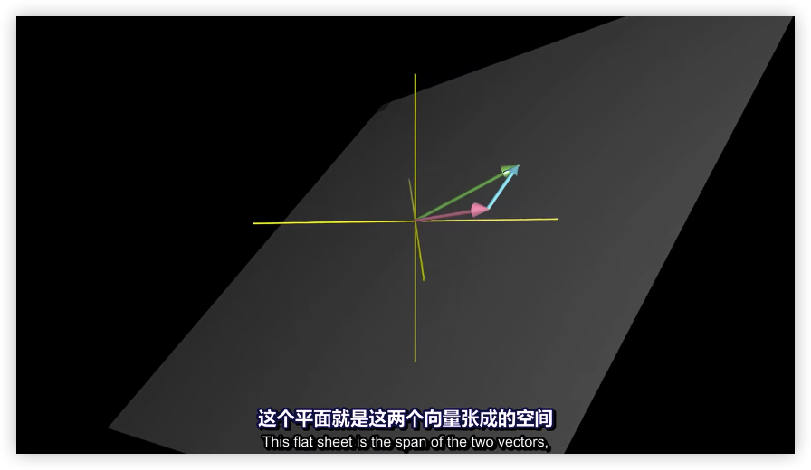

## 线性变换

$\displaystyle{概念如下:}$

- $\displaystyle{线性有关: 多个向量中移除一个而不减小张成的空间}$

- $\displaystyle{线性无关: 所有向量都给张成的空间增添了新的维度}$

- $\displaystyle{向量空间的一个基: 张成该空间的一个线性无关向量的集合}$

 

$\displaystyle{一个变化称为线性变化的\textcolor{red}{满足条件}:}$

1. $\displaystyle{直线在变换后仍然保持为直线}$

2. $\displaystyle{原点必须保持固定}$

$\displaystyle{可以理解为保持网格线平行并等距离分布的变换称为线性变换}$

 $\displaystyle{结论:}$ 

$\displaystyle{线性变换是将向量作为输入和输出的一类函数}$

### 数学表示线性变换位置

$\displaystyle{存在线性变换如下:}$

$\displaystyle{只需要记录两个基向量(i、j帽)落脚后的位置}$

$\displaystyle{向量\left[\begin{matrix} -1 \\ 2 \\ \end{matrix}\right] 线性变换前: }$
$$
\vec v =  -1i + 2j
$$

$\displaystyle{从变换网格线可以看到变换后的i帽为\left[\begin{matrix} 1 \\ -2 \\ \end{matrix}\right] ,j帽为\left[\begin{matrix} 3 \\ 0 \\ \end{matrix}\right]}$

 $\displaystyle{线性变换后的:}$

$$
\begin{aligned}
&Transformed \quad  \vec{v} =  -1 (Transformed \quad i)+ 2(Transformed \quad j)\\
& = -1 \left[\begin{matrix} 1 \\ -2 \\ \end{matrix}\right] + 2\left[\begin{matrix} 3 \\ 0 \\ \end{matrix}\right] \\
& = \left[\begin{matrix} -1(1) &+ &2(3) \\ -1(-2) &+ &2(0) \\ \end{matrix}\right] \\
& = \left[\begin{matrix} 5 \\ 2 \\ \end{matrix}\right] \\
&  \\
\end{aligned}
$$

# 线性代数

## 线性方程组

$线性代数的基本问题就是解 n 元一次方程组。\\例如:三元一次方程组 \rightarrow 矩阵形式$

$$
\begin{aligned}
\begin{cases} &2x+5y+3z = -3 \\ &4x+0y+8z=0 \\&1x+3y+0z = 2 \\ \end{cases} \rightarrow \left[\begin{matrix} 2&5&3 \\ 4&0&8 \\1 & 3 & 0 \\ \end{matrix}\right] \left[\begin{matrix} x \\ y \\ z \end{matrix}\right] = \left[\begin{matrix} -3 \\ 0 \\ 2 \\\end{matrix}\right]
\end{aligned}
$$

$\displaystyle{\textcolor{red}{系数矩阵}: A=\left[\begin{matrix} 2&-1 \\ -1&2 \\ \end{matrix}\right]}$

$\displaystyle{\textcolor{red}{未知数向量}: x = \left[\begin{matrix} x \\ y \\ \end{matrix}\right]}$

$\displaystyle{\textcolor{red}{结果向量}: b }$

${\textcolor{red}{线性方程}记为：Ax=b}$

## 矩阵

$\displaystyle{二维线性变换后的i帽、j帽组成的坐标包装在2 \times 2的格子中称它为\textcolor{red}{矩阵}(Matrix)}$

$\displaystyle{矩阵代表一个特定的线性变换}$

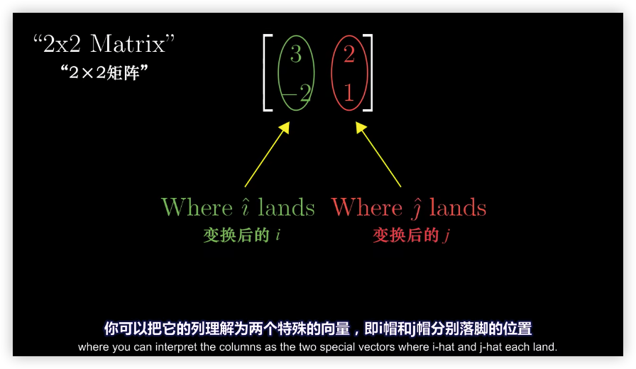

#### 矩阵与向量的乘法

$\displaystyle{其中 \left[\begin{matrix} x \\ y \\ \end{matrix}\right]表示向量，\left[\begin{matrix} 1 & 2 \\ 3 & 4\\ \end{matrix}\right]表示矩阵}$

$$
\left[\begin{matrix}
1 & 2 \\ 
3 & 4 \\ 
\end{matrix}\right]
\cdot
\left[\begin{matrix}
x \\
y \\ 
\end{matrix}\right]
= x
\left[\begin{matrix}
1 \\
3 \\
\end{matrix}\right]
+ y
\left[\begin{matrix}
2 \\
4 \\
\end{matrix}\right]
=
\left[\begin{matrix}
1x + 2y \\
3x + 4y \\
\end{matrix}\right]
$$

#### 消元法
高斯消元法就是通过对方程组中的某两个方程进行适当的数乘和加和，以达到将某一未知数系数变为零，从而削减未知数个数的目的

$$
\begin{aligned}
& A = \left[\begin{matrix} 1&2&1 \\ 3&8&1 \\ 0&4&1 \end{matrix}\right]   \quad b = \left[\begin{matrix} 2 \\ 12 \\ 2 \\ \end{matrix}\right]\\
\end{aligned}
$$

:one:矩阵左上角的"1"称为**主元一**，首先消除第一列主元之外的数字为0

$$
\begin{aligned}
&A=
\left[\begin{matrix}
\boxed{1}&2&1 \\
3&8&1 \\
0&4&1 \\
\end{matrix}\right]
\rightarrow
\left[\begin{matrix}
\boxed{1}&2&1 \\
0&2&-2 \\
0&4&1 \\
\end{matrix}\right]
\end{aligned}
$$

:two:处在第二行第二列的**主元二**为"2"，对其进行消元,最终得到**主元三**为"5"

$$
\begin{aligned}
\left[\begin{matrix}
\boxed{1} & 2 & 1\\
0 & \boxed{2} & -2\\
0 & 4 & 1\\
\end{matrix}\right]
\rightarrow
\left[\begin{matrix}
\boxed{1} & 2 & 1\\
0 & \boxed{2} & -2\\
0 & 0 & \boxed{5}\\
\end{matrix}\right]
\end{aligned}
$$

矩阵$A$为可逆矩阵，消元结束后得到了**上三角阵**$U$ ，左下部分的元素都为0，**主元1，2，5**分列在 $U$ 的**对角线上**。**行列式的值**即为主元之积

##### 线性方程组无解

主元不能为0，如果恰好消元至某行，0出现在了主元的位置上，应当通过与下方一行进行“行交换”使得非零数字出现在主元位置上。如果0出现在了主元位置上，并且下方没有对等位置为非0数字的行，则消元终止，并证明矩阵A为**不可逆矩阵**，且**线性方程组没有唯一解**

$$
"系数"矩阵比如 \rightarrow \left[\begin{matrix}* & * & *\\0 & * & *\\0 & 0 & 0\\
\end{matrix}\right]
$$

$任何情况下，只要是矩阵 A 可逆，均可以通过消元法求得 Ax=b 的解$

#### 回代
做方程的高斯消元时，需要对等式右侧的 b 做同样的乘法和加减法。手工计算 时比较有效率的方法是应用$\textcolor{red}{增广矩阵}$

$使用: 将b插入矩阵A之后形成最后一列，在消元过程中带着 b 一起操作$
$$
\left[\begin{matrix}
1 & 2 & 1 & 2\\
3 & 8 & 1 & 12\\
0 & 4 & 1 & 2\\
\end{matrix}\right] \rightarrow
\left[\begin{matrix}
\boxed{1} & 2 & 1 & 2\\
0 & \boxed{2} & -2 & 6\\
0 & 0 & \boxed{5} & -10\\
\end{matrix}\right]
$$
$从最后一行可知z=-2 ,进行回代即可得到\begin{cases} &x=2 \\ &y=1 \\ &z=-2 \\\end{cases}$

#### 消元矩阵

$矩阵运算就是对“行”、”列“进行独立操作$

- 列向量线性组合
$$
\left[\begin{matrix}
1 & 2 & 3\\
4 & 5 & 6\\
7 & 8 & 9\\
\end{matrix}\right]
\left[\begin{matrix}
x\\
y\\
z\\
\end{matrix}\right]
=x
\left[\begin{matrix}
1\\
4\\
7\\
\end{matrix}\right]
+y
\left[\begin{matrix}
2\\
5\\
8\\
\end{matrix}\right]
+z
\left[\begin{matrix}
3\\
6\\
9\\
\end{matrix}\right]
$$

- 行向量线性组合

$$
\left[\begin{matrix}
x & y & z\\
\end{matrix}\right]
\left[\begin{matrix}
1 & 2 & 3\\
4 & 5 & 6\\
7 & 8 & 9\\
\end{matrix}\right]
=
x
\left[\begin{matrix}
1 & 2 & 3\\
\end{matrix}\right]
+y
\left[\begin{matrix}
4 & 5 & 6\\
\end{matrix}\right]
+z
\left[\begin{matrix}
7 & 8 & 9\\
\end{matrix}\right]
$$

>这里注意必须是**左乘**不能是**右乘**, 只有在第一个矩阵的**列数**等于第二个矩阵的**行数**时，两个矩阵才能相乘

##### 左乘例子

$存在如下两个矩阵:$
$$
\left[\begin{matrix}
1 & 0 & 0\\
-3 & 1 & 0\\
0 & 0 & 1\\
\end{matrix}\right]
\left[\begin{matrix}
1 & 2 & 1\\
3 & 8 & 1\\
0 & 4 & 1\\
\end{matrix}\right]
=?
$$

:one: $通过每行左乘矩阵$

$$
\begin{array}{}
\begin{bmatrix}
1 & 0 & 0\\
\end{bmatrix}

\begin{bmatrix}
1 & 2 & 1\\
3 & 8 & 1\\
0 & 4 & 1\\
\end{bmatrix}=

\begin{bmatrix}
1 & 2 & 1\\
\end{bmatrix}
\quad \\
\begin{bmatrix}
-3 & 1 & 0\\
\end{bmatrix}

\begin{bmatrix}
1 & 2 & 1\\
3 & 8 & 1\\
0 & 4 & 1\\
\end{bmatrix}=-3

\begin{bmatrix}
1 & 2 & 1\\
\end{bmatrix}+1

\begin{bmatrix}
3 & 8 & 1\\
\end{bmatrix}+0 =

\begin{bmatrix}
0 & 2 & -2\\
\end{bmatrix}
\\
\begin{bmatrix}
0 & 0 & 1\\
\end{bmatrix}

\begin{bmatrix}
1 & 2 & 1\\
3 & 8 & 1\\
0 & 4 & 1\\
\end{bmatrix}=

\begin{bmatrix}
0 & 4 & 1\\
\end{bmatrix}
\\
合并矩阵则有 \rightarrow
\begin{bmatrix}
1 & 2 & 1\\
0 & 2 & -2\\
0 & 4 & 1\\
\end{bmatrix}
\end{array}
$$

:two: $构建矩阵消元结构$

$$
\left[\begin{matrix}
1 & 0 & 0\\
0 & 1 & 0\\
0 & -2 & 1\\
\end{matrix}\right]
\left[\begin{matrix}
1 & 2 & 1\\
0 & 2 & -2\\
0 & 4 & 1\\
\end{matrix}\right]
=
\left[\begin{matrix}
1 & 2 & 1\\
0 & 2 & -2\\
0 & 0 & 5\\
\end{matrix}\right]
$$

##### 右乘例子

$存在如下矩阵:$

$$
\underbrace{\left[\begin{matrix} 0&2 \\ 1&0 \\ \end{matrix}\right]}_{M_2} \underbrace{\left[\begin{matrix} 1&-2 \\ 1&0 \\ \end{matrix}\right]}_{M_1}= ?
$$

:one: $\displaystyle{根据定义i帽的新坐标由M_1的第一类给出，也就是(1,1)}$

$$i:(1,1)\quad j:(-2,0)$$

:two: $\displaystyle{将i帽经过M_2矩阵变换后，就是将向量(1,1)乘上矩阵M_2}$

$$
\underbrace{\left[\begin{matrix} 0&2 \\ 1&0 \\ \end{matrix}\right]}_{M_2} \underbrace{\left[\begin{matrix} 1 \\ 1 \\ \end{matrix}\right]}_{i} = 1\left[\begin{matrix} 0 \\ 1 \\ \end{matrix}\right] + 1\left[\begin{matrix} 2 \\ 0 \\ \end{matrix}\right] = \left[\begin{matrix} 2 \\ 1 \\ \end{matrix}\right]
$$

:three: $\displaystyle{将j帽经过M_2矩阵变换后，就是将向量(-2,0)乘上矩阵M_2}$

$$
\underbrace{\left[\begin{matrix} 0&2 \\ 1&0 \\ \end{matrix}\right]}_{M_2}\underbrace{\left[\begin{matrix} -2 \\ 0 \\ \end{matrix}\right]}_{j} = -2 \left[\begin{matrix} 0 \\ 1 \\ \end{matrix}\right] + 0 = \left[\begin{matrix} 0 \\ -2 \\ \end{matrix}\right]
$$

:four: $\displaystyle{最后代入即可}$

$$
\left[\begin{matrix} 0&2 \\ 1&0 \\ \end{matrix}\right] \left[\begin{matrix} 1&-2 \\ 1&0 \\ \end{matrix}\right] = \left[\begin{matrix} 2&0 \\ 1&-2 \\ \end{matrix}\right]
$$

#### 置换矩阵
由最基本的i、j帽矩阵进行位置置换得到最基本置换矩阵
$$
\underbrace{\left[\begin{matrix}
1 & 0\\
0 & 1\\
\end{matrix}\right]}_{i,j矩阵}
\rightarrow
\underbrace{\left[\begin{matrix}
0 & 1\\
1 & 0\\
\end{matrix}\right]}_{置换矩阵}
$$

- **左乘**置换矩阵可以完成原矩阵的**行**变换

$$
\left[\begin{matrix}
0 & 1\\
1 & 0\\
\end{matrix}\right]
\left[\begin{matrix}
a  & b \\
c & d\\
\end{matrix}\right]
=
\left[\begin{matrix}
c & d\\
a  & b \\
\end{matrix}\right]
$$

- **右乘**置换矩阵可以完成原矩阵的**列**变换
$$
\left[\begin{matrix}
a & b\\
c & d\\
\end{matrix}\right]
\left[\begin{matrix}
0 & 1\\
1 & 0\\
\end{matrix}\right]
=
\left[\begin{matrix}
b & a\\
d & c\\
\end{matrix}\right]
$$

为什么要学习置换矩阵呢，因为不管是左乘还是右乘后的原矩阵还是一样,置换矩阵可以理解为空间反转了，原来的i帽变成了j帽，j帽变成了i帽。示意图-->
[仅供参考、理解空间反转](#空间反转)

##### 对于三阶矩阵
$$
\left[\begin{matrix}
0 & 0 & 1\\
0 & 1 & 0\\
1 & 0 & 0\\
\end{matrix}\right]
\left[\begin{matrix}
a & b & c\\
d & e & f\\
g & h & i\\
\end{matrix}\right]
=
\left[\begin{matrix}
g & h & i\\
d & e & f\\
a & b & c\\
\end{matrix}\right]
$$

其实只要把置换矩阵中的0看作清除标记，1看作取值标记就可以很好的理解：
- 第一行[0,0,1]就表示只取最后一行的值
- 第二行[0,1,0]就表示只取中间一行的值
- 第三行[1,0,0]就表示只取开头一行的值

最后将它们组合起来就可以得到变换后矩阵

#### 复合变换

$\displaystyle{如下对整个平面逆时针旋转90度，再进行一次剪切}$

$\displaystyle{计算表示为如下:}$

$$
\underbrace{\left[\begin{matrix} 1 & 1 \\ 0 & 1 \\ \end{matrix}\right]}_{剪切矩阵} \bigg(\underbrace {\left[\begin{matrix} 0 & -1 \\ 1 & 0 \\ \end{matrix}\right] }_{旋转矩阵}\left[\begin{matrix} x \\ y \\ \end{matrix}\right] \bigg)
$$

$\displaystyle{矩阵乘积需要\textcolor{red}{从右往左}读,即平面先应用右侧矩阵的变换再往左侧应用变换}$

$\displaystyle{\textcolor{grey}{和复合函数的记号一样比如f(g(x)) 是先计算g(x)然后才是f(x)}}$

 $\displaystyle{结论:}$

$\displaystyle{两个矩阵相乘的几何意义就是两个线性变换的相继作用}$

### 矩阵 \* 矩阵

👆这里引用上述结论(消元矩阵)以防止下面定义混乱
>只有在第一个矩阵的**列数**等于第二个矩阵的**行数**时，两个矩阵才能相乘

$$
A_{mn} \cdot B_{np} = C_{mp}
$$

1. 标准方法

通过矩阵$A$第i行的行向量和矩阵$B$第j列的列向量点积得到$C_{ij}$

$$
C_{ij} = \sum_{k=1}^n a_{ik}b_{kj} = a_{i1}b_{1j} + a_{i2}b_{2j} + a_{i3}b_{3j} + \dots
$$

2. 列操作

矩阵$C$的第j列是通过矩阵$A$乘以矩阵$B$的第j列得到的
$$
C_j = A \cdot B_j = A \cdot
\left[\begin{matrix}
b_{1j}\\
b_{2j}\\
\dots \\
b_{ij}\\
\end{matrix}\right]
$$

即：矩阵C的列向量是矩阵A列向量的线性组合，组合的“权”就是矩阵B第j列的各个分量

例子：👆看上面[消元矩阵->列向量线性组合](#消元矩阵)

3. 行操作

矩阵$C$的第i行是通过矩阵$A$的第i行乘以矩阵$B$得到的

$$
C_i = A_i \cdot B =
\left[\begin{matrix}
a_{i1} & a_{i2} &  \dots & a_{ij}\\
\end{matrix}\right] \cdot B
$$
例子：👆看上面[消元矩阵->行向量线性组合](#消元矩阵)

4. 列乘行

矩阵$A$的**第k列**是一个mx1的向量，矩阵$B$的**第k行**是一个1xp的向量，两向量相乘得到一个矩阵$C_k$，然后将所有的n个矩阵相加即可得到矩阵$C$

$$
C = A \cdot B = \sum_{k=1}^n
\left[\begin{matrix}
a_{1k}\\
a_{2k}\\
\dots \\
a_{mk}\\
\end{matrix}\right]
\left[\begin{matrix}
b_{k1} & b_{k2}& \dots &b_{kp}\\
\end{matrix}\right]
$$

>原理：由矩阵乘法的分配律变为加法得到

### 分块矩阵
矩阵乘法中需要严格匹配区块时，可以通过分块的乘法实现
$$
\left[\begin{matrix}
A_{1} & A_{2}\\
A_{3} & A_{4}\\
\end{matrix}\right]
\left[\begin{matrix}
B_{1} & B_{2}\\
B_{3} & B_{4}\\
\end{matrix}\right]
=
\left[\begin{matrix}
C_{1} & C_{2}\\
C_{3} & C_{4}\\
\end{matrix}\right]
$$
其中可以知道$C_{1}=A_{1}B_{1} + A_{2}B_{3}$,而当矩阵阶数变大，为了形象的方便大脑计算，那么就可以移动一下$B矩阵$的位置到上方,如图所示

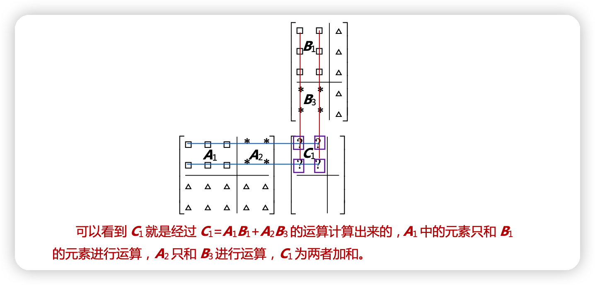

矩阵分块是否合理只要看第一个矩阵列的划分是否和第二个矩阵行的划分匹配

$$
\begin{bmatrix}
\begin{array}{cc|cc|cc}
1 & 0 & 1 & 0 & 1 & 0\\
0 & 1 & 0 & 1 & 0 & 1\\
\end{array}
\end{bmatrix}\
\begin{bmatrix}
1 & 2\\
3 & 4\\\hline
0 & 0\\
0 & 0\\\hline
0 & 0\\
0 & 0\\
\end{bmatrix}\
=
\begin{bmatrix}
I & I & I\\
\end{bmatrix}\
\begin{bmatrix}
A\\
0\\
0\\
\end{bmatrix}\
=
\begin{bmatrix}
1 & 2\\
3 & 4\\
\end{bmatrix}\
$$

### 逆矩阵

消元矩阵的逆矩阵主要是抵消原矩阵的消元操作

$A$的逆变换：$A^{(-1)}$

恒等变换：$A \cdot A^{(-1)} =  I =  \left[\begin{matrix}1&0 \\ 0&1 \\ \end{matrix}\right]$(i帽、j帽不变)

$$
A \vec{x} = \vec{v}  \rightarrow   A^{-1}A \vec{x} = A^{-1} \vec{v} \rightarrow  \vec{x} = A^{-1}\vec{v}
$$

**可逆**：当满足$A^{-1} A = I = A A^{-1}$左逆矩阵等于右逆矩阵时，则矩阵A可逆

线性变换 A 没有压缩空间纬度（行列式不为 0），则它存在逆变换

比如：

$$
E_{21} =
\left[\begin{matrix}
1 & 0 & 0\\
-3 & 1 & 0\\
0 & 0 & 1\\
\end{matrix}\right]
,E_{21}^{(-1)}=
\left[\begin{matrix}
1 & 0 & 0\\
3 & 1 & 0\\
0 & 0 & 1\\
\end{matrix}\right]\\ 
满足E_{21}^{(-1)} E_{21} = I 
\left[\begin{matrix}
1 & 0 & 0\\
3 & 1 & 0\\
0 & 0 & 1\\
\end{matrix}\right]
\left[\begin{matrix}
1 & 0 & 0\\
-3 & 1 & 0\\
0 & 0 & 1\\
\end{matrix}\right]
=
\left[\begin{matrix}
1 & 0 & 0\\
0 & 1 & 0\\
0 & 0 & 1\\
\end{matrix}\right]
\\同时满足E_{21}E_{21}^{(-1)}=I
\left[\begin{matrix}
1 & 0 & 0\\
-3 & 1 & 0\\
0 & 0 & 1\\
\end{matrix}\right]
\left[\begin{matrix}
1 & 0 & 0\\
3 & 1 & 0\\
0 & 0 & 1\\
\end{matrix}\right]
=
\left[\begin{matrix}
1 & 0 & 0\\
0 & 1 & 0\\
0 & 0 & 1\\
\end{matrix}\right]
\\
\begin{bmatrix}
1 & 0 & 0\\
-3 & 1 & 0\\
0 & 0 & 1\\
\end{bmatrix}\
\begin{bmatrix}
0\\
0\\
0\\
\end{bmatrix}\
=
\begin{bmatrix}
0\\
0\\
0\\
\end{bmatrix}\
\rightarrow
\begin{cases} &x = 0 \\ &-3x+y = 0 \\ &z = 0 \\ \end{cases}
$$

 此时方程$Ax=0$ x的解只有0

**不可逆**：又称奇异，它的行列式为0

不存在逆变换时。将空间变换压缩为一条直线，向量 v 恰好落与该直线，则该解存在

比如：

$$
\begin{bmatrix}
1 & 3\\
2 & 6\\
\end{bmatrix}\
\begin{bmatrix}
-3\\
1\\
\end{bmatrix}\
=
\begin{bmatrix}
0\\
0\\
\end{bmatrix}\
\rightarrow \begin{cases} &x + 3y = 0 \\ &2x + 6y = 0 \\ \end{cases}
$$
 此时方程$Ax=0$ 存在非零解x

#### 求逆矩阵

- **线程方程组解法:**

求逆相当于两组方程(右乘)
$$
\underbrace{
\begin{bmatrix}
1 & 3\\
2 & 7\\
\end{bmatrix}}_A
\begin{bmatrix}
a\\
b\\
\end{bmatrix} =

\begin{bmatrix}
1\\
0\\
\end{bmatrix}\ 和

\underbrace{
\begin{bmatrix}
1 & 3\\
2 & 7\\
\end{bmatrix}}_{A}

\begin{bmatrix}
c\\
d\\
\end{bmatrix}\ =
\begin{bmatrix}
0\\
1\\
\end{bmatrix}\
$$

计算如下(左乘):
$$
\begin{bmatrix}
1 & 3\\
2 & 7\\
\end{bmatrix}\
\begin{bmatrix}
a & b\\
c & d\\
\end{bmatrix}\
=
\begin{bmatrix}
1 & 0\\
0 & 1\\
\end{bmatrix}\ = I
$$

$$
\begin{bmatrix}
a & b\\
\end{bmatrix}\
+
\begin{bmatrix}
3c & 3d \\
\end{bmatrix}\ =
\begin{bmatrix}
a+3c & b+3d\\
\end{bmatrix}\\\
\begin{bmatrix}
2a & 2b\\
\end{bmatrix}\ +
\begin{bmatrix}
7c & 7d\\
\end{bmatrix}\ =
\begin{bmatrix}
2a+7c & 2b+7d\\
\end{bmatrix}\ \\ 
\quad   \\
\begin{cases} &a+3c = 1 \\ &b+3d = 0 \\&2a+7c = 0 \\ &2b+7d = 1 \\ \end{cases} \rightarrow
\begin{cases} &a=7 \\ &b=-3 \\&c= -2 \\& d= 1 \end{cases} \rightarrow
\begin{bmatrix}
7 & -3\\
-2 & 1\\
\end{bmatrix}\
$$

- **高斯-诺尔当消元法:**

Gauss-Jordan 消元法可以同时处理两个方程

:one: 把输入矩阵和输出矩阵合并为分块矩阵
$$
\begin{bmatrix}
\begin{array}{cc|cc}
1 & 3 & 1 & 0\\
2 & 7 & 0 & 1\\
\end{array}
\end{bmatrix}\
$$
:two: 进行消元得到上三角矩阵
$$
\begin{bmatrix}
\begin{array}{cc|cc}
\boxed{1} & 3 & 1 & 0\\
2 & 7 & 0 & 1\\
\end{array}
\end{bmatrix} \rightarrow

\begin{bmatrix}
\begin{array}{cc|cc}
\boxed{1} & 3 & 1 & 0\\
\boxed{0} & \boxed{1} & -2 & 1\\
\end{array}
\end{bmatrix}
$$

:three: 继续消元得到$I$矩阵

$$
\begin{bmatrix}
\begin{array}{cc|cc}
\boxed{1} & 3 & 1 & 0\\
\boxed{0} & \boxed{1} & -2 & 1\\
\end{array}
\end{bmatrix} \rightarrow

\begin{bmatrix}
\begin{array}{cc|cc}
\boxed{1} & \boxed{0} & 7 & -3\\
\boxed{0} & \boxed{1} & -2 & 1\\
\end{array}
\end{bmatrix}\\
\quad
$$

**原理**:
1. 将矩阵$A$左乘消元矩阵$E$从而得到消元结果$EA = I$

2. 而在此同时分块矩阵中的右侧矩阵(也就是运算前的$I$矩阵)也同时进行了同样的消元操作，相等于左乘了矩阵$E$从而得到消元结果 $IE = E$

3. 而此时的右侧矩阵$E$就是矩阵$A$的逆矩阵,即$A^{(-1)} = E$

**公式如下:**
$$
E
\begin{bmatrix}
\begin{array}{c|c}
A & I\\
\end{array}
\end{bmatrix}\ =

\begin{bmatrix}
\begin{array}{c|c}
EA & EI\\
\end{array}
\end{bmatrix}\ =

\begin{bmatrix}
\begin{array}{c|c}
I & A^{-1}\\
\end{array}
\end{bmatrix}\
$$

                   

## 行列式

- $\displaystyle{空间变换情况：}$

  - $\displaystyle{向外拉伸空间}$

  - $\displaystyle{向内挤压空间}$

### 拉伸空间

$\displaystyle{如下矩阵\left[\begin{matrix} 3&0 \\ 0&2 \\ \end{matrix}\right]它将i帽伸长为原来的3倍，将j帽伸长为原来的2倍}$

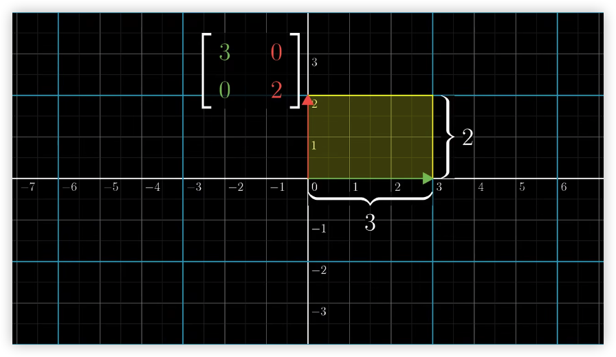

- $\displaystyle{从图中可得信息有面积扩展为原来的6倍}$

$\displaystyle{这种特殊的缩放比例,即线性变换对面积产生改变的比例称为这个变换的\textcolor{red}{行列式}}$

 $\displaystyle{以上线性变换可表示为:}$

$$
det\bigg(\left[\begin{matrix} 3&0 \\ 0&2 \\ \end{matrix}\right]\bigg)  = 6
$$

### 挤压空间

$\displaystyle{同样，当面积发生缩小\frac{1}{2}倍时，那么此时的行列式也为\frac{1}{2}}$

 $\displaystyle{以上线性变换可表示为:}$

$$
det\bigg(\left[\begin{matrix} 0.5 & 0.5 \\ 0.5&0.5 \\ \end{matrix}\right]\bigg) =  \frac{1}{2}
$$

$\displaystyle{当det\bigg(\left[\begin{matrix} 4&2 \\ 2&1 \\ \end{matrix}\right]\bigg) = 0时那么则表示该矩阵所代表的变换压缩到了更小维度}$

$\displaystyle{结论}$

$\displaystyle{通过判断矩阵的行列式是否为0,即可得到该矩阵所代表的变换是否将空间压缩到了更小维度上}$

 

### 空间反转

$\displaystyle{行列式为负数时,此时的线性变为称为该变换反转了空间取向,而面积依旧是放大}$

$\displaystyle{以上线性变换可表示为:}$

$$
det\bigg(\left[\begin{matrix} 1 & 2 \\ 1&-1 \\ \end{matrix}\right]\bigg) = -3
$$

 $\displaystyle{公式如下}$

$$
det\bigg(\left[\begin{matrix} a&b \\ c&d \\ \end{matrix}\right]\bigg) = ad - bc
$$

$\displaystyle{好比i帽、j帽为1时的矩阵则行列式为1 => 1 \cdot 1 - 0 \cdot 0 =1}$

$\displaystyle{当b或c其中一项为0时(ad不为0)则矩阵为一个平行四边形,此时面积为ad}$

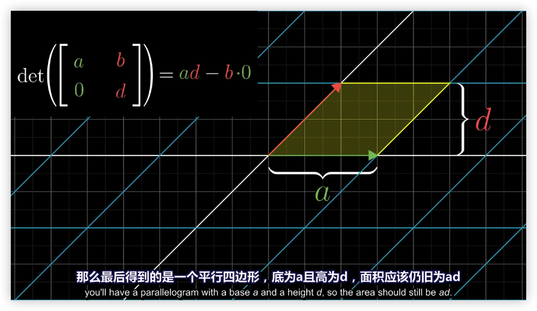

$\displaystyle{而当b或c不为0时(ad不为0)则该平行四边形在对角方向上拉伸或压缩了多少}$

### 三维空间面积线性变换

 $\displaystyle{公式如下}$ 
$$
det\left(\left[\begin{matrix} a&b&c \\ d&e&f \\ g&h&i \\ \end{matrix}\right]\right) = a \cdot  det \left(\left[\begin{matrix} e&f \\ h&i \\ \end{matrix}\right]\right) -b \cdot det \left(\left[\begin{matrix} d&f \\ g&i \\ \end{matrix}\right]\right) + c \cdot det\left(\left[\begin{matrix} d&e \\ g&h \\ \end{matrix}\right]\right)\\
$$

## 秩(Rank)

- 秩：表示变换后的空间维数
- 列空间:一个变换所有可能的变换结果的集合称为矩阵的“列空间”
- https://www.bilibili.com/video/BV1ns411r7dE/?spm_id_from=333.788.recommend_more_video.0&vd_source=1ec51cb8123536a0bf872aa061240412
