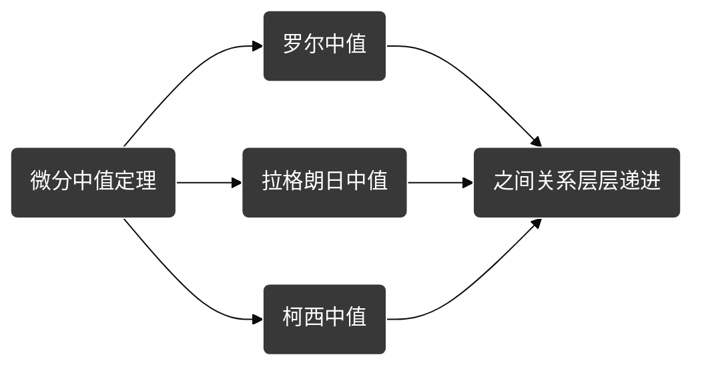
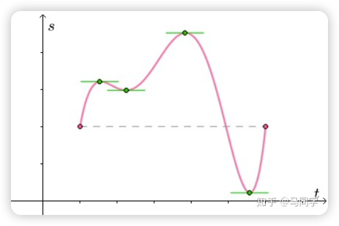
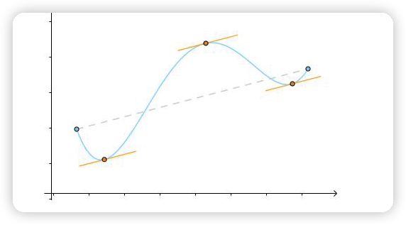
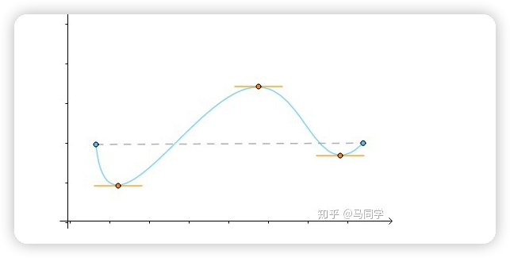
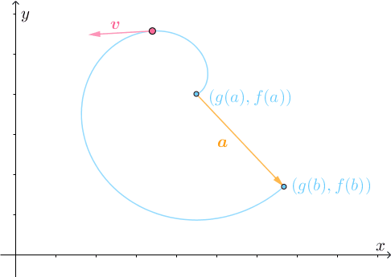
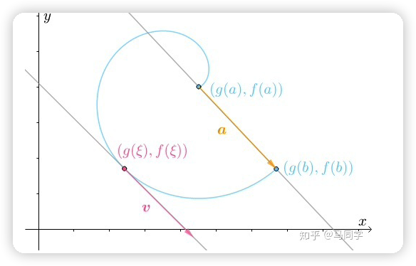
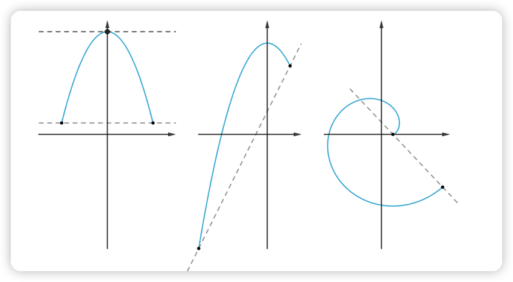
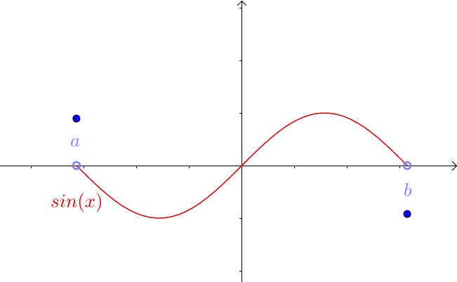
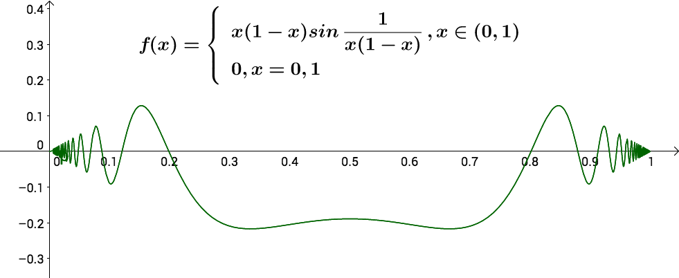

[toc]

学习文章：
1. https://zhuanlan.zhihu.com/p/47436090
2. https://www.zhihu.com/question/37423489
3. https://zhuanlan.zhihu.com/p/422000903

视频:
1. https://www.youtube.com/watch?v=UUEXjEGOCyY&ab_channel=PengTitus

# 微分中值定理

## 三大微分中值定理

 $\displaystyle{导图概述}$ 

### 罗尔中值定理

$\displaystyle{函数从A点开始然后再次回到A点,如图:}$

 $\displaystyle{从函数中的信息有:}$
 

* $\displaystyle{函数是连续的=>f(x)在闭区间[a,b]上连续}$

* $\displaystyle{起点和终点相等=>f(a) = f(b)}$

* $\displaystyle{函数在开区间(a,b)可导=>\lim\limits_{x\rightarrow 0}\frac{f(x + a) - f(a)}{x}存在}$

为什么是闭区间连续、开区间可导？为了不影响排版我放在了文章末尾

`函数可导定义:`

`1）设f(x)在x0及其附近有定义，则当a趋向于0时，若 [f(x0+a)-f(x0)]/a的极限存在, 则称f(x)在x0处可导。`

`2）若对于区间(a,b)上任意一点(m，f(m))均可导，则称f(x)在(a，b)上可导`

 $\displaystyle{所得结论:}$

$\displaystyle{{中间必定有增量为0的点(可以理解为凸峰处的顶点) =>\xi \in (a,b)  \quad, f'(\xi) = 0}}$

 
 
 
 
 

### 拉格朗日中值定理

 $\displaystyle{从函数中的信息有:}$
 

* $\displaystyle{函数是连续的=>f(x)在闭区间[a,b]上连续}$

* $\displaystyle{函数在开区间(a,b)可导=>\lim\limits_{x\rightarrow 0}\frac{f(x + a) - f(a)}{x}存在}$

 $\displaystyle{所得结论:}$
 

$${至少一点的切线与端点的连线平行 => \xi \in  (a,b) 使得f'(\xi) = \frac{f(b) - f(a)}{ b - a}}$$

$\displaystyle{将函数旋转使得f(a) = f(b)得到的即是罗尔定理函数}$

 
 
 
 
 

### 柯西中值定理
$\displaystyle{大名鼎鼎的洛必达定理就是由柯西中值定理证明的}$

$\displaystyle{参数方程 \begin{cases} &x= g(t) \\ &y = f(t) \\ \end{cases}\quad 描述了一个二维空间中的运动:}$

 $\displaystyle{分析:}$
 

- $\displaystyle{此运动过程中刚开始的时候，速度v 的方向与a 相反}$

- $\displaystyle{在a运动b的某一时刻必然会有v和a同向的时刻，使得两者所在直线平行，如下图:}$

- $\displaystyle{此时a所在的直线斜率为 \frac{f(b) - f(a)}{b - a} / \frac{g(b) - g(a)}{b-a} = \frac{f(b)- f(a)}{g(b) - g(a)}}$

- $\displaystyle{此时v所在的直线斜率为\frac{f'(\xi)}{g'(\xi)}}$

 $\displaystyle{从函数中的信息有:}$
 

* $\displaystyle{函数是连续的=>f(x),g(x)在闭区间[a,b]上连续}$

* $\displaystyle{函数在f(x),g(x)开区间(a,b)可导}$

* $\displaystyle{\forall x \in (a,b) => g'(x) \neq 0}$

 $\displaystyle{所得结论:}$
 

$${存在\xi \in  (a,b)则有等式: \frac{f(b) - f(a)}{g(b) - g(a)} = \frac{f'(\xi)}{g'(\xi)}}$$

$\displaystyle{在x = g(t) , f(x) = f(t)则柯西中值定理就变成了拉格朗日中值定理}$

 
 

### 三大微分中值定理联系:

 
 
 
 
 

## 各类基本定理

### 费马定理

$\displaystyle{存在f'(a) = \lim\limits_{x\rightarrow a} \frac{f(x) - f(a)}{x-a} 时，那么由极限的\textcolor{red}{保号性}可得f_+'(a) = \lim\limits_{x\rightarrow a}\frac{f(x)-f(a)}{x-a} > 0}\\
\displaystyle{即"\textcolor{red}{左低右高}",f'_{-}(a) = \lim\limits_{x\rightarrow a}\frac{f(x) - f(a)}{x - a} < 0 即"\textcolor{green}{左高右低}"}$

$\displaystyle{那么f(x)在x = x_0处取极值且f'(x_0)存在时，则必有f'(x_0) = 0}$

$\displaystyle{可导的情况下，定义域内部(强调不在边界上)极值点一定导数为0}$

 $$\begin{aligned}
& x_0 \in (a,b)为f(x)的极值点 \\
& 那么存在\xi > 0使得f(x) \leq f(x_0) , x \in (x_0 - \xi , x_0 + \xi) \\
&  \\
&  \\
&  \\
\end{aligned}$$

                   

## 疑惑章

### 罗尔定理条件为什么是闭区间连续、开区间可导?

 $\displaystyle{条件可能的情况:}$
 

1. $\displaystyle{(a,b)连续，[a,b]可导}$

2. $\displaystyle{(a,b)连续，(a,b)可导}$

3. $\displaystyle{[a,b]连续，[a,b]可导(最好奇的点)}$

4. $\displaystyle{[a,b]连续，(a,b)可导(条件)}$

 $\displaystyle{情况2:}$
 

$\displaystyle{图中可知端点是间断的即起点终点不同,不可使用罗尔定理}$

 $\displaystyle{情况3:}$
 

$\displaystyle{图中可知f(x)在[0,1]连续,但只有(0,1)可导(端点处导数震荡),不可使用罗尔定理}$
