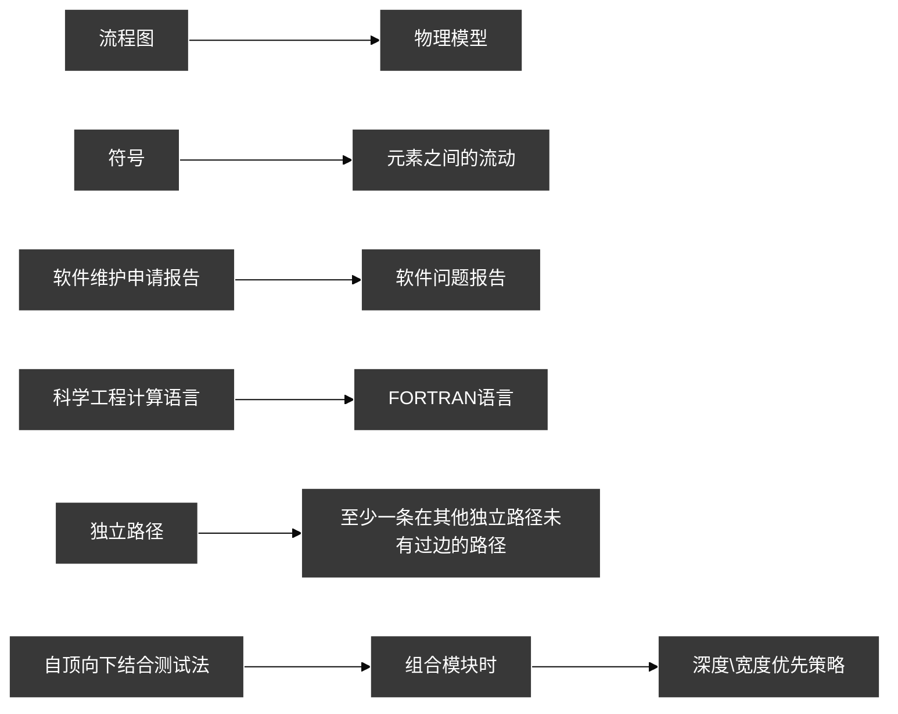

## Main_2
Putnam模型: 一种具有实用价值的动态多变量软件成本进度。是假定在软件开发的整个生存期中工作量特定的分布

PAD问题分析图（Problem Analysis Diagram）是继PFD和N-S图之后，又一种描述详细设计的工具，是软件工程中的分析利器，

## Main

UML -> Unified modeling language(统一建模语言)是一种用于软件系统 分析和设计的语言工具，它用于帮助软件开发人员进行思考和记录思路的结果

软件开发阶段
- 人员最多 : 编码阶段
- 开发要求最高 : 原型化方法

偶然性:相同的代码

面向数据流将数据流分为
- 当数据流呈线型
	- 变换流 ： 系统输入输出流
			
- 当数据流呈辐射形
	- 事物流 ： 根据输入数据的性质选择加工路径。若处理沿输入通道达到一个处理T，处理T根据输入数据的类型在若干动作序列中选择一个来执行。这类特殊的数据流称为事务流。处理T称为处理中心
			

内聚度 : 模块内部各成分之间相关联程度的度量

软件可维护性: 被修改的，修改包括纠正、改进或软件对环境、和功能规格说明变化的适应。
- 可理解性
- 可靠性
- 可测试性
- 可修改性
- 可移植性

静态测试主要包括：评审文档、阅读代码
动态测试主要包括：运行程序测试软件称为动态测试
	- 黑盒测试：又称功能测试。这种方法把被测软件看成黑盒，在不考虑软件内部结构和特性的情况下测试软件的外部特性。
	- 白盒测试：又称结构测试。这种方法把被测软件看成白盒，根据程序的内部结构和逻辑设计来设计测试实例，对程序的路径和过程进行测试。

面向数据流系统:
	- 数据的可用性控制着计算
	- 设计的结构有数据在进程之间的有序运动决定
	- 数据的模式是明确的
- 控制流 :
	- 我们关注程序中的控制流轨迹
	- 数据可能伴随控制,但是数据不是主导.我们关心程序的执行顺序

系统->功能->结构

技术评审:一种的同行审查技术。 其主要特点是由一组评审者按照规范的步骤对软件需求、设计、代码或其他技术文档进行仔细地检查，以找出和消除其中的缺陷

### 填空

FORTRAN语言：IBM的第一个高级语言，现在主要用于科学计算语言
PASCAL语言：第一个结构化语言

### 判断
- CMM(Capability Maturity Model for Software)软件能力成熟度模型: 是对组织软件过程能力的描述。
	- CMM的核心是把软件开发视为一个过程，并根据这一原则对软件开发和维护进行过程监控和研究，以使其更加科学化、标准化，使企业能够更好的实现商业目标。
- SA(Structured Analysis) 结构化分析: 一种建模的活动，主要是根据软件内部的数据传递、变换关系，自顶向下逐层分解，描绘出满足功能要求的软件模型。

### 名词
UML关系表达
	- 关联：类目 之间的一种结构关系，是对一组具有相同结构、相同链的描述
	- 依赖：一种使用关系，用于描述一个类目使用另一个类目的信息和服务
	- 泛化：一般性类目 和它的较为 特殊类目 之间的一种关系
	- 细化：类目 之间的语义关系，一个类目规约了保证另一个类目执行的契约

